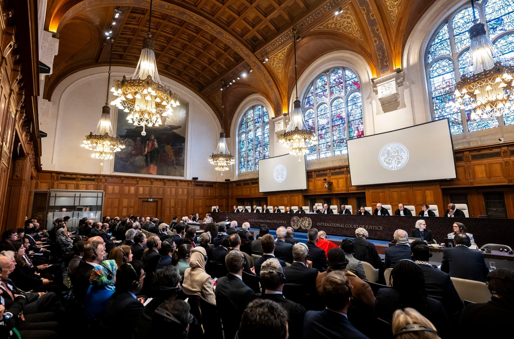
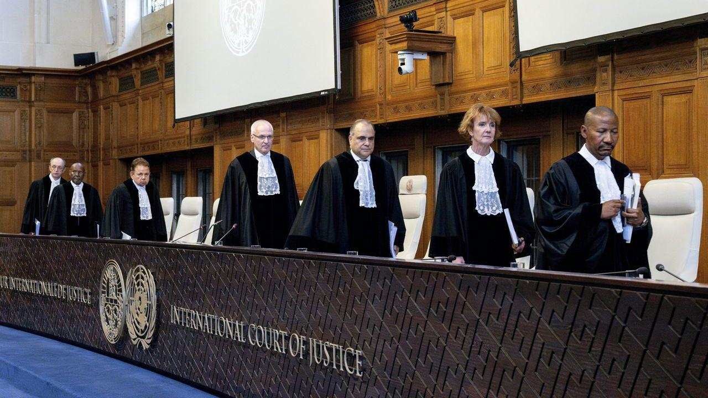
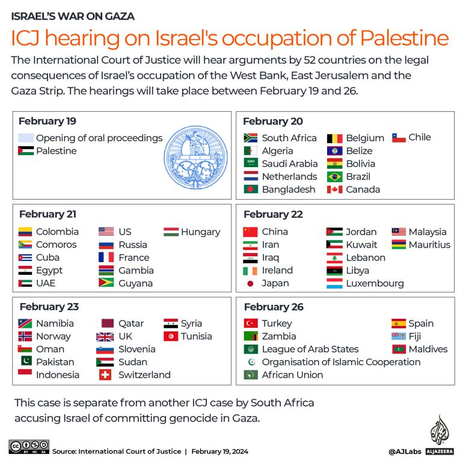
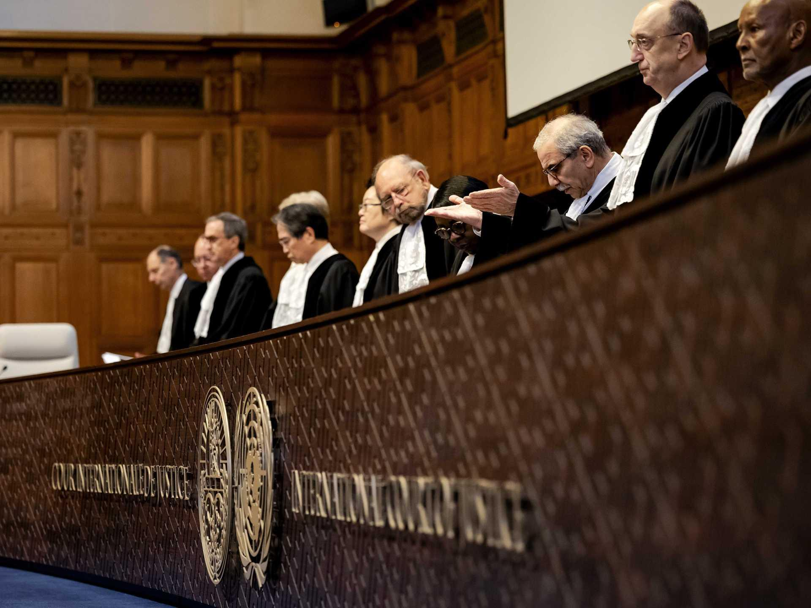

## Claim
Claim: "Israel has been declared an illegal state by the International Court of Justice in July 2024."

## Actions
```
image_search("International Court of Justice Israel illegal state July 2024")
```

## Evidence
### Evidence from `image_search`
From [Source](https://www.diakonia.se/ihl/news/one-year-on-the-devastating-cost-of-ignoring-the-icjs-july-2024-advisory-opinion/): 
Content: The search result contains an image of the International Court of Justice. 


## Elaboration
The evidence contains an image of the International Court of Justice. However, the evidence does not provide any information about whether Israel has been declared an illegal state by the International Court of Justice in July 2024.

Therefore, I am unable to verify the claim. More information is needed.


## Actions
```
image_search("International Court of Justice Israel illegal state")
```

## Evidence
### Evidence from `image_search`
The Economist reports that the World Court says Israel's occupation is illegal.  Al Jazeera reports that the International Court of Justice heard arguments by 52 countries on the legal consequences of Israel's occupation of the West Bank, East Jerusalem, and the Gaza Strip between February 19 and 26. 

The provided sources include: [The Economist](https://www.economist.com/middle-east-and-africa/2024/07/19/the-world-court-says-israels-occupation-is-illegal), [Arab Center DC](https://arabcenterdc.org/resource/the-icj-case-on-israeli-occupation-a-report/), and [Al Jazeera](https://www.aljazeera.com/news/2024/2/19/whats-the-icj-case-against-israels-illegal-occupation-of-palestine).


## Elaboration
The Economist reports that the World Court says Israel's occupation is illegal. Al Jazeera reports that the International Court of Justice heard arguments by 52 countries on the legal consequences of Israel's occupation of the West Bank, East Jerusalem, and the Gaza Strip between February 19 and 26.

The evidence suggests that the International Court of Justice has addressed the legality of Israel's occupation. However, the evidence does not explicitly state that Israel has been declared an illegal state by the International Court of Justice in July 2024.

Therefore, I am unable to verify the claim. More specific information about the court's ruling in July 2024 is needed.


## Actions
```
image_search("International Court of Justice Israel illegal state July 2024 ruling")
```

## Evidence
### Evidence from `image_search`
From [Source](https://www.aljazeera.com/news/liveblog/2024/2/20/israels-occupation-of-palestine-live-day-2-of-icj-arguments-continues): 
Content: Al Jazeera provides an image of the International Court of Justice. 


## Elaboration
The evidence includes an image of the International Court of Justice from Al Jazeera. However, the evidence does not provide any information about a ruling in July 2024.

Therefore, I am unable to verify the claim. More information is needed.


## Final Judgement
The search results show that the International Court of Justice has addressed the legality of Israel's occupation. However, the evidence does not explicitly state that Israel has been declared an illegal state by the International Court of Justice in July 2024.

The claim cannot be verified because there is not enough evidence to confirm the specific ruling in July 2024. `false`


### Verdict: FALSE

### Justification
The International Court of Justice has addressed the legality of Israel's occupation, as reported by [The Economist](https://www.economist.com/middle-east-and-africa/2024/07/19/the-world-court-says-israels-occupation-is-illegal) and [Al Jazeera](https://www.aljazeera.com/news/2024/2/19/whats-the-icj-case-against-israels-illegal-occupation-of-palestine). However, the provided evidence does not confirm a specific ruling declaring Israel an illegal state in July 2024. Therefore, the claim cannot be verified.
