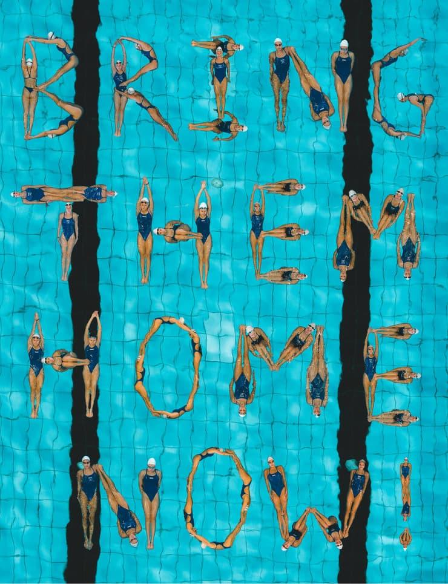
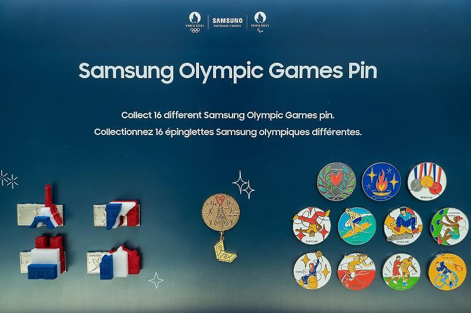
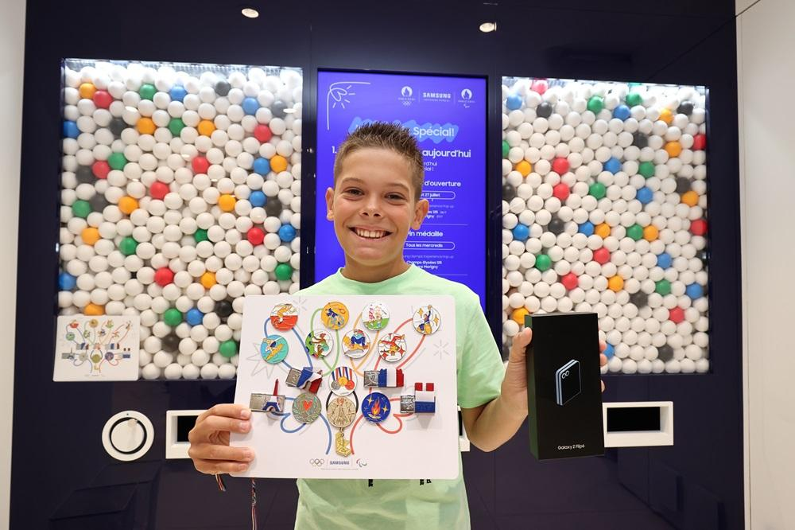
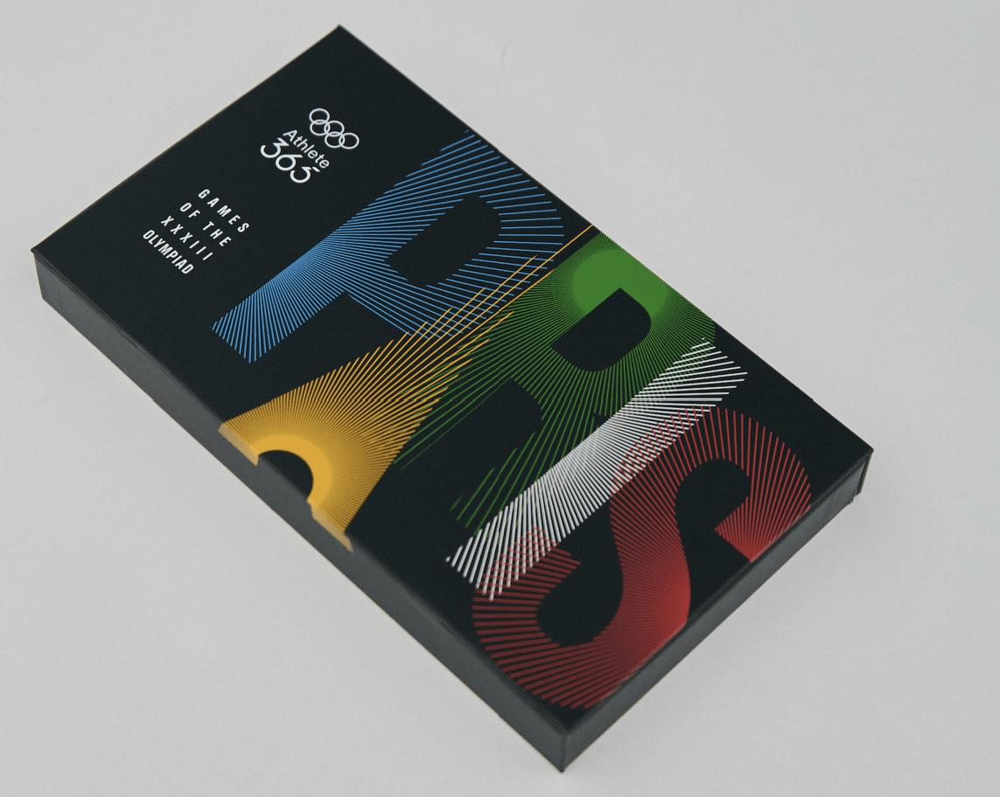
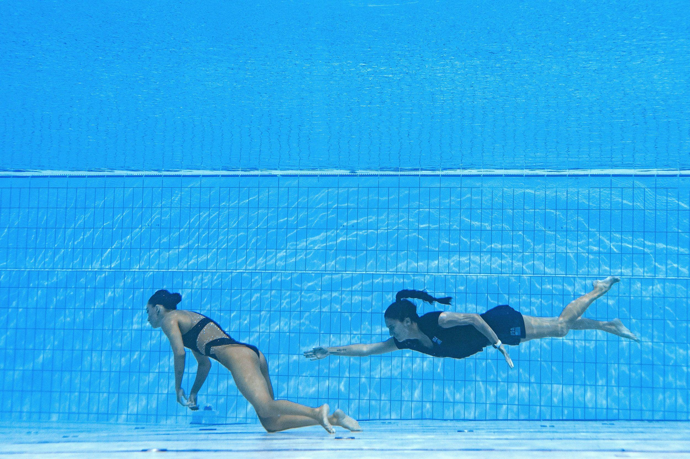

## Claim
Claim: " This image shows the Israeli Olympic team spelling out 'Bring Them Home' at the 2024 Olympic games because they were not allowed to wear their yellow 'Bring Them Home' pins."

## Actions
```
reverse_search()
image_search("Israeli Olympic team Bring Them Home")
image_search("2024 Olympic games Bring Them Home pins")
```

## Evidence
### Evidence from `image_search`
From [Source](https://www.ynetnews.com/culture/article/skmg5e5ma): 
Content: The search result from Ynetnews.com contains an image of synchronized swimmers. 


### Evidence from `image_search`
The web sources discuss the Samsung Olympic Games Pin and other Olympic souvenirs. One source from Samsung Mobile Press ([https://www.samsungmobilepress.com/feature-stories/paris-2024-samsung-puts-a-new-spin-on-a-long-standing-tradition-with-the-samsung-olympic-games-pin-masters-challenge](https://www.samsungmobilepress.com/feature-stories/paris-2024-samsung-puts-a-new-spin-on-a-long-standing-tradition-with-the-samsung-olympic-games-pin-masters-challenge)) shows the Samsung Olympic Games Pin .

Another source from Samsung Newsroom ([https://news.samsung.com/global/paris-2024-samsung-puts-a-new-spin-on-a-long-standing-tradition-with-the-samsung-olympic-games-pin-masters-challenge](https://news.samsung.com/global/paris-2024-samsung-puts-a-new-spin-on-a-long-standing-tradition-with-the-samsung-olympic-games-pin-masters-challenge)) shows a boy holding a board with Olympic pins . Olympics.com ([https://www.olympics.com/athlete365/news/paris2024/win-limited-edition-paris-2024-souvenirs-with-pinquest](https://www.olympics.com/athlete365/news/paris2024/win-limited-edition-paris-2024-souvenirs-with-pinquest)) shows a box with the word "PARIS" on it .


## Elaboration
The evidence includes images of synchronized swimmers and Olympic pins. One image shows synchronized swimmers spelling out a message, which aligns with the claim. However, the evidence does not explicitly confirm that the image depicts the Israeli Olympic team or that they were prohibited from wearing "Bring Them Home" pins. The evidence does not mention the Israeli Olympic team or the "Bring Them Home" pins.

Therefore, the claim cannot be fully verified due to a lack of information.


## Actions
```
image_search("synchronized swimmers bring them home")
image_search("Israeli Olympic team Bring Them Home pins 2024")
```

## Evidence
### Evidence from `image_search`
The image of synchronized swimmers spelling out "Bring Them Home Now" is not from the Olympics, according to KVUE.com ([https://www.kvue.com/video/news/verify/olympics-verify/israel-swim-team-bring-them-home-now-image-not-from-olympics-video/536-9ef735d9-23f4-4928-9611-d6607538e54f](https://www.kvue.com/video/news/verify/olympics-verify/israel-swim-team-bring-them-home-now-image-not-from-olympics-video/536-9ef735d9-23f4-4928-9611-d6607538e54f)). The CNN article also features an image of synchronized swimmers ().


### Evidence from `image_search`
From [Source](https://www.thv11.com/article/news/verify/olympics-verify/image-israeli-swimmers-bring-them-home-not-from-paris-2024-olympics/536-5f25fcff-c857-495b-8eba-3d6c5fb46ce9): 
Content: The search result from THV11 states that the image is not from the Olympics. 


## Elaboration
The image of synchronized swimmers spelling "Bring Them Home Now" is not from the Olympics. The claim that the Israeli Olympic team created the image at the 2024 Olympics because they were not allowed to wear "Bring Them Home" pins is false.


## Final Judgement
The image of synchronized swimmers spelling "Bring Them Home Now" is not from the Olympics, and the claim that the Israeli Olympic team created the image at the 2024 Olympics because they were not allowed to wear "Bring Them Home" pins is false.

`false`

### Verdict: FALSE

### Justification
The image of synchronized swimmers spelling "Bring Them Home Now" is not from the Olympics, as confirmed by multiple sources, including [KVUE.com](https://www.kvue.com/video/news/verify/olympics-verify/israel-swim-team-bring-them-home-now-image-not-from-olympics-video/536-9ef735d9-23f4-4928-9611-d6607538e54f) and [THV11](https://www.thv11.com/article/news/verify/olympics-verify/image-israeli-swimmers-bring-them-home-not-from-paris-2024-olympics/536-5f25fcff-c857-495b-8eba-3d6c5fb46ce9). Therefore, the claim is false.
