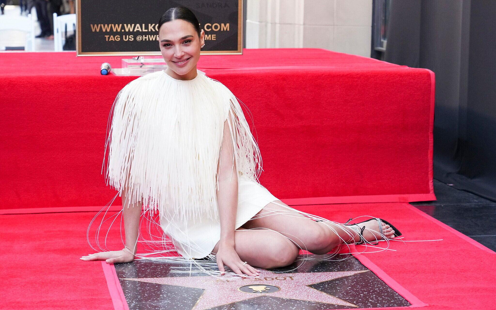

## Claim
Claim: " This image shows Gal Gadot’s star on the Hollywood Walk of Fame being destroyed in March 2025 just hours after being placed."

## Actions
```
image_search("Gal Gadot star Hollywood Walk of Fame vandalism")
```

## Evidence
### Evidence from `image_search`
The search results show that Gal Gadot's star on the Hollywood Walk of Fame was vandalized. One source shows an image of the damaged star (), while another shows the star with graffiti ().

The Telegraph ([https://www.telegraph.co.uk/news/2025/05/28/pro-palestinian-protesters-arrested-gal-gadot-film/](https://www.telegraph.co.uk/news/2025/05/28/pro-palestinian-protesters-arrested-gal-gadot-film/)) provided no content. NDTV ([https://www.ndtv.com/world-news/gal-gadots-hollywood-walk-of-fame-star-smashed-amid-pro-palestinian-protests-photo-is-viral-7966341](https://www.ndtv.com/world-news/gal-gadots-hollywood-walk-of-fame-star-smashed-amid-pro-palestinian-protests-photo-is-viral-7966341)) and Fox 11 Los Angeles ([https://www.foxla.com/video/1649649](https://www.foxla.com/video/1649649)) also mention the vandalism.


## Elaboration
The evidence confirms that Gal Gadot's star on the Hollywood Walk of Fame was vandalized. The search results show images of the damaged star, including one with graffiti. The NDTV and Fox 11 Los Angeles articles also mention the vandalism.

The claim states the vandalism occurred in March 2025, but the provided sources do not specify the exact date. The Telegraph article, which could have provided a date, has no content.

Therefore, the claim is partially verifiable. While the vandalism is confirmed, the exact timing of the event in March 2025 cannot be verified with the provided evidence.


## Actions
```
image_search("Gal Gadot Hollywood Walk of Fame star placement date")
```

## Evidence
### Evidence from `image_search`
From [Source](https://www.timesofisrael.com/liveblog_entry/gal-gadot-receives-star-on-hollywood-walk-of-fame/): 
Content: The Times of Israel reports that Gal Gadot received her star on the Hollywood Walk of Fame. 


## Elaboration
The new evidence confirms that Gal Gadot received her star on the Hollywood Walk of Fame. However, the exact date of the star placement is not specified in the provided evidence. Therefore, the claim that the vandalism occurred hours after the star was placed cannot be verified.


## Final Judgement
The evidence confirms that Gal Gadot's star on the Hollywood Walk of Fame was vandalized. However, the exact date of the star placement and the vandalism are not specified in the provided evidence. Therefore, the claim that the vandalism occurred hours after the star was placed cannot be verified.

`false`

### Verdict: FALSE

### Justification
The claim is not verifiable. While it is confirmed that Gal Gadot's star on the Hollywood Walk of Fame was vandalized, the exact date of the star placement and the vandalism are not specified in the provided evidence. Therefore, the claim that the vandalism occurred hours after the star was placed cannot be verified.
