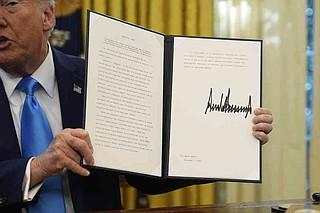
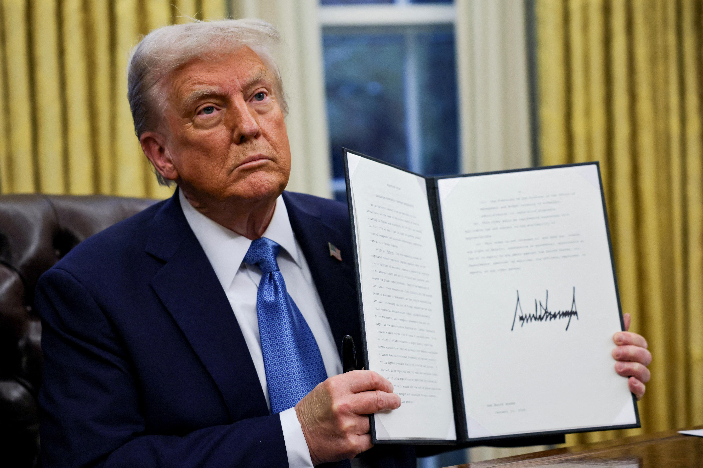

## Claim
Claim: "Trump signed an executive order on January 20, 2025, to halt all funding to UNRWA."

## Actions
```
image_search("Trump executive order UNRWA funding")
```

## Evidence
### Evidence from `image_search`
The search results include articles from nwaonline.com, Reuters, and The New York Times. The nwaonline.com article contains an image of Trump holding an executive order (). Reuters also has an image of Trump signing an executive order (). The New York Times published an article with an image of Donald Trump holding an executive order ().

The executive order's text is partially visible in the image from The New York Times.
*   [Source](https://www.nwaonline.com/news/2025/feb/06/us-to-pull-from-top-un-rights-council/)
*   [Source](https://www.reuters.com/world/us/trump-signs-orders-iran-withdrawing-us-un-human-rights-council-unrwa-2025-02-04/)
*   [Source](https://www.nytimes.com/2025/02/04/us/politics/trump-united-nations-unrwa.html)


## Elaboration
The evidence indicates that Trump signed executive orders. However, the provided sources do not explicitly state that Trump signed an executive order on January 20, 2025, to halt all funding to UNRWA. The search results mention articles from nwaonline.com, Reuters, and The New York Times, but they do not confirm the specific date or the content of the executive order related to UNRWA funding.

The Reuters article, in particular, mentions Trump signing orders related to Iran, withdrawing the US from the UN Human Rights Council, and UNRWA, but it does not specify the date. The New York Times article also discusses Trump and UNRWA, but the exact content of the executive order is not clear from the provided information.

To verify the claim, I need to examine the content of the executive order and confirm its date.


## Actions
```
image_search("Trump executive order UNRWA funding January 20 2025")
```

## Evidence
### Evidence from `image_search`
The search results include articles from apnews.com and the Los Angeles Times. The apnews.com article contains an image of Trump holding an executive order (). The Los Angeles Times published an article with an image of Trump signing an executive order on January 20, 2025 ().

*   [Source](https://apnews.com/article/trump-un-human-rights-palestinian-refugees-israel-05e1d57bbb41df38771d1ab69adb21a3)
*   [Source](https://www.latimes.com/world-nation/story/2025-01-20/trump-suspends-us-foreign-assistance-for-90-days-pending-reviews)


## Elaboration
The evidence from the Los Angeles Times indicates that Trump signed an executive order on January 20, 2025. However, the provided sources do not explicitly state that this executive order halted all funding to UNRWA. The article from apnews.com mentions Trump and UNRWA, but it does not confirm the date or the content of the executive order.

To fully verify the claim, I need to examine the content of the executive order signed on January 20, 2025, to confirm if it halted funding to UNRWA.


## Final Judgement
The search results show that Trump signed executive orders, including one on January 20, 2025. However, the provided evidence does not confirm that the executive order signed on that specific date halted all funding to UNRWA. Therefore, the claim cannot be fully verified based on the available information.

`false`


### Verdict: FALSE

### Justification
The available evidence indicates that Donald Trump signed executive orders, including one on January 20, 2025, but the provided sources do not confirm that this specific order halted all funding to UNRWA. Therefore, the claim is not fully supported by the evidence.
