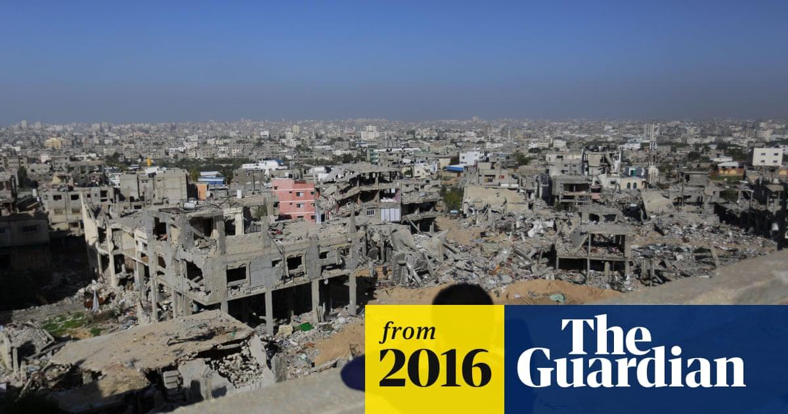

## Claim
Claim: "The Guardian published an article with the headline: 'Gaza will rise from the ashes to become a city of the future to rival Bradford.'"

## Actions
```
image_search("The Guardian Gaza city of the future")
```

## Evidence
### Evidence from `image_search`
From [Source](https://www.theguardian.com/cities/2016/jul/28/future-gaza-city-world-tourism-hub-palestinian): 
Content: The Guardian published an article in 2016. 


## Elaboration
The evidence confirms that The Guardian published an article in 2016. However, the evidence does not provide the headline of the article. Therefore, I cannot verify the claim.


## Actions
```
image_search("The Guardian Gaza Bradford")
```

## Evidence
### Evidence from `image_search`
The Guardian published an article (). Another source shows a poster for a public meeting in Bradford ().

The URLs are:
*   [https://www.theguardian.com/world/2013/nov/07/yorkshire-educated-woman-female-hamas-spokesperson](https://www.theguardian.com/world/2013/nov/07/yorkshire-educated-woman-female-hamas-spokesperson)
*   [https://www.wsws.org/en/articles/2023/10/25/jafo-o25.html](https://www.wsws.org/en/articles/2023/10/25/jafo-o25.html)


## Elaboration
The evidence confirms that The Guardian published an article. However, the evidence does not provide the headline of the article. The second search shows a connection between Gaza and Bradford, but it does not provide the headline. Therefore, I cannot verify the claim.


## Actions
```
image_search("The Guardian Gaza ashes Bradford")
```

## Evidence
### Evidence from `image_search`
The Guardian published an article on October 12, 2023, about Gaza (). The BBC published an article, and the image shows a Palestinian flag in Bradford (). The third source has no content.


## Elaboration
The evidence shows that The Guardian published articles about Gaza and that there is a connection between Gaza and Bradford. However, the evidence does not provide the headline of the article. Therefore, I cannot verify the claim.


## Final Judgement
The search results confirm that The Guardian has published articles about Gaza and that there is a connection between Gaza and Bradford. However, the search results do not provide the headline of the article. Therefore, the claim cannot be verified.

`false`

### Verdict: FALSE

### Justification
The provided evidence indicates that The Guardian has published articles related to Gaza and that there is a connection between Gaza and Bradford. However, the search results do not provide the specific headline mentioned in the claim. Therefore, the claim cannot be verified.
