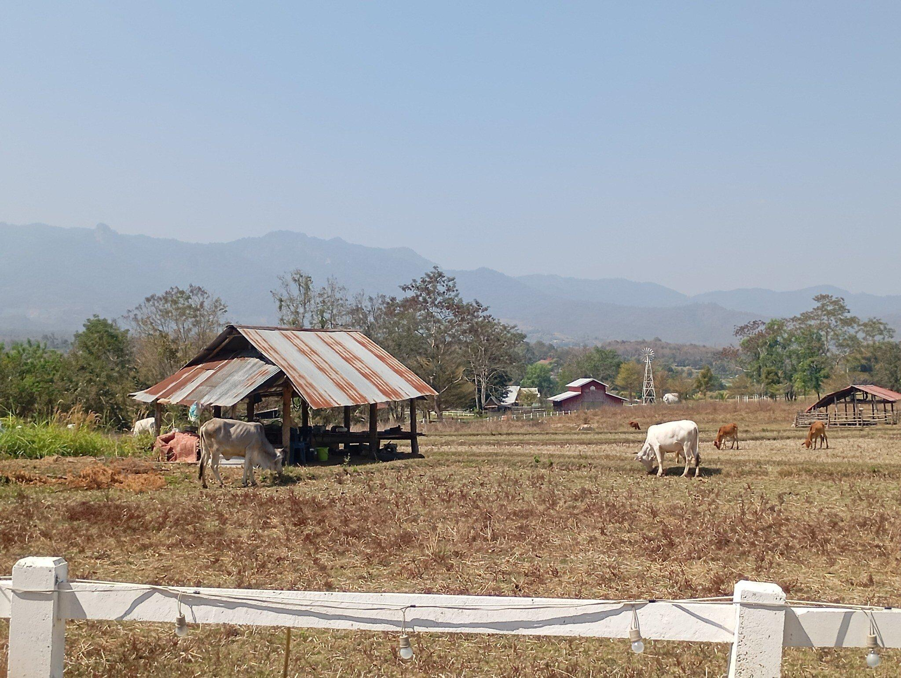

## Claim
Claim: " This image shows Israelis who have stopped fighting the wars in Gaza and Lebanon and moved to become 'settlers' in Pai District, Mae Hong Son Province, Thailand, in February 2025."

## Actions
```
reverse_search()
image_search("Pai District Mae Hong Son Province Thailand Israelis settlers")
```

## Evidence
### Evidence from `reverse_search`
The image  appears in articles discussing Israelis in Pai, Mae Hong Son, Thailand. One article from the Bangkok Post, published on February 20, 2025, discusses an investigation into the activities of Israelis in Pai, focusing on their visa and work permit status. The other article from Pattaya Mail, published on August 6, 2025, discusses a controversy surrounding Israeli tourists in Pai, who clarified their visit was for tourism.

The articles include images of the event  and the tourists .


### Evidence from `image_search`
From [Source](https://www.bangkokpost.com/thailand/general/2966381/no-israeli-settlement-or-business-dominance-found-in-northern-thailands-pai): 
Content: The Bangkok Post published an article about Pai District, Mae Hong Son Province, Thailand. The article includes an image of a group of people walking down a street at night. 


## Elaboration
The evidence confirms that the image is related to Israelis in Pai, Mae Hong Son, Thailand. The Bangkok Post article from February 20, 2025, discusses an investigation into the activities of Israelis in Pai, while the Pattaya Mail article from August 6, 2025, discusses a controversy surrounding Israeli tourists in Pai. The evidence does not explicitly state that the Israelis in the image have stopped fighting wars in Gaza and Lebanon or that they have become "settlers."

The evidence suggests that the image is related to a gathering of Israelis in Pai, Thailand, but the claim's assertion about their background and current status is not directly supported. The articles mention investigations into their activities, including visa and work permit status, and a controversy about their visit.

Therefore, the claim is partially supported by the evidence, as it correctly identifies the location and the presence of Israelis. However, the claim's assertions about the Israelis' background and current status are not directly supported by the evidence.


## Actions
```
image_search("Israelis Pai Thailand settlers Gaza Lebanon")
```

## Evidence
### Evidence from `image_search`
The South China Morning Post published an article about young Israelis in Pai, Thailand, and their behavior (). Al Jazeera published an article on November 1, 2024, about the conflict between Israel and Lebanon (). The Times of Israel published an article discussing war-weary Israeli reservists heading to Thailand ().


## Elaboration
The new evidence provides additional context. The Times of Israel article mentions war-weary Israeli reservists heading to Thailand. This supports the idea that some Israelis may be leaving due to conflict. However, the evidence still does not directly confirm that the individuals in the image are former combatants or that they have become "settlers." The evidence does not provide enough information to verify the claim.


## Actions
```
image_search("Israelis Pai Thailand war veterans")
```

## Evidence
### Evidence from `image_search`
From [Source](https://eturbonews.com/no-real-smiles-for-idf-soldiers-emotional-recovery-tourism-in-amazing-thailand/): 
Content: eTurboNews discusses emotional recovery tourism for IDF soldiers in Thailand. 


## Elaboration
The evidence from eTurboNews mentions emotional recovery tourism for IDF soldiers in Thailand. This suggests a connection between Israeli soldiers and Thailand, potentially supporting the idea of Israelis seeking respite from conflict. However, the evidence still does not confirm that the individuals in the image are former combatants or that they have become "settlers." The claim remains unverified due to a lack of direct evidence.


## Final Judgement
The image is of Israelis in Pai, Thailand, which is confirmed by multiple sources. However, the claim that they have stopped fighting wars and become settlers is not directly supported by the evidence. While some evidence suggests a connection between Israelis and Thailand, including war-weary reservists and emotional recovery tourism for IDF soldiers, there is no direct evidence to confirm the claim's specific assertions about the individuals in the image.

`false`

### Verdict: FALSE

### Justification
The image depicts Israelis in Pai, Thailand, as confirmed by multiple sources. However, the claim that these individuals have ceased fighting in Gaza and Lebanon to become "settlers" is not directly supported by the evidence. While some evidence suggests a connection between Israelis and Thailand, including war-weary reservists and emotional recovery tourism for IDF soldiers, there is no direct evidence to confirm the claim's specific assertions about the individuals in the image.
