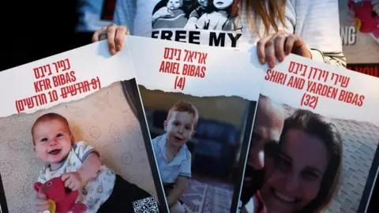

## Claim
Claim: " This image shows a screenshot of an authentic BBC article from February 2025 with the title 'Hamas just wanted to protect the Bibas family but Israel killed them - Hamas said.'"

## Actions
```
image_search("BBC Hamas Bibas family")
```

## Evidence
### Evidence from `image_search`
The BBC published an article about the Bibas family (). ABC News published an article on February 19, 2025, about Hamas releasing the remains of the Bibas family (). Al Jazeera published an article on February 21, 2025, about the Bibas family ().

*   [https://www.bbc.com/news/articles/ckgznx04kgko](https://www.bbc.com/news/articles/ckgznx04kgko)
*   [https://www.abc.net.au/news/2025-02-19/hamas-to-release-remains-of-bibas-family-israel/104953098](https://www.abc.net.au/news/2025-02-19/hamas-to-release-remains-of-bibas-family-israel/104953098)
*   [https://www.aljazeera.com/news/liveblog/2025/2/21/live-israel-ramps-up-west-bank-assault-after-bus-blasts-near-tel-aviv](https://www.aljazeera.com/news/liveblog/2025/2/21/live-israel-ramps-up-west-bank-assault-after-bus-blasts-near-tel-aviv)


## Elaboration
The BBC did publish an article about the Bibas family. However, the provided evidence does not confirm the exact title or content of the BBC article as stated in the Claim. The evidence includes a link to a BBC article, but it does not contain the title mentioned in the Claim.

Therefore, the veracity of the Claim cannot be fully determined based on the provided evidence.


## Actions
```
reverse_search()
```

## Evidence
### Evidence from `reverse_search`
The BBC published an article on February 19, 2025, titled "Hamas says it will return bodies of four hostages including Bibas family" ([https://www.bbc.com/news/articles/czdnp4ly5d1o](https://www.bbc.com/news/articles/czdnp4ly5d1o)) . CNN published an article on June 7, 2025, reporting that Israel killed the leader of a Palestinian militant group, Asaad Abu Sharia, who led the Mujahideen Brigades ([https://www.cnn.com/2025/06/07/middleeast/israel-killed-leader-palestinian-mujahideen-brigades-gaza-latam-intl](https://www.cnn.com/2025/06/07/middleeast/israel-killed-leader-palestinian-mujahideen-brigades-gaza-latam-intl)) , . NDTV published an article on December 4, 2023, titled "Gaza's Youngest Hostage: Hamas Says He's Dead, Family Hoping Against Hope" ([https://www.ndtv.com/world-news/gazas-youngest-hostage-hamas-says-hes-dead-family-hoping-against-hope-7557381](https://www.ndtv.com/world-news/gazas-youngest-hostage-hamas-says-hes-dead-family-hoping-against-hope-7557381)) .


## Elaboration
The BBC did publish an article about the Bibas family on February 19, 2025. The article's title was "Hamas says it will return bodies of four hostages including Bibas family" ([https://www.bbc.com/news/articles/czdnp4ly5d1o](https://www.bbc.com/news/articles/czdnp4ly5d1o)). This contradicts the Claim, which states the title as "Hamas just wanted to protect the Bibas family but Israel killed them - Hamas said."


## Final Judgement
The BBC did publish an article about the Bibas family, but the title mentioned in the Claim is not accurate. The actual title of the BBC article is different.

`false`

### Verdict: FALSE

### Justification
The claim is false. While the BBC did publish an article about the Bibas family, the title presented in the claim, "Hamas just wanted to protect the Bibas family but Israel killed them - Hamas said," is not accurate. The actual title of the BBC article was "Hamas says it will return bodies of four hostages including Bibas family" ([https://www.bbc.com/news/articles/czdnp4ly5d1o](https://www.bbc.com/news/articles/czdnp4ly5d1o)).
