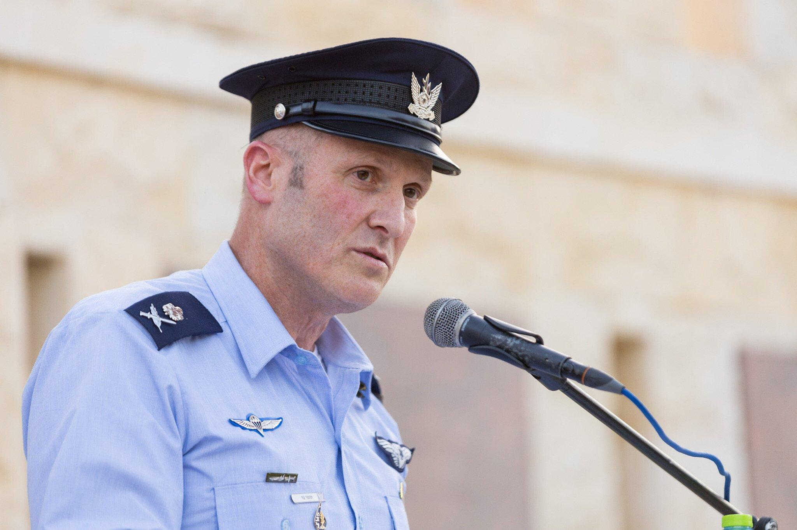
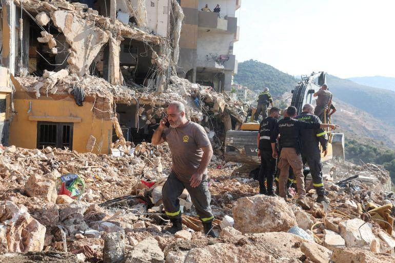
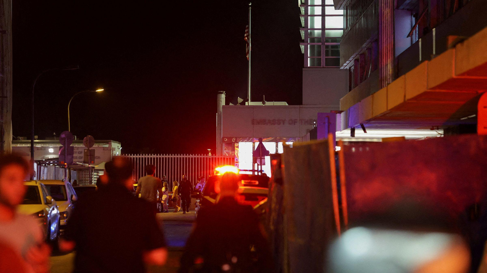
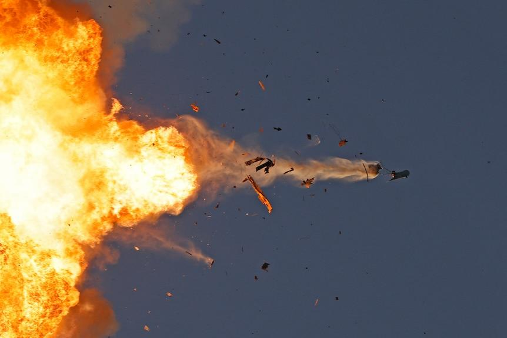

## Claim
Claim: "Commander of the Israeli Air Force, Major General Tomer Bar has been killed by Hеzbollаh in Tel Aviv in a drone attack in November 2024."

## Actions
```
image_search("Tomer Bar")
image_search("Tomer Bar killed")
```

## Evidence
### Evidence from `image_search`
The search results include images of Major General Tomer Bar. One image is from DVIDS Hub ([https://www.dvidshub.net/image/7332048/csaf-attends-riat-2022](https://www.dvidshub.net/image/7332048/csaf-attends-riat-2022)) , and another is from The Times of Israel ([https://www.timesofisrael.com/air-force-chief-reportedly-vows-to-keep-politics-away-from-service/](https://www.timesofisrael.com/air-force-chief-reportedly-vows-to-keep-politics-away-from-service/)) .


## Elaboration
The image search results confirm the existence of Major General Tomer Bar. However, the search results do not provide any information about his death or any attacks.

The claim cannot be verified with the available evidence. Additional information is needed to confirm the alleged attack and the death of Major General Tomer Bar.


## Actions
```
image_search("Tomer Bar death November 2024")
image_search("Hеzbollаh drone attack Tel Aviv November 2024")
```

## Evidence
### Evidence from `image_search`
Al Jazeera reports on Hеzbollаh drone attacks targeting Tel Aviv, including an image of a destroyed building () ([https://www.aljazeera.com/news/2024/11/7/hezbollah-attack-drones-target-tel-aviv-army-base-as-israel-pounds-lebanon](https://www.aljazeera.com/news/2024/11/7/hezbollah-attack-drones-target-tel-aviv-army-base-as-israel-pounds-lebanon)). CNN reports on an explosion in Tel Aviv () ([https://www.cnn.com/2024/07/19/middleeast/israel-tel-aviv-explosion-us-embassy-intl-hnk](https://www.cnn.com/2024/07/19/middleeast/israel-tel-aviv-explosion-us-embassy-intl-hnk)). ABC News published an article about an air strike () ([https://www.abc.net.au/news/2024-08-25/air-strike-inside-lebanon-israel-says/104267610](https://www.abc.net.au/news/2024-08-25/air-strike-inside-lebanon-israel-says/104267610)).


## Elaboration
The new evidence reveals reports of Hеzbollаh drone attacks on Tel Aviv and explosions in the city. However, there is no mention of Major General Tomer Bar being killed in any of these attacks.

The claim remains unverified. The evidence confirms attacks in Tel Aviv but does not link them to the death of Major General Tomer Bar.


## Final Judgement
The image searches confirm the existence of Major General Tomer Bar and report on attacks in Tel Aviv. However, there is no evidence to support the claim that Major General Tomer Bar was killed in a drone attack in November 2024.

The decision option that best applies is `false`.


### Verdict: FALSE

### Justification
The fact-check reveals that while Major General Tomer Bar exists and there have been reports of attacks in Tel Aviv, there is no evidence to support the claim that he was killed in a drone attack in November 2024. The search results from sources like [Al Jazeera](https://www.aljazeera.com/news/2024/11/7/hezbollah-attack-drones-target-tel-aviv-army-base-as-israel-pounds-lebanon) and [CNN](https://www.cnn.com/2024/07/19/middleeast/israel-tel-aviv-explosion-us-embassy-intl-hnk) confirm attacks but do not mention his death.
