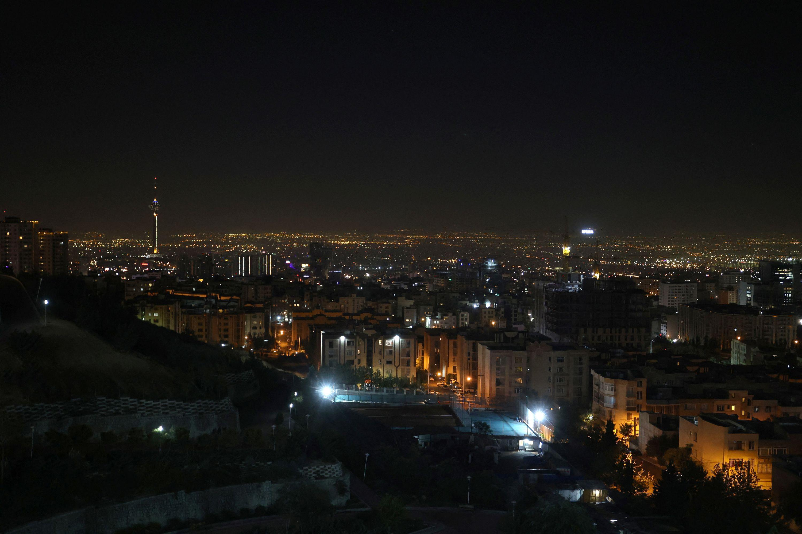

## Claim
Claim: " This image shows Israel bombing Tehran on October 26, 2024."

## Actions
```
reverse_search()
image_search("Tehran bombing October 26 2024")
```

## Evidence
### Evidence from `reverse_search`
The image in the claim () appears in articles about a fire at an oil refinery near Tehran. The Times of Israel ([https://www.timesofisrael.com/liveblog_entry/huge-fire-at-refinery-near-tehran-extinguished-after-20-hours-report/](https://www.timesofisrael.com/liveblog_entry/huge-fire-at-refinery-near-tehran-extinguished-after-20-hours-report/)), The Globe and Mail ([https://www.theglobeandmail.com/world/article-massive-fire-breaks-out-at-oil-refinery-south-of-tehran/](https://www.theglobeandmail.com/world/article-massive-fire-breaks-out-at-oil-refinery-south-of-tehran/)), and The New Arab ([https://www.newarab.com/news/massive-fire-breaks-out-oil-refinery-near-irans-capital](https://www.newarab.com/news/massive-fire-breaks-out-oil-refinery-near-irans-capital)) all used the image in articles published on June 2, 2021. The image is credited to Atta Kenare/AFP/Getty Images.

The articles describe a fire at an oil refinery near Tehran. The claim that the image shows Israel bombing Tehran on October 26, 2024, is not supported by the provided sources.


### Evidence from `image_search`
CNN published an article on October 26, 2024, about Israel strikes in Iran. () Al Jazeera published an article on October 26, 2024, about Israel attacks, including an image of a destroyed ambulance. () The Institute for the Study of War (ISW) published a map showing IDF strikes around Tehran on October 26, 2024. ()

The articles can be found at the following URLs: [https://www.cnn.com/2024/10/26/middleeast/israel-strikes-iran-explainer-intl-hnk](https://www.cnn.com/2024/10/26/middleeast/israel-strikes-iran-explainer-intl-hnk), [https://www.aljazeera.com/news/liveblog/2024/10/26/live-israel-attacks-targets-across-iran-warns-tehran-against-retaliation](https://www.aljazeera.com/news/liveblog/2024/10/26/live-israel-attacks-targets-across-iran-warns-tehran-against-retaliation), and [https://www.understandingwar.org/backgrounder/iran-update-october-26-2024](https://www.understandingwar.org/backgrounder/iran-update-october-26-2024).


## Elaboration
The image in the claim (

## Final Judgement
The image in the claim is from a fire at an oil refinery near Tehran in 2021, not from an event on October 26, 2024. While there were reports of Israeli strikes in Iran on October 26, 2024, the image is not related to those events.

The claim misrepresents the origin and context of the image. Therefore, the most appropriate decision option is `false`.

### Verdict: FALSE

### Justification
The image in the claim is from a 2021 fire at an oil refinery near Tehran, as confirmed by reverse image searches and articles from sources like The Times of Israel ([https://www.timesofisrael.com/liveblog_entry/huge-fire-at-refinery-near-tehran-extinguished-after-20-hours-report/](https://www.timesofisrael.com/liveblog_entry/huge-fire-at-refinery-near-tehran-extinguished-after-20-hours-report/)). While there were reports of Israeli strikes in Iran on October 26, 2024, the image is unrelated to those events.
