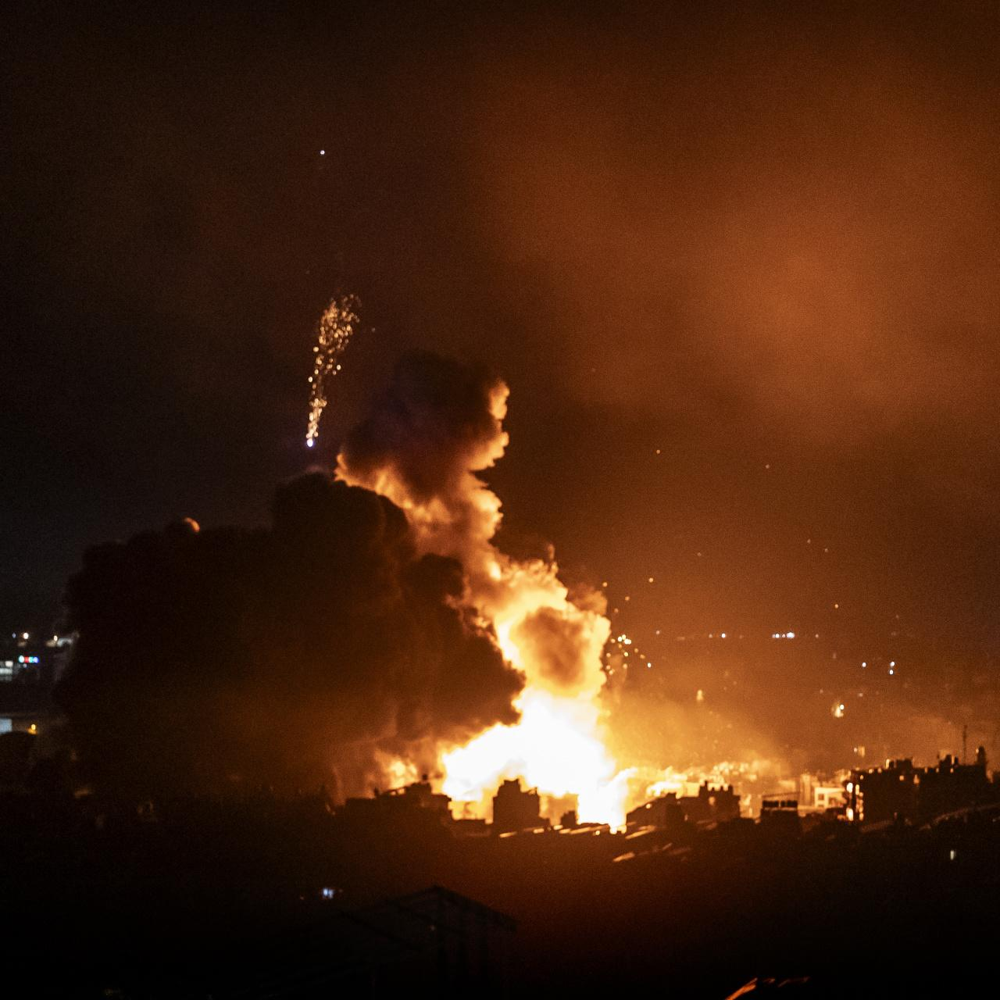

## Claim
Claim: " This image shows the remains of Nasrallah's ring after being killed in an Israeli airstrike in Beirut on September 28, 2024."

## Actions
```
reverse_search()
image_search("Nasrallah ring Israeli airstrike Beirut")
```

## Evidence
### Evidence from `reverse_search`
The image () shows a ring and fragments. According to [Khabaronline.ir](https://www.khabaronline.ir/news/1890386/%D8%B9%DA%A9%D8%B3%DB%8C-%D8%AA%D9%84%D8%AE-%D8%A7%D8%B2-%D8%A7%D9%86%DA%AF%D8%B4%D8%AA%D8%B1-%D8%A8%D8%B1%D8%AC%D8%A7%DB%8C-%D9%85%D8%A7%D9%86%D8%AF%D9%87-%D8%A7%D8%B2-%D8%B3%D8%B1%D8%AF%D8%A7%D8%B1-%D8%B2%D8%A7%D9%87%D8%AF%DB%8C-%D8%A8%D8%B9%D8%AF-%D8%A7%D8%B2-%D8%B4%D9%87%D8%A7%D8%AF%D8%AA-%D9%87%D8%AF%DB%8C%D9%87), [Etemadonline.com](https://www.etemadonline.com/%D8%A8%D8%AE%D8%B4-%D8%B3%DB%8C%D8%A7%D8%B3%DB%8C-9/655901-%D8%A7%D9%86%DA%AF%D8%B4%D8%AA%D8%B1-%D8%A7%D9%87%D8%AF%D8%A7%DB%8C%DB%8C-%D8%B4%D9%87%DB%8C%D8%AF%D8%B2%D8%A7%D9%87%D8%AF%DB%8C-%D8%AD%D9%85%D9%84%D9%87-%D8%A7%D8%B3%D8%B1%D8%A7%D8%A6%DB%8C%D9%84) and [598.ir](https://www.598.ir/fa/news/535490/%D8%AA%D8%B5%D9%88%DB%8C%D8%B1%DB%8C-%D8%A7%D8%B2-%D8%A7%D9%86%DA%AF%D8%B4%D8%AA%D8%B1-%D8%B4%D9%87%DB%8C%D8%AF-%D8%B2%D8%A7%D9%87%D8%AF%DB%8C), the image depicts the ring of General Mohammad Reza Zahedi, who was killed in an Israeli airstrike in Damascus. The ring was received as a gift from Imam Reza's shrine the night before his death.


### Evidence from `image_search`
The Wall Street Journal published an image of an Israeli airstrike in Beirut.  Defense News reports that Hezbollah confirmed leader Hassan Nasrallah was killed in an Israeli airstrike. 


## Elaboration
The image (

## Final Judgement
The image shows the ring of General Mohammad Reza Zahedi, who was killed in an Israeli airstrike in Damascus, not Nasrallah's ring after an airstrike in Beirut. The image search also shows that there was an Israeli airstrike in Beirut.

The claim is demonstrably false because the image is misrepresented. `false`

### Verdict: FALSE

### Justification
The image in the claim depicts the ring of General Mohammad Reza Zahedi, who was killed in an Israeli airstrike in Damascus, not Nasrallah's ring after an airstrike in Beirut, as confirmed by sources like [Khabaronline.ir](https://www.khabaronline.ir/news/1890386/%D8%B9%DA%A9%D8%B3%DB%8C-%D8%AA%D9%84%D8%AE-%D8%A7%D8%B2-%D8%A7%D9%86%DA%AF%D8%B4%D8%AA%D8%B1-%D8%A8%D8%B1%D8%AC%D8%A7%DB%8C-%D9%85%D8%A7%D9%86%D8%AF%D9%87-%D8%A7%D8%B2-%D8%B3%D8%B1%D8%AF%D8%A7%D8%B1-%D8%B2%D8%A7%D9%87%D8%AF%DB%8C-%D8%A8%D8%B9%D8%AF-%D8%A7%D8%B2-%D8%B4%D9%87%D8%A7%D8%AF%D8%AA-%D9%87%D8%AF%DB%8C%D9%87), [Etemadonline.com](https://www.etemadonline.com/%D8%A8%D8%AE%D8%B4-%D8%B3%DB%8C%D8%A7%D8%B3%DB%8C-9/655901-%D8%A7%D9%86%DA%AF%D8%B4%D8%AA%D8%B1-%D8%A7%D9%87%D8%AF%D8%A7%DB%8C%DB%8C-%D8%B4%D9%87%DB%8C%D8%AF%D8%B2%D8%A7%D9%87%D8%AF%DB%8C-%D8%AD%D9%85%D9%84%D9%87-%D8%A7%D8%B3%D8%B1%D8%A7%D8%A6%DB%8C%D9%84) and [598.ir](https://www.598.ir/fa/news/535490/%D8%AA%D8%B5%D9%88%DB%8C%D8%B1%DB%8C-%D8%A7%D8%B2-%D8%A7%D9%86%DA%AF%D8%B4%D8%AA%D8%B1-%D8%B4%D9%87%DB%8C%D8%AF-%D8%B2%D8%A7%D9%87%D8%AF%DB%8C).
