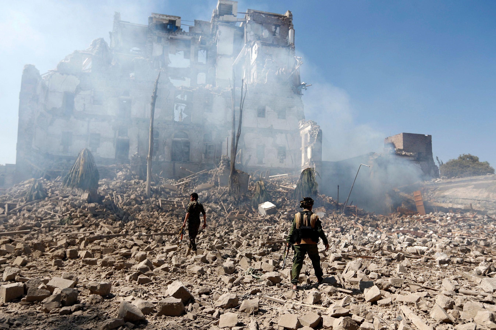

## Claim
Claim: " This image shows the U.S. bombarding Yemen on December 22, 2024 in reprisal after Yemen launched an attack on Israel's capital."

## Actions
```
reverse_search()
image_search("bombing in Yemen December 22 2024")
```

## Evidence
### Evidence from `reverse_search`
The image 

### Evidence from `image_search`
On December 22, 2024, the U.S. CENTCOM conducted airstrikes targeting Houthi military facilities and weapons systems in Sanaa, Yemen. () CNN reported on US strikes in Yemen. ()

The provided image () is not mentioned in the summaries.


## Elaboration
The evidence confirms that the U.S. conducted airstrikes in Yemen on December 22, 2024. However, the provided image is not mentioned in the search results. Therefore, the claim that the image shows the U.S. bombarding Yemen on December 22, 2024, cannot be verified.

The claim also states that the airstrikes were in reprisal after Yemen launched an attack on Israel's capital. The evidence does not mention the reason for the airstrikes.

Insufficient information is available to verify the claim.


## Actions
```
geolocate()
```

## Evidence
### Evidence from `geolocate`
The most likely countries where the image was taken are: {'Palestine': 0.55, 'Israel': 0.3, 'United Arab Emirates': 0.1, 'Jordan': 0.02, 'Albania': 0.0, 'Andorra': 0.0, 'Argentina': 0.0, 'Australia': 0.0, 'Austria': 0.0, 'Bangladesh': 0.0}

## Elaboration
The geolocation of the image suggests it was most likely taken in Palestine or Israel. This contradicts the claim that the image shows a bombing in Yemen. The evidence also does not provide any information about the reason for the airstrikes.


## Final Judgement
The image is likely from Palestine or Israel, not Yemen, as the claim suggests. The evidence confirms that the U.S. conducted airstrikes in Yemen on December 22, 2024, but the provided image is not mentioned in the search results. The claim also states that the airstrikes were in reprisal after Yemen launched an attack on Israel's capital, but the evidence does not mention the reason for the airstrikes.

`false`

### Verdict: FALSE

### Justification
The image in the claim is likely from Palestine or Israel, not Yemen, as indicated by the geolocation results. While the U.S. did conduct airstrikes in Yemen on December 22, 2024, the provided image is not associated with those strikes, and the claim's assertion about the cause of the airstrikes is not supported by the evidence. Therefore, the claim is false.
