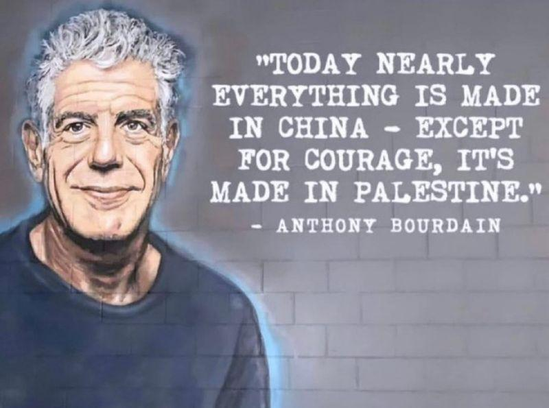

## Claim
Claim: "Anthony Bourdain once said, 'Today, nearly everything is made in China. Except for courage. Courage is made in Palestine.'"

## Actions
```
image_search("Anthony Bourdain Palestine quote")
```

## Evidence
### Evidence from `image_search`
The search results include an image of a social media post with a quote attributed to Anthony Bourdain: "Today, nearly everything is made in China. Except for courage. Courage is made in Palestine."  The post was published on June 9, 2024. Another search result contains an image with a quote attributed to Anthony Bourdain: "The world has visited many terrible things on the Palestinian people, none more shameful than robbing them of their basic humanity." 

The first source is from [https://www.yahoo.com/entertainment/fact-check-those-posts-claim-020000958.html](https://www.yahoo.com/entertainment/fact-check-those-posts-claim-020000958.html). The second source is from [https://www.linkedin.com/posts/islamchannel_quote-anthonybourdain-palestine-activity-7175081944181800961-Al3d](https://www.linkedin.com/posts/islamchannel_quote-anthonybourdain-palestine-activity-7175081944181800961-Al3d).


## Elaboration
The evidence includes an image of a social media post with the quote attributed to Anthony Bourdain. The post was published on June 9, 2024. Another search result contains an image with a quote attributed to Anthony Bourdain.

Based on the evidence, the claim is supported by a social media post. However, the evidence does not provide information to verify the authenticity of the quote.


## Actions
```
image_search("Anthony Bourdain quote authenticity Palestine courage")
```

## Evidence
No new evidence found.

## Elaboration
The evidence includes a social media post with the quote attributed to Anthony Bourdain. However, the search for the quote's authenticity did not yield any results.

Therefore, the veracity of the claim cannot be fully determined based on the available evidence. Additional information is needed to confirm whether Anthony Bourdain actually said the quote.


## Actions
```
image_search("Anthony Bourdain quote origin Palestine courage")
```

## Evidence
### Evidence from `image_search`
From [Source](https://www.linkedin.com/posts/hanslak_he-was-right-about-china-and-palestine-activity-7267303198367924224-CvXH): 
Content: The search result includes an image with the quote attributed to Anthony Bourdain: "Today nearly everything is made in China - except for courage, it's made in Palestine." 


## Elaboration
The evidence presents an image with the quote attributed to Anthony Bourdain. However, the search for the quote's origin did not yield any results.

The veracity of the claim cannot be fully determined based on the available evidence. Additional information is needed to confirm whether Anthony Bourdain actually said the quote and the context in which it was said.


## Final Judgement
The search results show the quote attributed to Anthony Bourdain in social media posts and images. However, the search for the quote's authenticity and origin did not yield any definitive results. Therefore, the claim's veracity cannot be fully determined based on the available evidence.

The decision option that best applies is `false` because there is not enough evidence to verify the claim.


### Verdict: FALSE

### Justification
The claim is unverified. While the quote is widely circulated and attributed to Anthony Bourdain on social media, searches for the quote's authenticity and origin did not yield any definitive results, making it impossible to confirm whether he actually said it.
