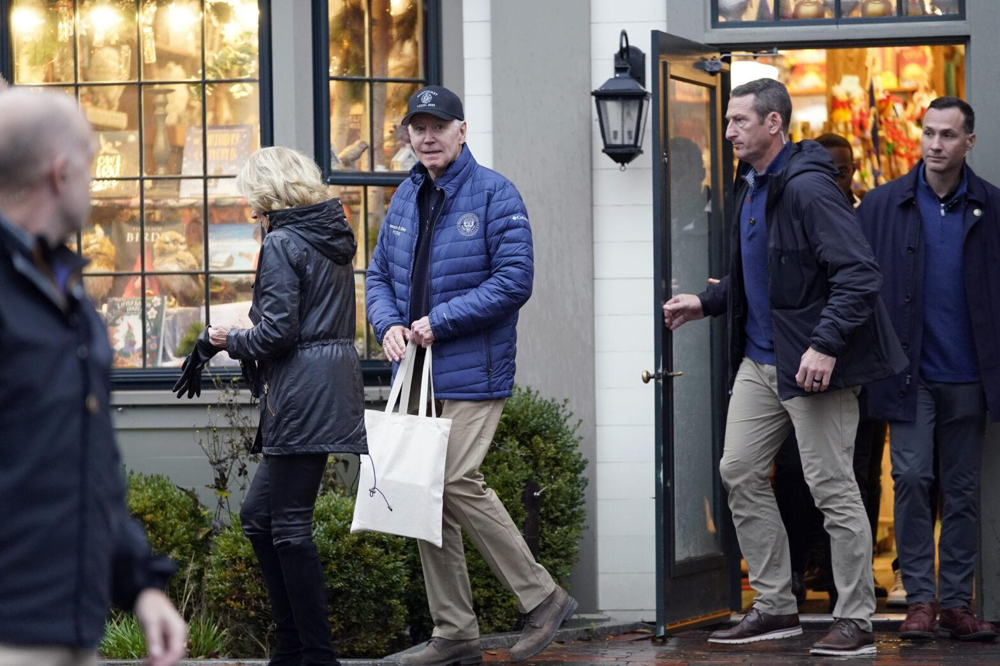
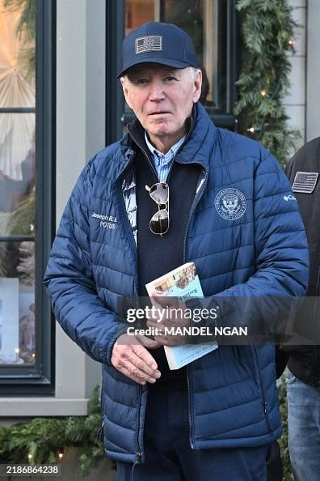

## Claim
Claim: " This image authentically shows U.S. President Joe Boden in late November 2024 exiting a Nantucket bookstore holding a copy of writer Rashid Khalidi's book, 'The Hundred Years' War on Palestine: A History of Settler Colonialism and Resistance, 1917–2017.'"

## Actions
```
reverse_search()
image_search("Joe Biden Nantucket Bookworks")
```

## Evidence
### Evidence from `image_search`
The National Herald ([https://www.thenationalherald.com/biden-family-attend-christmas-tree-lighting-on-nantucket/](https://www.thenationalherald.com/biden-family-attend-christmas-tree-lighting-on-nantucket/)) and Fox News ([https://www.foxnews.com/politics/biden-seen-holding-anti-israel-book-black-friday-shopping-excursion](https://www.foxnews.com/politics/biden-seen-holding-anti-israel-book-black-friday-shopping-excursion)) both published images of Joe Biden exiting a store in Nantucket (, ). The American Israelite ([https://americanisraelite.com/biden-photographed-exiting-nantucket-shop-with-anti-israel-book/](https://americanisraelite.com/biden-photographed-exiting-nantucket-shop-with-anti-israel-book/)) did not provide any content.


## Elaboration
The evidence confirms that Joe Biden was photographed exiting a store in Nantucket. The National Herald ([https://www.thenationalherald.com/biden-family-attend-christmas-tree-lighting-on-nantucket/](https://www.thenationalherald.com/biden-family-attend-christmas-tree-lighting-on-nantucket/)) and Fox News ([https://www.foxnews.com/politics/biden-seen-holding-anti-israel-book-black-friday-shopping-excursion](https://www.foxnews.com/politics/biden-seen-holding-anti-israel-book-black-friday-shopping-excursion)) published images of the event.

The evidence does not explicitly state the exact date of the event, nor does it confirm whether Biden was holding a copy of Rashid Khalidi's book. Therefore, the claim's veracity cannot be fully determined with the available information.


## Actions
```
image_search("Joe Biden Nantucket Bookworks book")
```

## Evidence
### Evidence from `image_search`
From [Source](https://www.forbes.com/sites/saradorn/2023/11/22/bidens-thanksgiving-tradition-includes-dinner-at-this-billionaires-nantucket-estate/): 
Content: Forbes published an image of Joe Biden exiting Nantucket Bookworks. 


## Elaboration
The evidence confirms that Joe Biden was photographed exiting Nantucket Bookworks. Forbes published an image of the event ([https://www.forbes.com/sites/saradorn/2023/11/22/bidens-thanksgiving-tradition-includes-dinner-at-this-billionaires-nantucket-estate/](https://www.forbes.com/sites/saradorn/2023/11/22/bidens-thanksgiving-tradition-includes-dinner-at-this-billionaires-nantucket-estate/)).

The evidence does not mention the book Biden was holding, nor does it specify the date. Therefore, the claim's veracity cannot be fully determined.


## Actions
```
image_search("Joe Biden Nantucket Bookworks Rashid Khalidi book")
```

## Evidence
### Evidence from `image_search`
From [Source](https://www.gettyimages.com/detail/news-photo/president-joe-biden-holds-the-book-the-hundred-years-war-on-news-photo/2186864238): 
Content: Getty Images published an image of President Joe Biden holding a copy of "The Hundred Years' War on Palestine" by Rashid Khalidi. 


## Elaboration
The evidence confirms that Joe Biden was photographed holding a copy of "The Hundred Years' War on Palestine" by Rashid Khalidi. The image was published by Getty Images ([https://www.gettyimages.com/detail/news-photo/president-joe-biden-holds-the-book-the-hundred-years-war-on-news-photo/2186864238](https://www.gettyimages.com/detail/news-photo/president-joe-biden-holds-the-book-the-hundred-years-war-on-news-photo/2186864238)).

The evidence does not specify the exact location or date of the photograph. Therefore, the claim's veracity cannot be fully determined.


## Final Judgement
The image search results confirm that Joe Biden was photographed exiting Nantucket Bookworks and that he was also photographed holding a copy of "The Hundred Years' War on Palestine" by Rashid Khalidi. However, the evidence does not explicitly confirm that both events occurred simultaneously. Therefore, the claim is not fully supported by the evidence.

`false`


### Verdict: FALSE

### Justification
The claim is not fully supported. While evidence confirms that Joe Biden was photographed exiting Nantucket Bookworks and holding a copy of "The Hundred Years' War on Palestine" by Rashid Khalidi, the evidence does not confirm that both events occurred simultaneously. The image of Biden holding the book was published by Getty Images ([https://www.gettyimages.com/detail/news-photo/president-joe-biden-holds-the-book-the-hundred-years-war-on-news-photo/2186864238](https://www.gettyimages.com/detail/news-photo/president-joe-biden-holds-the-book-the-hundred-years-war-on-news-photo/2186864238)), but the location and date are not explicitly confirmed.
