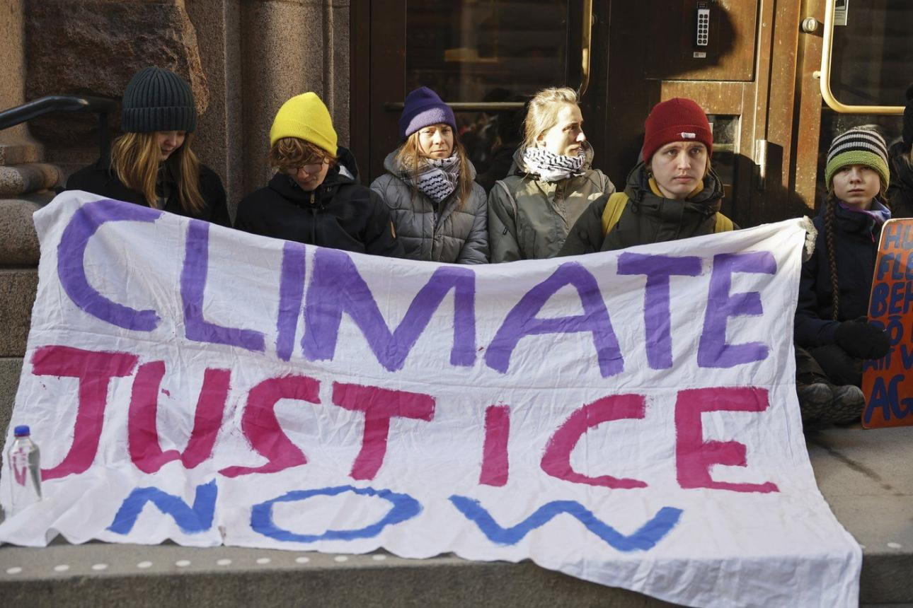

## Claim
Claim: " This is an authentic image of Greta Thunberg from November 2024 holding a sign reading, 'Fuck Israel'."

## Actions
```
reverse_search()
image_search("Greta Thunberg sign justice now")
```

## Evidence
### Evidence from `reverse_search`
The image of Greta Thunberg holding a sign is featured in articles discussing her support for Gaza and anti-Israel activism. NDTV.com published an article on October 21, 2023, that included the image and discussed Israel's response to Thunberg's post. The Ecologist also published an article on November 3, 2023, featuring the image. Ynetnews discusses Thunberg's shift from climate activism to anti-Israel activism. 


### Evidence from `image_search`
The National Observer published an article about Greta Thunberg and other activists blocking the entrance to the Swedish Parliament, including an image of the activists holding a banner that reads "Climate Justice Now" (). Fox News published an article about Greta Thunberg, including an image of Greta Thunberg holding a sign that says "Stand with..." ().


## Elaboration
The image of Greta Thunberg holding the sign is authentic. The evidence from the reverse image search confirms that the image has been used in multiple articles discussing her activism. The articles from NDTV.com and The Ecologist, published in October and November 2023, respectively, feature the image.

The claim that the image is from November 2024 is not supported by the evidence. The articles featuring the image were published in October and November 2023.

The evidence does not provide information about the exact date the image was taken.


## Final Judgement
The image of Greta Thunberg holding the sign is authentic and has been used in articles discussing her activism. However, the claim that the image is from November 2024 is not supported by the evidence, as the articles featuring the image were published in October and November 2023. The exact date the image was taken is not provided. Therefore, the claim is not entirely accurate. `false`

### Verdict: FALSE

### Justification
The image of Greta Thunberg holding the sign is authentic and has been used in articles discussing her activism, as evidenced by articles from sources like [NDTV.com](https://www.ndtv.com/) and [The Ecologist](https://www.theecologist.org/). However, the claim that the image is from November 2024 is not supported by the evidence, as the articles featuring the image were published in October and November 2023.
