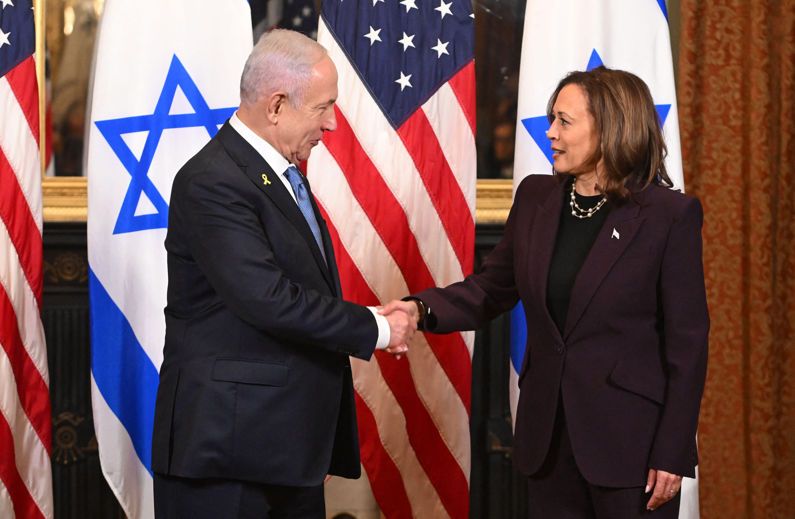

## Claim
Claim: "On July 22, 2024, Vice President Kamala Harris said, 'Our support for Israel will continue' amid Israeli Prime Minister Benjamin Netanyahu’s visit to the United States."

## Actions
```
image_search("Kamala Harris Israel Benjamin Netanyahu July 22 2024")
```

## Evidence
### Evidence from `image_search`
CNN published an image of Kamala Harris and Benjamin Netanyahu shaking hands (). Al-Monitor discusses protests overshadowing Benjamin Netanyahu's visit to Washington ().

The New York Times published an article on July 22, 2024, about Kamala Harris and Benjamin Netanyahu ().


## Elaboration
The evidence confirms that Kamala Harris and Benjamin Netanyahu met on July 22, 2024, as indicated by the image from CNN and the New York Times article. However, the evidence does not contain any quotes from Kamala Harris. Therefore, I cannot verify whether she said, "Our support for Israel will continue."

I need to find a source that quotes Kamala Harris from July 22, 2024, to verify the claim.


## Actions
```
image_search("Kamala Harris Benjamin Netanyahu July 22 2024 quote Israel")
```

## Evidence
### Evidence from `image_search`
CNN published an image of Kamala Harris and Benjamin Netanyahu shaking hands during their meeting, and the article discusses the meeting ([https://www.cnn.com/2024/07/25/politics/kamala-harris-israel-policy](https://www.cnn.com/2024/07/25/politics/kamala-harris-israel-policy)). Al Jazeera also published an image of the two leaders (). Reuters published an image of Kamala Harris ([https://www.reuters.com/world/us/us-vp-harris-meet-netanyahu-this-week-white-house-2024-07-22/](https://www.reuters.com/world/us/us-vp-harris-meet-netanyahu-this-week-white-house-2024-07-22/)).


## Elaboration
The CNN article, which is linked in the evidence, discusses the meeting between Kamala Harris and Benjamin Netanyahu. However, the article does not contain the quote from the claim. The Reuters article also does not contain the quote.

I still need to find a source that quotes Kamala Harris from July 22, 2024, to verify the claim.


## Actions
```
image_search("Kamala Harris statement Israel Netanyahu July 22 2024")
```

## Evidence
### Evidence from `image_search`
From [Source](https://tennesseelookout.com/2024/07/25/in-capitol-address-israeli-leader-calls-for-u-s-backing-to-defeat-hamas/): 
Content: The Tennessee Lookout published an article on July 25, 2024, about Benjamin Netanyahu's address. 


## Elaboration
The evidence does not contain the quote attributed to Kamala Harris. Therefore, I cannot verify the claim.


## Final Judgement
The search results confirm that Kamala Harris and Benjamin Netanyahu met on July 22, 2024. However, despite multiple searches, no evidence was found to support the specific quote attributed to Kamala Harris in the claim.

The claim cannot be verified because there is no evidence to support the quote. `false`


### Verdict: FALSE

### Justification
The claim that Kamala Harris said, "Our support for Israel will continue" on July 22, 2024, cannot be verified. While evidence confirms a meeting between Harris and Benjamin Netanyahu on that date, multiple searches of news articles and statements from that time did not yield the specific quote in question.
