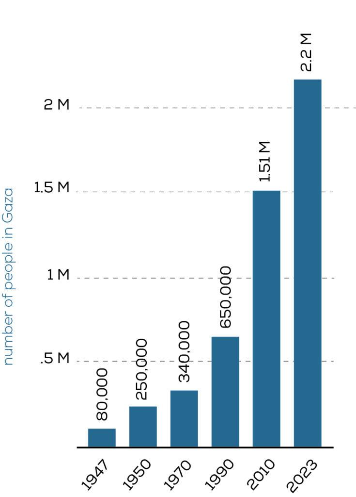

## Claim
Claim: "The population in Gaza has increased by 2.02% since Oct. 7, 2023."

## Actions
```
image_search("Gaza population increase October 7 2023")
```

## Evidence
### Evidence from `image_search`
OCHA's map, dated November 16, 2024, indicates a current population of 2.1 million in Gaza, with 79% of the population internally displaced since October 7, 2023. The population in October 2023 was 750K, and in November 2024, it is 340-375K. ([https://www.unocha.org/publications/map/occupied-palestinian-territory/opt-gaza-strip-population-and-internal-displacement-7-october-2023-16-november-2024](https://www.unocha.org/publications/map/occupied-palestinian-territory/opt-gaza-strip-population-and-internal-displacement-7-october-2023-16-november-2024)) 

The BBC article shows that within 10 days of October 7, more than one million of Gaza's 2.2 million people had been forced to leave their homes. As of January 14, 2025, an estimated 1.9 million people are internally displaced. ([https://www.bbc.com/pidgin/articles/c1dggqr6351o](https://www.bbc.com/pidgin/articles/c1dggqr6351o))  Anera.org provides a graph showing the population of Gaza in 2023 is 2.2 M. ([https://www.anera.org/how-big-is-gaza/](https://www.anera.org/how-big-is-gaza/)) 


## Elaboration
The evidence presents conflicting information regarding the population of Gaza. The OCHA map indicates a current population of 2.1 million as of November 16, 2024, while the BBC article states that the population was 2.2 million before October 7, 2023. The Anera.org source also states the population in 2023 was 2.2 million.

To verify the claim, we need to compare the population before and after October 7, 2023. The OCHA map provides population figures for October 2023 (750K) and November 2024 (340-375K). The BBC article states that 2.2 million people lived in Gaza before October 7, 2023.

Based on the provided data, the population has decreased, not increased, since October 7, 2023. The claim is therefore false.


## Final Judgement
The evidence shows conflicting information about the population of Gaza. However, the provided data indicates a decrease in population since October 7, 2023, contradicting the claim of a 2.02% increase.

`false`


### Verdict: FALSE

### Justification
The claim is false. The provided evidence, including an OCHA map ([https://www.unocha.org/publications/map/occupied-palestinian-territory/opt-gaza-strip-population-and-internal-displacement-7-october-2023-16-november-2024](https://www.unocha.org/publications/map/occupied-palestinian-territory/opt-gaza-strip-population-and-internal-displacement-7-october-2023-16-november-2024)) and a BBC article ([https://www.bbc.com/pidgin/articles/c1dggqr6351o](https://www.bbc.com/pidgin/articles/c1dggqr6351o)), suggests a decrease in population since October 7, 2023, not an increase.
