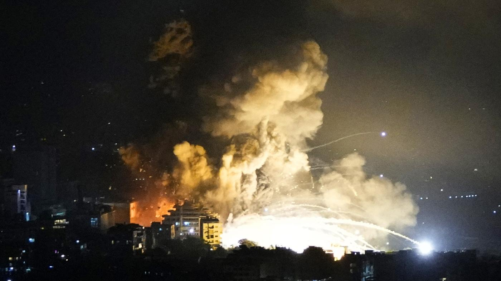
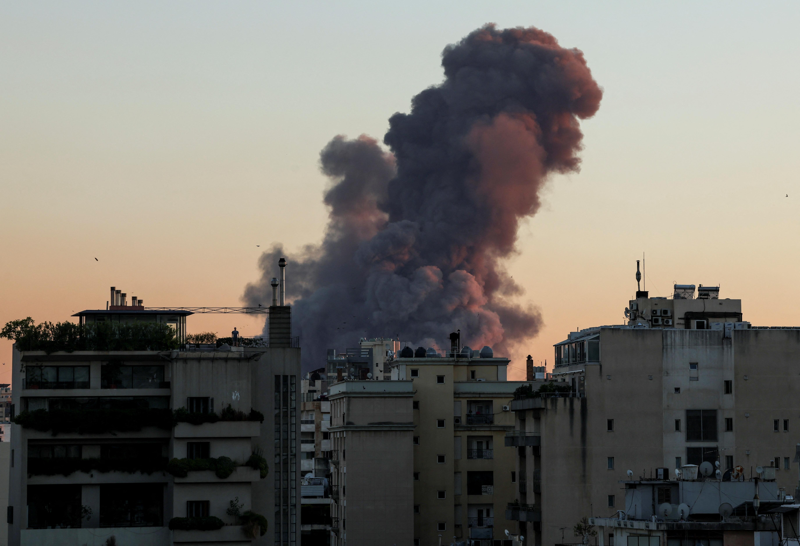

## Claim
Claim: " This image shows an Iphone that exploded during the pager attacks on Hezbollah devices in Lebanon in September 2024, blowing up random people."

## Actions
```
reverse_search()
image_search("iphone explosion hezbollah lebanon september 2024")
```

## Evidence
### Evidence from `reverse_search`
The image of the exploded iPhone () is featured in multiple articles discussing explosions in Lebanon. One article from DW.com ([https://www.dw.com/en/fact-check-no-iphones-solar-panels-laptops-exploded-in-lebanon/a-70281061](https://www.dw.com/en/fact-check-no-iphones-solar-panels-laptops-exploded-in-lebanon/a-70281061)) fact-checks the claim, stating the image is old and unrelated to the September 2024 attacks. Another article from ITC.ua ([https://itc.ua/en/news/not-just-pagers-iphones-laptops-electronic-locks-and-other-devices-exploded-in-lebanon-today/](https://itc.ua/en/news/not-just-pagers-iphones-laptops-electronic-locks-and-other-devices-exploded-in-lebanon-today/)) discusses explosions targeting electronic devices, including iPhones, and includes the image ().

The China Academy ([https://thechinaacademy.org/israels-pager-attack-has-cooked-western-led-globalization/](https://thechinaacademy.org/israels-pager-attack-has-cooked-western-led-globalization/)) also uses the image () in an article about the "pager attack," claiming it caused a trust crisis among Chinese consumers.


### Evidence from `image_search`
The Times of Israel published an article about Hezbollah device explosions, including an image of a burning vehicle (). NPR published an article on September 28, 2024, about Israel striking Hezbollah ().

Reuters published an article on September 27, 2024, about the ceasefire discussions in Lebanon, including an image of a large explosion in the sky ().


## Elaboration
The claim is partially supported by the evidence. The image of the exploded iPhone (

## Final Judgement
The image is associated with explosions in Lebanon, but the claim that it is directly related to the September 2024 attacks and caused by pager attacks is not fully supported. The image is old and has been used in different contexts. Therefore, the claim is misleading. `false`

### Verdict: FALSE

### Justification
The image of the exploded iPhone (