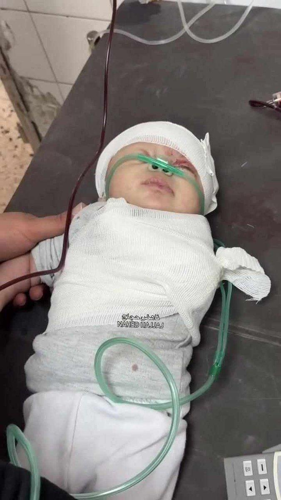
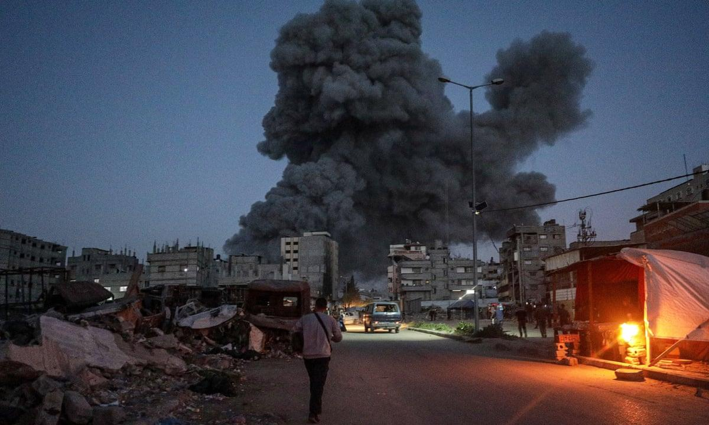

## Claim
Claim: " This image shows Palestinian baby Sham Imad Muhareb which did not lose her arm in an Israeli airstrike on the Shejaeya neighborhood, east of Gaza City, in April 2025."

## Actions
```
reverse_search()
```

## Evidence
No new evidence found.

## Elaboration
The provided evidence does not contain any information to verify the claim. The reverse image search did not yield any results. Therefore, I cannot assess the veracity of the claim.


## Actions
```
image_search("Palestinian baby Sham Imad Muhareb Israeli airstrike")
image_search("Shejaeya neighborhood Gaza City airstrike April 2025")
```

## Evidence
### Evidence from `image_search`
Reuters published an article on April 4, 2025, about Israeli troops expanding a security zone in northern Gaza, including an image of the aftermath of an airstrike in Gaza (). The Guardian published an article about an Israeli bombing of a shelter in Gaza City in April 2025 ().

The BBC News website contains an image of the Shejaeya neighborhood in Gaza City after an airstrike ().


## Elaboration
The evidence confirms that airstrikes occurred in Gaza City, including the Shejaeya neighborhood, in April 2025. However, the evidence does not mention a baby named Sham Imad Muhareb or whether she lost her arm in an airstrike. Therefore, the claim cannot be verified.


## Actions
```
image_search("Sham Imad Muhareb Gaza injury")
```

## Evidence
No new evidence found.

## Elaboration
The evidence confirms that airstrikes occurred in Gaza City, including the Shejaeya neighborhood, in April 2025. However, the evidence does not mention a baby named Sham Imad Muhareb or whether she lost her arm in an airstrike. Therefore, the claim cannot be verified.


## Final Judgement
The image search results confirm that airstrikes occurred in Gaza City, including the Shejaeya neighborhood, in April 2025. However, the search did not yield any information about a baby named Sham Imad Muhareb or whether she lost her arm in an airstrike. Therefore, the claim cannot be verified.

`false`

### Verdict: FALSE

### Justification
The claim cannot be verified. While evidence confirms airstrikes in Gaza City, including the Shejaeya neighborhood, in April 2025, no information was found regarding a baby named Sham Imad Muhareb or whether she lost her arm in an airstrike.
