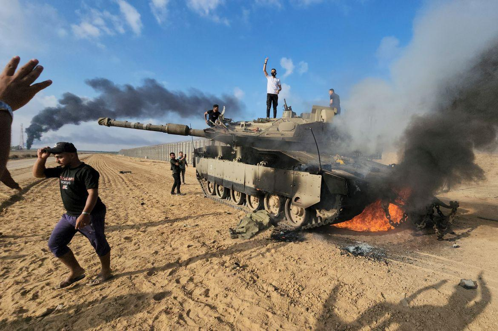
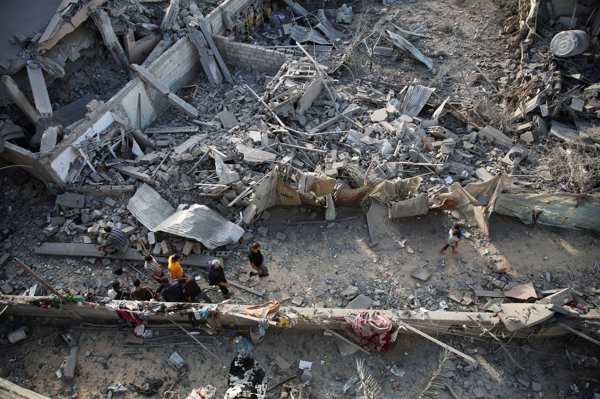
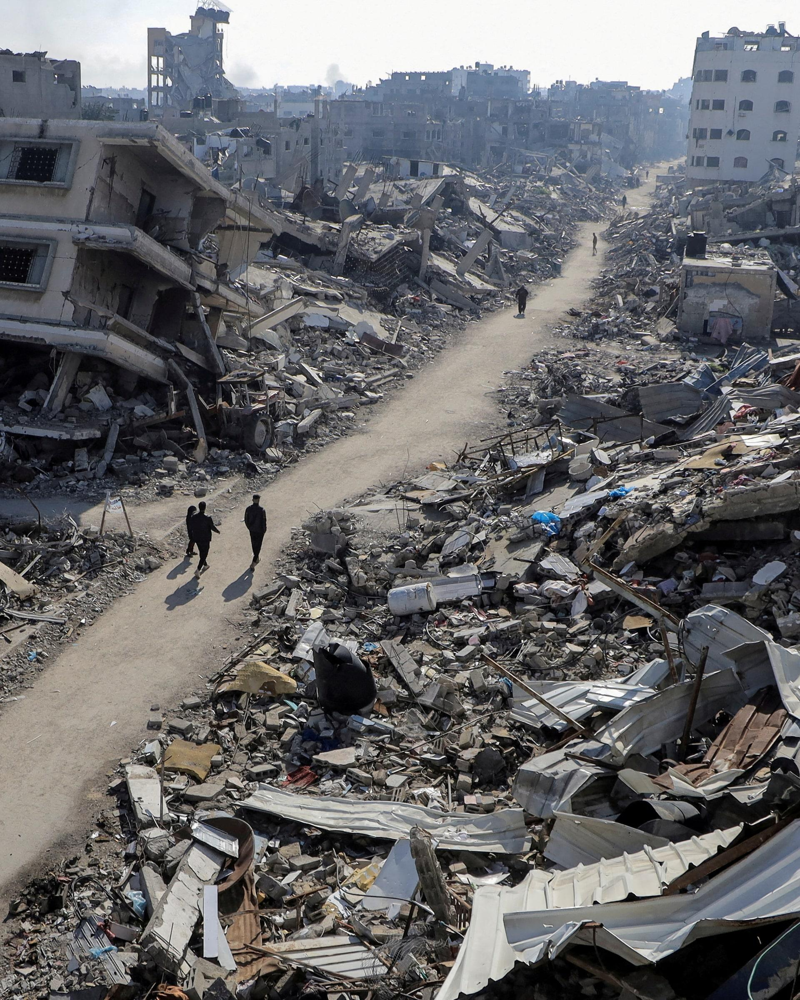
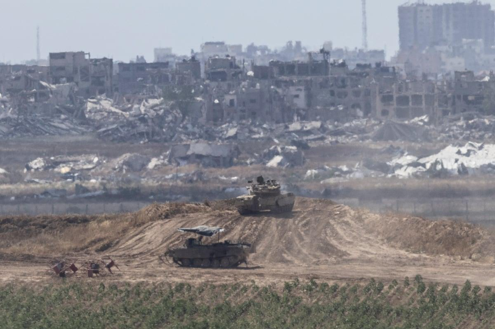
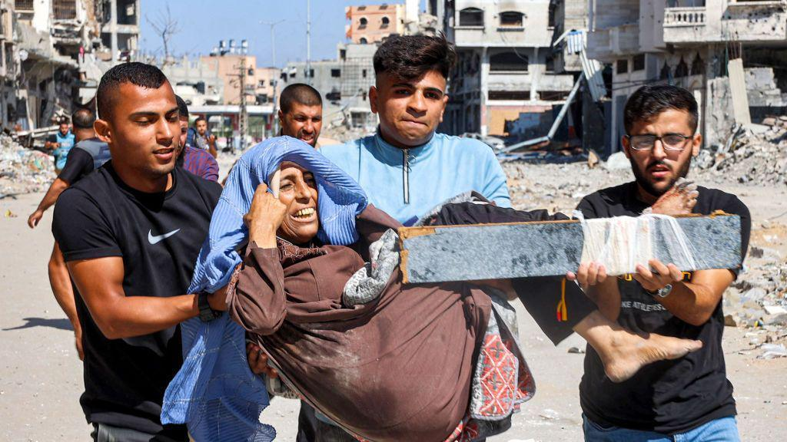
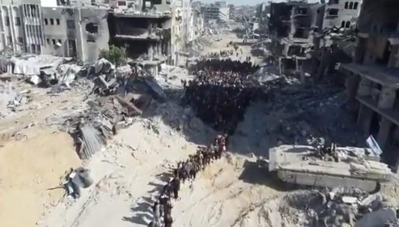
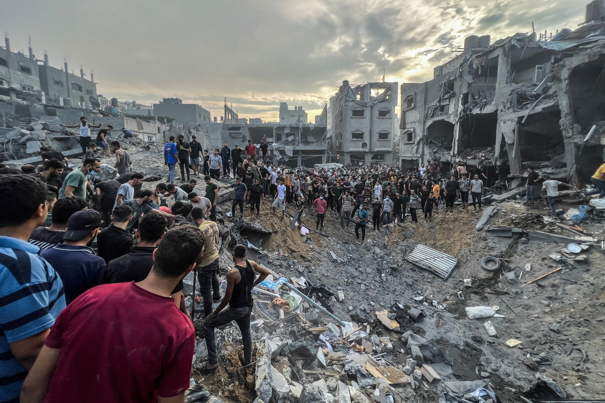

## Claim
Claim: " This image shows an Israeli tank unit near Jabalia camp in northern Gaza that was successfully ambushed by Hamas fighters, destroying multiple vehicles and injuring or killing their crews in October 2024."

## Actions
```
reverse_search()
image_search("Israeli tank destroyed Gaza October 2024")
```

## Evidence
### Evidence from `reverse_search`
The image 

### Evidence from `image_search`
Al Jazeera published an image of a destroyed Israeli tank in Gaza (). Business Insider published an article about Israeli troops in Gaza, including an image of an Israeli tank (). Reuters published an article on October 2, 2024, about the conflict in Gaza ().


## Elaboration
The evidence confirms that there were Israeli tanks in Gaza and that there was conflict in Gaza in October 2024. However, the evidence does not confirm the specific details of the claim, such as the location of the tank, the involvement of Hamas fighters, or the extent of the damage.

The image search results show images of destroyed Israeli tanks in Gaza, which supports the claim that Israeli tanks were destroyed. However, the evidence does not provide enough information to verify the specific details of the claim.

More information is needed to verify the claim.


## Actions
```
image_search("Israeli tank Jabalia camp Hamas October 2024")
```

## Evidence
### Evidence from `image_search`
Reuters published an article on October 18, 2024, about Israel sending more troops into northern Gaza, including an image of the area (). El País published an article on May 14, 2024, about fighting against Hamas in northern Gaza, including an image of Israeli tanks (). The BBC published an image of people carrying an elderly woman in Gaza ().


## Elaboration
The new evidence confirms that Israeli tanks were present in Gaza and that there was fighting in northern Gaza in October 2024. However, the evidence does not confirm the specific details of the claim, such as the location of the tank near Jabalia camp, the involvement of Hamas fighters, or the extent of the damage.

The image search results show images of Israeli tanks in Gaza, which supports the claim that Israeli tanks were present. However, the evidence does not provide enough information to verify the specific details of the claim.

More information is still needed to verify the claim.


## Actions
```
image_search("Israeli tank destroyed Jabalia camp Hamas October 2024")
```

## Evidence
### Evidence from `image_search`
Le Monde published an article on October 27, 2024, about survivors fleeing from Jabalia refugee camp in Gaza, including an image of an Israeli tank . The Los Angeles Times published an article on October 31, 2023, about an Israeli strike on a Gaza refugee camp .


## Elaboration
The evidence confirms that Israeli tanks were present in the Jabalia refugee camp area in Gaza in October 2024. However, the evidence does not confirm that the tank in the image was destroyed by Hamas fighters. The evidence also does not confirm the extent of the damage or the casualties.

More information is still needed to verify the claim.


## Final Judgement
The evidence indicates that Israeli tanks were present in Gaza and near the Jabalia camp in October 2024. However, the provided evidence does not confirm that the tank in the image was destroyed by Hamas fighters, nor does it verify the extent of the damage or casualties. Therefore, the claim cannot be fully verified. `false`

### Verdict: FALSE

### Justification
The evidence confirms the presence of Israeli tanks in Gaza and near the Jabalia camp in October 2024, but it does not verify the claim that the tank in the image was destroyed by Hamas fighters, nor does it confirm the extent of the damage or casualties. Therefore, the claim is unverified.
