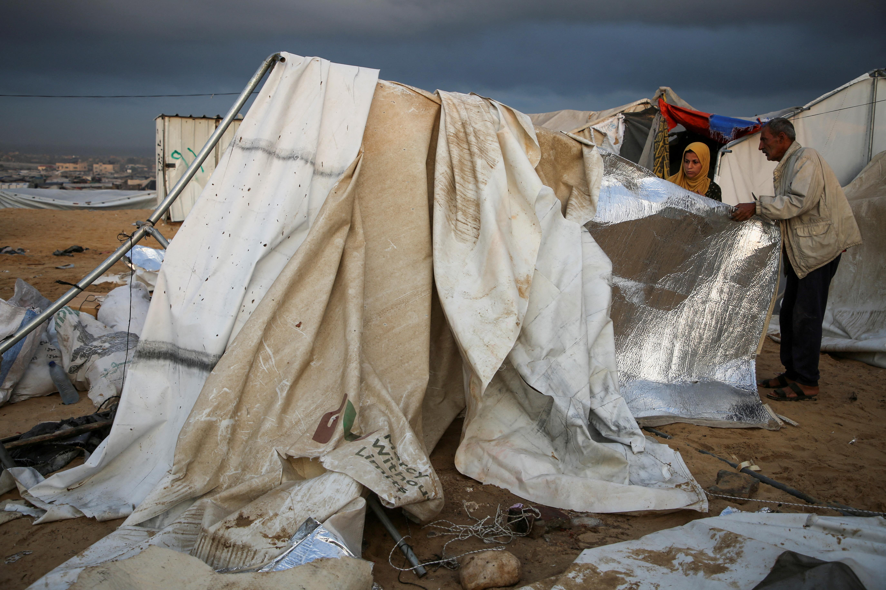
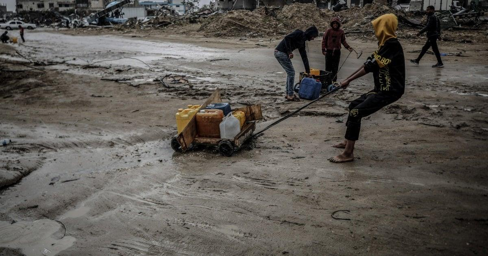
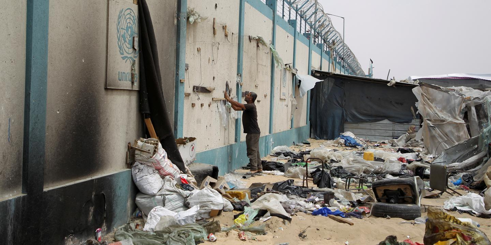

## Claim
Claim: " This image shows a Palestinian woman using an Israeli tank to dry clothes in Gaza in July 2024."

## Actions
```
reverse_search()
image_search("Israeli tank Palestinian woman Gaza")
geolocate()
```

## Evidence
### Evidence from `image_search`
The search results include an article from [DCI-Palestine](https://www.dci-palestine.org/israeli_tank_fired_shell_kills_palestinian_girl_in_gaza_hospital) with no content. Another article from [PBS](https://www.pbs.org/newshour/world/a-palestinian-woman-had-twins-after-trying-for-10-years-an-israeli-strike-killed-them-both) contains an image of two Palestinian women .

An article from [Al Jazeera](https://www.aljazeera.com/news/2025/2/24/israeli-tanks-roll-jenin-palestinians-prepare-lengthy-invasion) shows an Israeli tank .


### Evidence from `geolocate`
The most likely countries where the image was taken are: {'Palestine': 0.29, 'Tunisia': 0.26, 'Jordan': 0.19, 'United Arab Emirates': 0.09, 'Israel': 0.07, 'Pakistan': 0.04, 'China': 0.01, 'Albania': 0.0, 'Andorra': 0.0, 'Argentina': 0.0}

## Elaboration
The image search results show an Israeli tank and Palestinian women, which aligns with the claim. The geolocation data suggests the image was most likely taken in Palestine. However, the evidence does not confirm the image's date (July 2024) or the specific context of the woman using the tank to dry clothes.

Insufficient information is available to verify the claim's veracity.


## Actions
```
image_search("tank drying clothes Gaza")
image_search("Israeli tank Palestinian woman")
```

## Evidence
### Evidence from `image_search`
From [Source](https://www.reuters.com/world/middle-east/israel-kills-least-40-gaza-tanks-deepen-raid-north-2024-10-15/): 
Content: Reuters published an article on October 15, 2024, about the conflict in Gaza. The article includes an image of a tent .


## Elaboration
The image search results provide an article from Reuters dated October 15, 2024, about the conflict in Gaza. This suggests that the conflict was ongoing in October 2024. However, the article does not contain the image in the claim. The evidence still does not confirm the image's date (July 2024) or the specific context of the woman using the tank to dry clothes.

Insufficient information is available to verify the claim's veracity.


## Actions
```
image_search("tank drying clothes Gaza July 2024")
```

## Evidence
### Evidence from `image_search`
The search results include a report from Human Rights Watch published on December 19, 2024, about the situation in Gaza, with an image of people in Gaza (). Another result from Le Monde, published on June 5, 2024, discusses the war in Gaza and includes an image of a man near a damaged wall (). The UNRWA report has no content.


## Elaboration
The image search for "tank drying clothes Gaza July 2024" did not return the image in the claim. The search results include articles about the conflict in Gaza, but none of them contain the image or confirm the specific context described in the claim.

Insufficient information is available to verify the claim's veracity.


## Final Judgement
The image search results do not provide any evidence to support the claim that the image shows a Palestinian woman using an Israeli tank to dry clothes in Gaza in July 2024. The search results include articles about the conflict in Gaza, but none of them contain the image or confirm the specific context described in the claim. Therefore, the claim cannot be verified. `false`

### Verdict: FALSE

### Justification
The image search did not yield any results that corroborate the claim. While the search results mention the conflict in Gaza, they do not include the image in the claim or confirm the specific context of a Palestinian woman using an Israeli tank to dry clothes in July 2024. Therefore, the claim is unverified.
