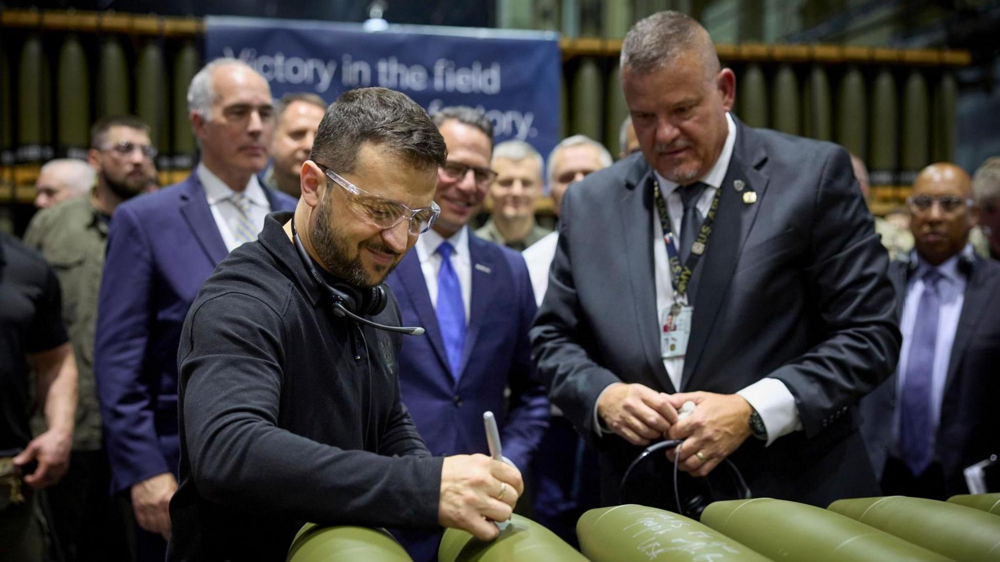

## Claim
Claim: " This image shows Ukrainian President Volodymyr Zelenskyy in March 2025 signing Israeli bombs intended for use against Palestinians in Gaza."

## Actions
```
reverse_search()
image_search("Zelenskyy signing bombs")
```

## Evidence
### Evidence from `reverse_search`
The image shows Ukrainian President Volodymyr Zelenskyy signing ammunition. The image was taken during a visit to an ammunition plant in Scranton, Pennsylvania, on September 23, 2024. The BBC News published articles on September 26, 2024, about Zelensky's meeting with Joe Biden, including the image of Zelensky signing ammunition. The Associated Press also published an article on September 25, 2024, discussing Speaker Johnson's demand for the removal of Ukraine's ambassador to the U.S. after Zelenskyy's visit to the ammunition plant.

The articles do not mention Israeli bombs or Gaza.

References: , , 


### Evidence from `image_search`
The Guardian published an image of Volodymyr Zelenskyy signing a bomb (). The BBC News website shows an image of Volodymyr Zelenskyy signing artillery shells ().

The Penn Capital-Star published an article about Volodymyr Zelenskyy's visit to an ammunition factory ().


## Elaboration
The claim is not supported by the evidence. The image shows Volodymyr Zelenskyy signing ammunition, not Israeli bombs. The event took place in September 2024, not March 2025. The evidence does not mention the bombs being intended for use against Palestinians in Gaza.


## Final Judgement
The image shows Volodymyr Zelenskyy signing ammunition during a visit to an ammunition plant in September 2024. The claim misrepresents the type of ammunition, the date, and the intended use.

`false`

### Verdict: FALSE

### Justification
The image depicts Ukrainian President Volodymyr Zelenskyy signing ammunition at a plant in Scranton, Pennsylvania, in September 2024, not Israeli bombs intended for use against Palestinians in Gaza, as the claim suggests. This is supported by articles from the BBC News and Associated Press, which document the event and do not mention Israeli bombs or Gaza.
