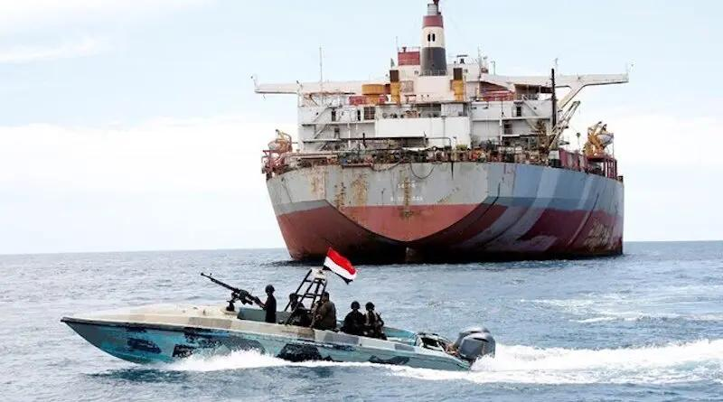
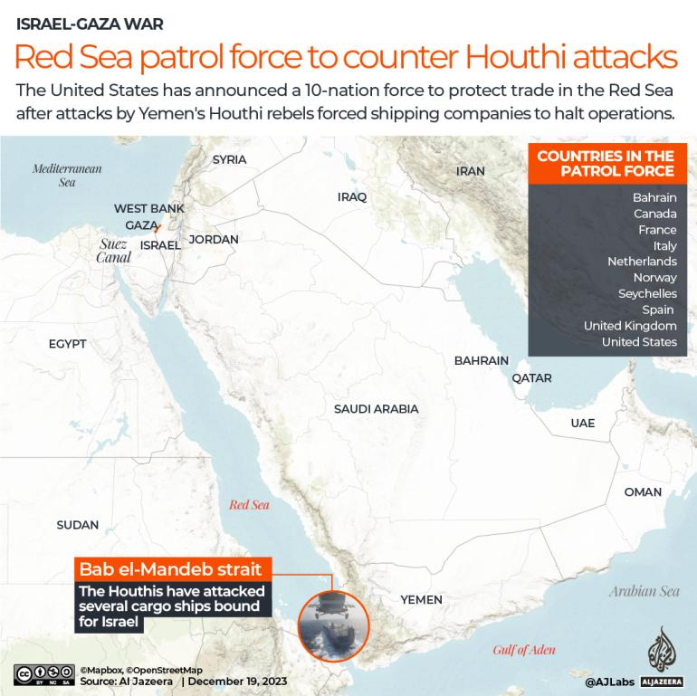
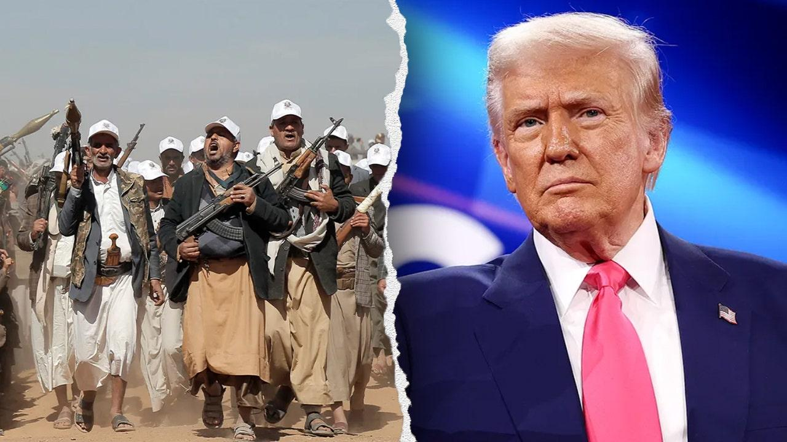
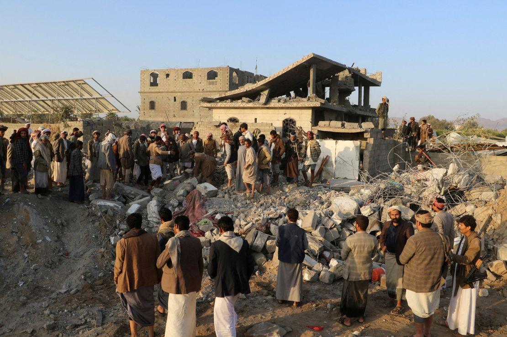
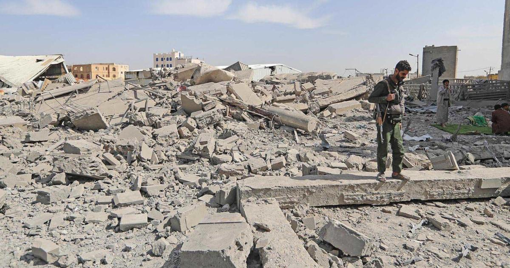
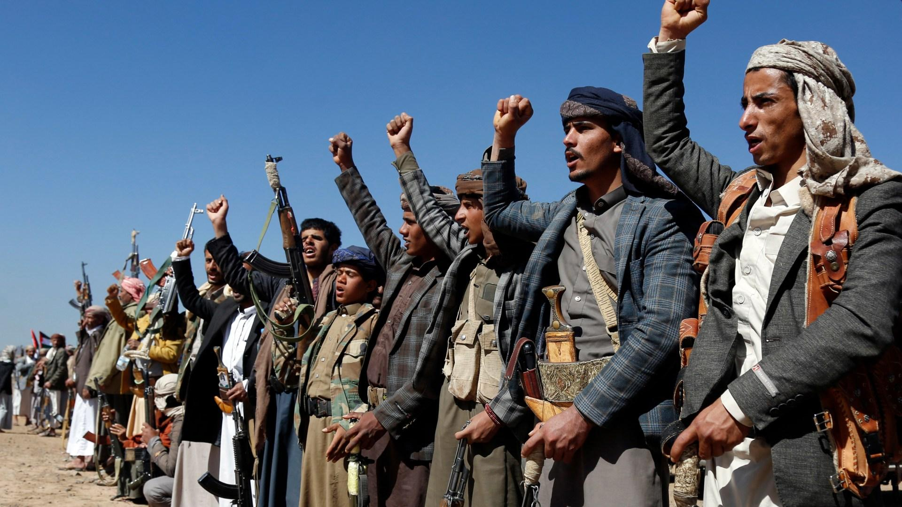
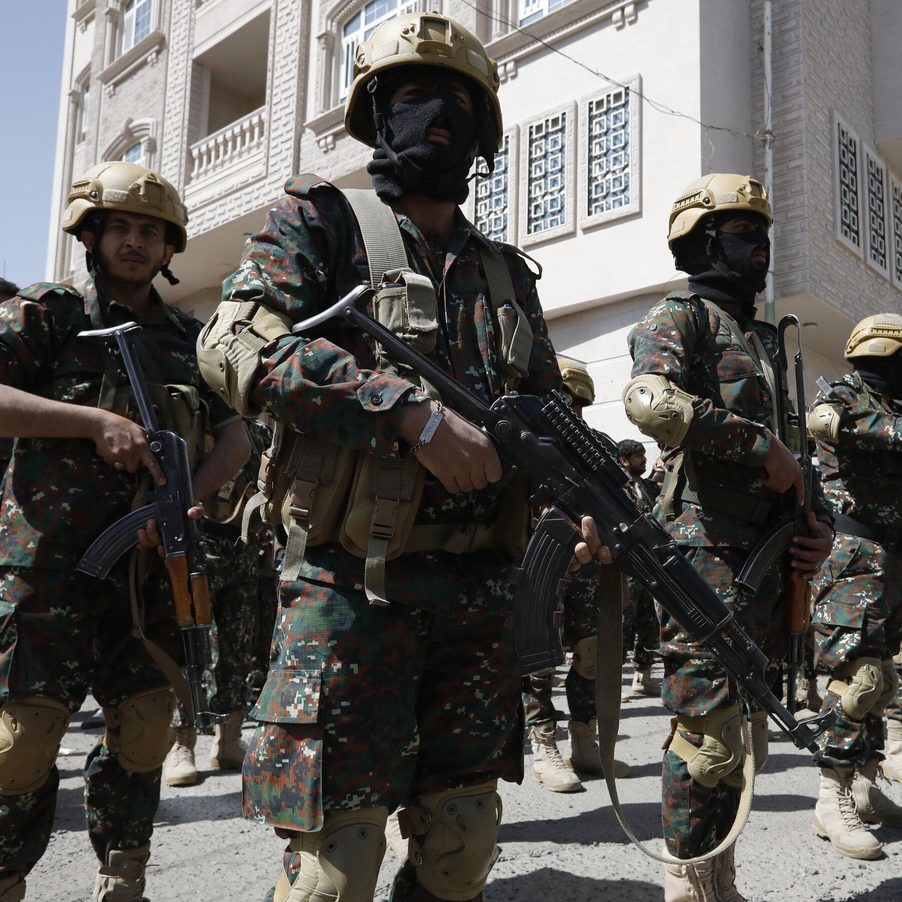
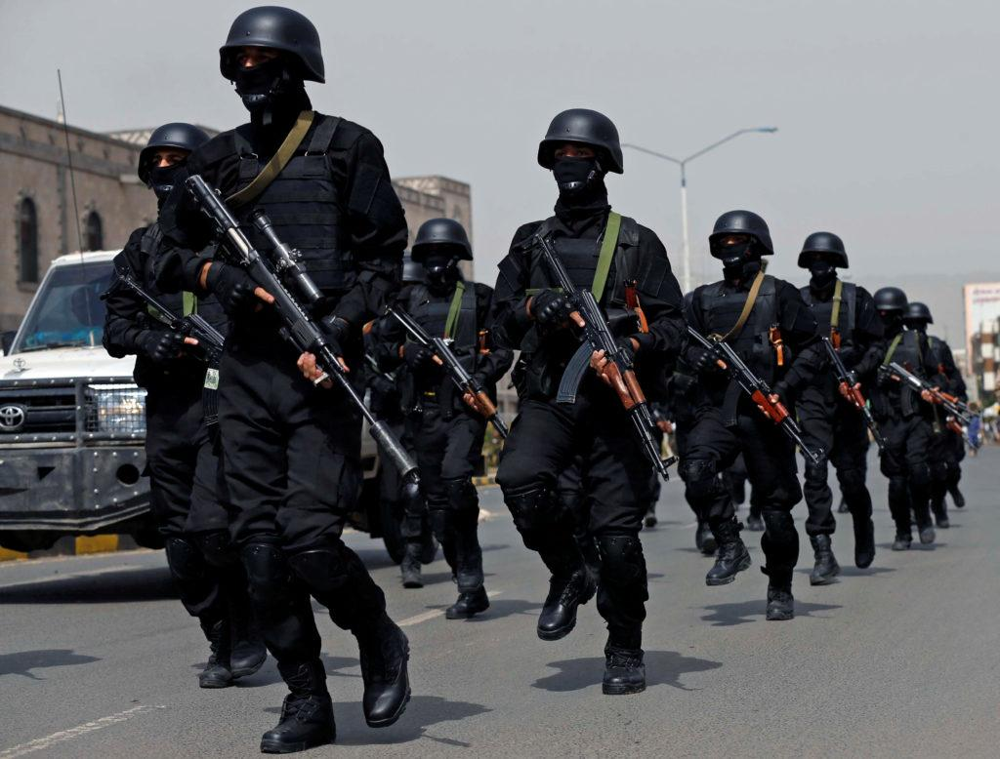

## Claim
Claim: "The Huthi rebels announced the final cessation of their military operations in international waters after Trump won the 2024 US presidential election."

## Actions
```
image_search("Huthi rebels military operations international waters")
image_search("Huthi rebels cease military operations Trump election")
```

## Evidence
### Evidence from `image_search`
One source ([https://indiashippingnews.com/houthi-rebels-to-halt-military-operations-against-most-ships-in-red-sea/](https://indiashippingnews.com/houthi-rebels-to-halt-military-operations-against-most-ships-in-red-sea/)) contains an image of a boat with armed people in the sea, with a large ship in the background . Another source ([https://www.aljazeera.com/news/2023/12/19/us-announces-10-nation-force-to-counter-houthi-attacks-in-red-sea](https://www.aljazeera.com/news/2023/12/19/us-announces-10-nation-force-to-counter-houthi-attacks-in-red-sea)) states that the United States announced a 10-nation force to counter Houthi attacks in the Red Sea .

The Al Jazeera article also mentions that the attacks by Yemen's Houthi rebels forced shipping companies to halt operations.


### Evidence from `image_search`
From [Source](https://www.foxnews.com/world/trump-announces-decisive-powerful-airstrikes-against-houthi-terrorists-yemen): 
Content: Fox News published an article with an image of Huthi rebels and Donald Trump .


## Elaboration
The evidence shows that the Houthi rebels have been involved in military operations in international waters, specifically targeting ships in the Red Sea, which led to the US forming a coalition to counter these attacks. However, the provided evidence does not mention any cessation of military operations by the Houthi rebels, nor does it mention Donald Trump's involvement in the matter.

Therefore, the claim cannot be verified with the available information. The evidence lacks information about the cessation of military operations and Trump's influence on the situation.


## Actions
```
image_search("Huthi rebels cease military operations after Trump election")
```

## Evidence
### Evidence from `image_search`
CNN published an article titled "Trump and Houthis military action" with an image of a destroyed building and people (). NBC News published an article with an image of destruction () discussing the cost of Trump's operation against the Houthis.


## Elaboration
The new evidence from image searches continues to show military actions involving the Houthi rebels and mentions Donald Trump's involvement. However, it still does not provide any information about the cessation of military operations by the Houthi rebels or confirm that such a cessation occurred after Trump won the 2024 US presidential election.

Therefore, the claim remains unverified due to the lack of supporting evidence.


## Actions
```
image_search("Huthi rebels statement cease military operations")
```

## Evidence
### Evidence from `image_search`
Al Jazeera reports that the Houthi rebels stated that Red Sea attacks will continue ([https://www.aljazeera.com/news/2024/1/25/us-uk-sanction-senior-houthis-as-rebels-say-red-sea-attacks-will-continue](https://www.aljazeera.com/news/2024/1/25/us-uk-sanction-senior-houthis-as-rebels-say-red-sea-attacks-will-continue)) . The New York Times published an article with an image of Houthi rebels ([https://www.nytimes.com/2022/04/17/world/middleeast/yemen-houthis-gulf.html](https://www.nytimes.com/2022/04/17/world/middleeast/yemen-houthis-gulf.html)) . PBS reports that the UN says Yemen's Houthi rebels have agreed to stop using child soldiers ([https://www.pbs.org/newshour/world/u-n-says-yemens-houthi-rebels-have-agreed-to-stop-using-child-soldiers](https://www.pbs.org/newshour/world/u-n-says-yemens-houthi-rebels-have-agreed-to-stop-using-child-soldiers)) .


## Elaboration
The latest evidence indicates that the Houthi rebels have stated that their attacks in the Red Sea will continue. This directly contradicts the claim that they announced the final cessation of their military operations. Furthermore, the evidence does not mention Trump's involvement or the timing of any such announcements.

Therefore, the claim is false.


## Final Judgement
The fact-check reveals that the Houthi rebels have not ceased military operations in international waters. In fact, they have stated that attacks will continue. The evidence does not support the claim that the cessation of military operations was announced after Trump won the 2024 US presidential election.

`false`

### Verdict: FALSE

### Justification
The claim is false. Evidence from multiple sources, including Al Jazeera ([https://www.aljazeera.com/news/2024/1/25/us-uk-sanction-senior-houthis-as-rebels-say-red-sea-attacks-will-continue](https://www.aljazeera.com/news/2024/1/25/us-uk-sanction-senior-houthis-as-rebels-say-red-sea-attacks-will-continue)), indicates that the Houthi rebels have stated that their attacks in the Red Sea will continue, directly contradicting the claim. There is no evidence to support the assertion that they ceased operations after Trump's election.
