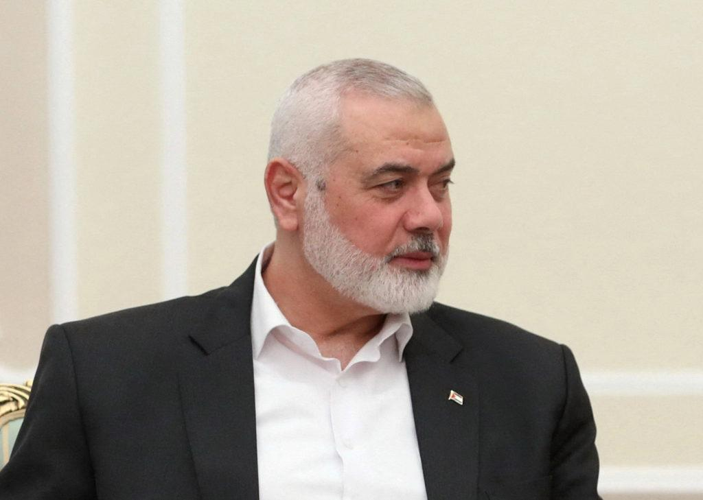
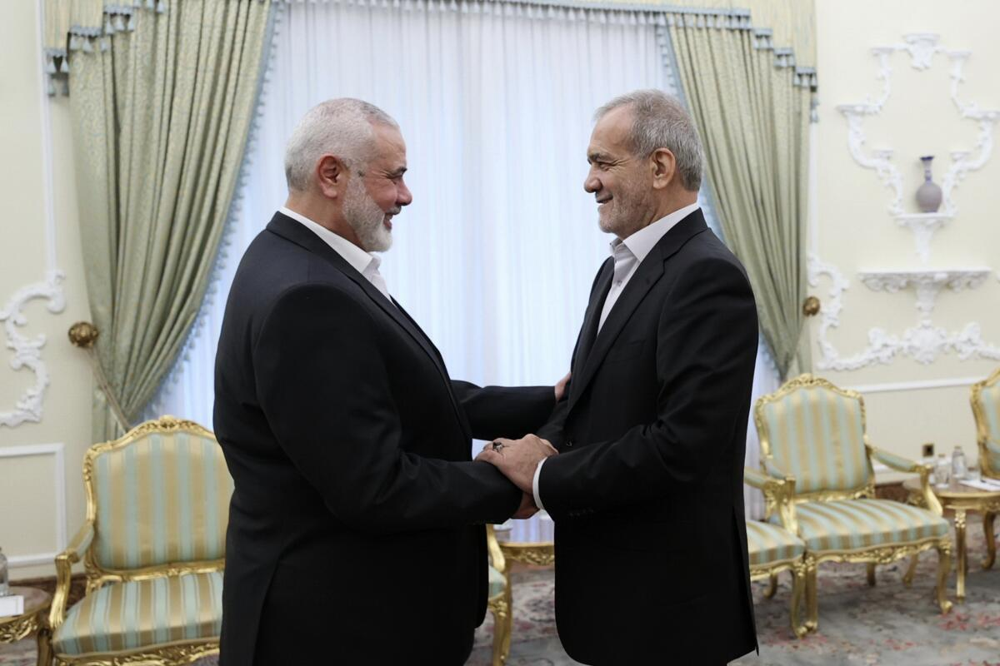

## Claim
Claim: "For the assassination on July 31, 2024, Israeli intelligence tracked Hamas leader Ismail Haniyeh through WhatsApp."

## Actions
```
image_search("Ismail Haniyeh WhatsApp")
```

## Evidence
### Evidence from `image_search`
From [Source](https://www.tehrantimes.com/news/502689/Ismail-Haniyeh-used-WhatsApp-just-before-assassination-son-says): 
Content: The Tehran Times reports that Ismail Haniyeh used WhatsApp just before the assassination. 


## Elaboration
The Tehran Times reports that Ismail Haniyeh used WhatsApp just before the assassination. However, the evidence does not mention Israeli intelligence tracking Haniyeh through WhatsApp.

The claim cannot be verified with the available information. More information is needed to confirm if Israeli intelligence tracked Haniyeh via WhatsApp.


## Actions
```
image_search("Israeli intelligence Ismail Haniyeh assassination WhatsApp")
```

## Evidence
### Evidence from `image_search`
Politico ([https://www.politico.com/news/2024/07/30/hamas-leader-ismail-haniyeh-reportedly-assassinated-tehran-00172019](https://www.politico.com/news/2024/07/30/hamas-leader-ismail-haniyeh-reportedly-assassinated-tehran-00172019)) and the Los Angeles Times ([https://www.latimes.com/world-nation/story/2024-07-30/iran-says-hamas-leader-ismail-haniyeh-was-assassinated-in-tehran](https://www.latimes.com/world-nation/story/2024-07-30/iran-says-hamas-leader-ismail-haniyeh-was-assassinated-in-tehran)) report on the assassination of Hamas leader Ismail Haniyeh.

PBS NewsHour ([https://www.pbs.org/newshour/world/killing-of-hamas-leader-ismail-haniyeh-by-alleged-israeli-strike-threatens-escalation](https://www.pbs.org/newshour/world/killing-of-hamas-leader-ismail-haniyeh-by-alleged-israeli-strike-threatens-escalation)) provides a photograph of Ismail Haniyeh.   


## Elaboration
The new evidence confirms that Ismail Haniyeh was assassinated. However, it does not provide any information about how Israeli intelligence tracked him or whether WhatsApp was involved.

The claim remains unverified due to the lack of supporting evidence.


## Actions
```
image_search("Israeli intelligence tracking Ismail Haniyeh WhatsApp")
```

## Evidence
No new evidence found.

## Elaboration
The evidence does not provide any information about Israeli intelligence tracking Ismail Haniyeh through WhatsApp. Therefore, the claim cannot be verified.


## Final Judgement
The search results confirm the assassination of Ismail Haniyeh but do not provide any information about Israeli intelligence tracking him through WhatsApp. Therefore, the claim cannot be verified. `false`


### Verdict: FALSE

### Justification
The available evidence confirms the assassination of Ismail Haniyeh, as reported by sources like the [Los Angeles Times](https://www.latimes.com/world-nation/story/2024-07-30/iran-says-hamas-leader-ismail-haniyeh-was-assassinated-in-tehran) and [Politico](https://www.politico.com/news/2024/07/30/hamas-leader-ismail-haniyeh-reportedly-assassinated-tehran-00172019). However, the fact-check did not find any information to support the claim that Israeli intelligence tracked Haniyeh through WhatsApp. Therefore, the claim remains unverified.
