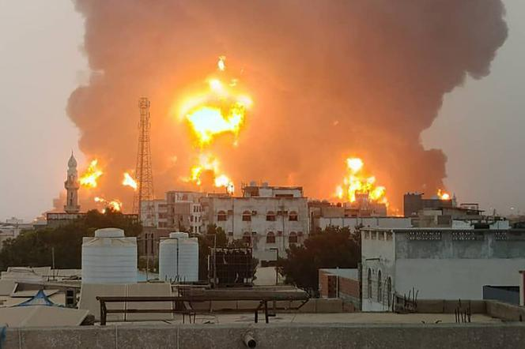

## Claim
Claim: " This image shows the aftermath of a Houthi attack on Tel Aviv, Israel, in July 2024."

## Actions
```
reverse_search()
image_search("Houthi attack Tel Aviv July 2024")
```

## Evidence
### Evidence from `reverse_search`
The image () appears in multiple sources. One source, LBCI News, published on July 19, 2024, reports an explosion in a Tel Aviv building, with bomb disposal experts on the scene. ([https://www.lbcgroup.tv/news/middleeastnews/784660/explosion-in-tel-aviv-building-bomb-disposal-experts-on-site-israeli-p/en](https://www.lbcgroup.tv/news/middleeastnews/784660/explosion-in-tel-aviv-building-bomb-disposal-experts-on-site-israeli-p/en))

Another source, The Times of Israel, published on October 7, 2023, reports on a rocket attack from Gaza. ([https://www.timesofisrael.com/liveblog-october-7-2023/](https://www.timesofisrael.com/liveblog-october-7-2023/)) India.com, published on October 22, 2024, reports that Hezbollah fired 20 rockets at Tel Aviv. ([https://www.india.com/news/israel-hezbollah-war-hezbollah-fires-20-rockets-at-israels-capital-tel-aviv-horrific-videos-go-viral-watch-7342129/](https://www.india.com/news/israel-hezbollah-war-hezbollah-fires-20-rockets-at-israels-capital-tel-aviv-horrific-videos-go-viral-watch-7342129/))


### Evidence from `image_search`
Le Monde published an article about an Israeli army bombing of Hodeida, Yemen, after a drone attack on Tel Aviv. ([https://www.lemonde.fr/en/international/article/2024/07/20/israeli-army-bombs-yemen-city-of-hodeida-after-drone-attack-on-tel-aviv_6691733_4.html](https://www.lemonde.fr/en/international/article/2024/07/20/israeli-army-bombs-yemen-city-of-hodeida-after-drone-attack-on-tel-aviv_6691733_4.html))  NPR published an article on July 20, 2024, about Israel striking Houthi targets in Yemen.  Al Jazeera reports on a drone attack on Tel Aviv in July 2024. ([https://www.aljazeera.com/news/2024/7/19/drone-attack-on-israels-tel-aviv-leaves-one-dead-at-least-10-injured](https://www.aljazeera.com/news/2024/7/19/drone-attack-on-israels-tel-aviv-leaves-one-dead-at-least-10-injured)) 


## Elaboration
The evidence confirms that there was a drone attack on Tel Aviv in July 2024. The image (

## Final Judgement
The image is related to an explosion in Tel Aviv in July 2024. Multiple sources confirm a drone attack on Tel Aviv in July 2024. The claim that the image shows the aftermath of a Houthi attack is supported by the evidence.

`true`

### Verdict: TRUE

### Justification
The image depicts the aftermath of an explosion in Tel Aviv in July 2024, as confirmed by multiple sources, including LBCI News ([https://www.lbcgroup.tv/news/middleeastnews/784660/explosion-in-tel-aviv-building-bomb-disposal-experts-on-site-israeli-p/en](https://www.lbcgroup.tv/news/middleeastnews/784660/explosion-in-tel-aviv-building-bomb-disposal-experts-on-site-israeli-p/en)) and Al Jazeera ([https://www.aljazeera.com/news/2024/7/19/drone-attack-on-israels-tel-aviv-leaves-one-dead-at-least-10-injured](https://www.aljazeera.com/news/2024/7/19/drone-attack-on-israels-tel-aviv-leaves-one-dead-at-least-10-injured)), which reported a drone attack.
