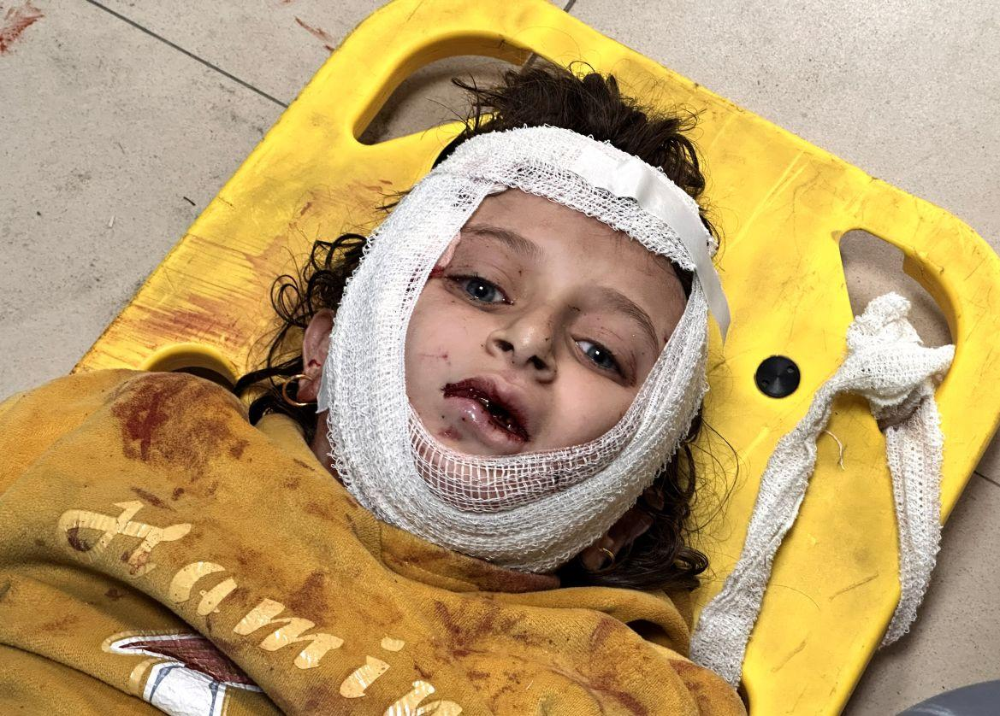
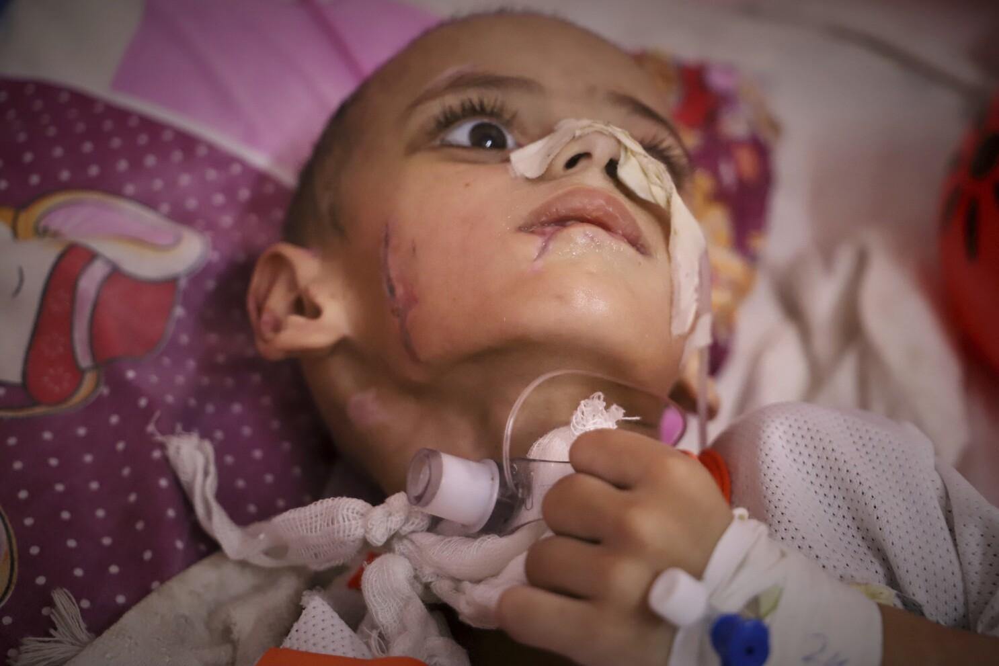
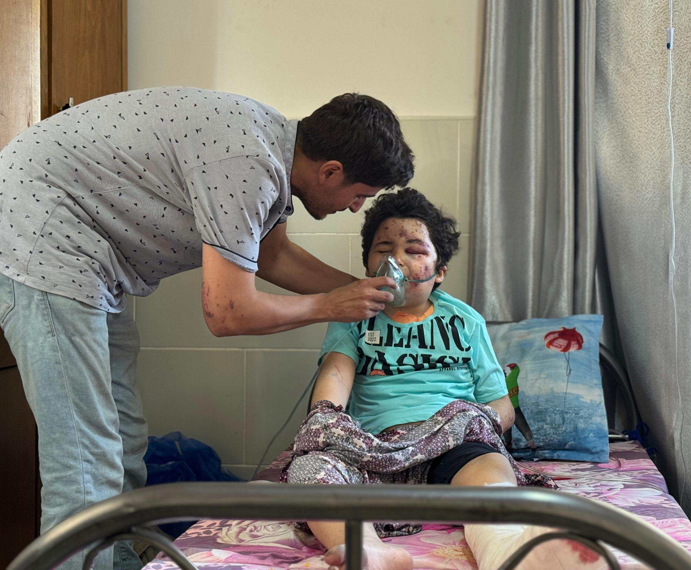

## Claim
Claim: " This image shows a Palestinian girl in the Gaza war in July 2024. She was holding her sister's oxygen mask inside the ambulance. She had already passed away, yet her hand remained on the mask firmly."

## Actions
```
reverse_search()
image_search("Palestinian girl Gaza war oxygen mask")
```

## Evidence
### Evidence from `reverse_search`
The image 

### Evidence from `image_search`
From [Source](https://www.bbc.com/news/world-middle-east-68141039): 
Content: The BBC News website contains an image of a baby in an incubator. 


## Elaboration
The reverse image search did not provide any additional information. The image search found a BBC News article with a picture of a baby in an incubator. The provided evidence does not verify the claim. More information is needed to verify the claim.


## Actions
```
image_search("Gaza war children oxygen mask")
```

## Evidence
### Evidence from `image_search`
Al Jazeera published a photo gallery about children in Gaza (). The Associated Press published an article with an image of a child in a hospital bed ().


## Elaboration
The image search results show images of children in Gaza, but none of them match the image in the claim. The evidence does not verify the claim. More information is needed to verify the claim.


## Actions
```
image_search("Gaza war children holding oxygen mask")
```

## Evidence
### Evidence from `image_search`
From [Source](https://www.doctorswithoutborders.ca/palestine-msf-survey-of-staff-and-their-families-in-gaza-shows-almost-half-of-people-killed-in-the-war-are-children/): 
Content: Doctors Without Borders published an article with an image of a child wearing an oxygen mask. 


## Elaboration
The image search found an image of a child wearing an oxygen mask, but it does not match the image in the claim. The evidence does not verify the claim. More information is needed to verify the claim.


## Final Judgement
The image searches did not provide any information to verify the claim. The image searches found images of children in Gaza, but none of them match the image in the claim.

`false`

### Verdict: FALSE

### Justification
The image searches did not provide any information to verify the claim. The searches found images of children in Gaza, but none matched the image in the claim. Therefore, the claim is considered false.
