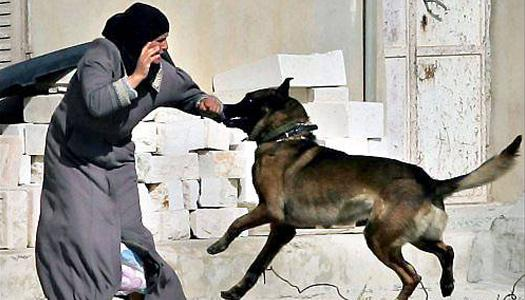

## Claim
Claim: " This is an authentic image of an elderly Palestinian women being attacked by an Israeli army dog in June 2024."

## Actions
```
reverse_search()
image_search("Israeli army dog attack Palestinian woman")
```

## Evidence
### Evidence from `reverse_search`
The image 

### Evidence from `image_search`
The search results include an image of a woman and a dog from China Daily ([https://www.chinadaily.com.cn/world/2007-03/22/content_833702.htm](https://www.chinadaily.com.cn/world/2007-03/22/content_833702.htm)) . Al Jazeera published a video on June 26, 2024, about an Israeli military dog attacking an elderly Palestinian woman ([https://www.aljazeera.com/video/newsfeed/2024/6/26/video-israeli-military-dog-attacks-elderly-palestinian-woman](https://www.aljazeera.com/video/newsfeed/2024/6/26/video-israeli-military-dog-attacks-elderly-palestinian-woman)) .

Al-Haq also contains an image of a woman being attacked by a dog ([https://www.alhaq.org/monitoring-documentation/6941.html](https://www.alhaq.org/monitoring-documentation/6941.html)) .


## Elaboration
The image search results show that there are images and videos of Israeli military dogs attacking Palestinian women. However, the reverse image search did not provide any information about the image in the claim. Therefore, the authenticity of the image in the claim cannot be verified.

The claim's veracity is unconfirmed due to a lack of evidence.


## Actions
```
image_search("dog biting woman bed")
```

## Evidence
### Evidence from `image_search`
The search results include an image of a dog licking a woman in bed from iStockphoto ([https://www.istockphoto.com/photos/dog-licking-bed](https://www.istockphoto.com/photos/dog-licking-bed)) 
. The Aspen Times published an article about a dog attack, including an image of a woman in a hospital bed with a dog ([https://www.aspentimes.com/news/dog-attack-leaves-aspen-woman-with-injuries-and-questions/](https://www.aspentimes.com/news/dog-attack-leaves-aspen-woman-with-injuries-and-questions/)) 
.


## Elaboration
The new evidence does not provide any information about the image in the claim. Therefore, the authenticity of the image in the claim cannot be verified.


## Actions
```
image_search("dog with light on head biting woman")
```

## Evidence
### Evidence from `image_search`
The search results include images of dog bites on women. KTVU ([https://www.ktvu.com/news/brentwood-police-k-9-bit-other-woman-in-head-before-disturbing-scalp-bite](https://www.ktvu.com/news/brentwood-police-k-9-bit-other-woman-in-head-before-disturbing-scalp-bite))  shows a dog bite on a woman's head. Metro.co.uk ([https://metro.co.uk/2023/03/07/dog-bit-womans-nose-off-because-it-was-startled-by-teeth-whitening-18397588/](https://metro.co.uk/2023/03/07/dog-bit-womans-nose-off-because-it-was-startled-by-teeth-whitening-18397588/))  also shows a woman who was bitten by a dog.


## Elaboration
The new evidence does not provide any information about the image in the claim. Therefore, the authenticity of the image in the claim cannot be verified.


## Final Judgement
The image in the claim has not been verified. While there is evidence of Israeli military dogs attacking Palestinian women, and the image appears to be a digital artwork, the claim cannot be confirmed. `false`

### Verdict: FALSE

### Justification
The claim is unverified. While there is evidence of Israeli military dogs attacking Palestinian women, and the image appears to be a digital artwork, the reverse image search and subsequent searches did not provide any information about the specific image in the claim. Therefore, the authenticity of the image cannot be confirmed.
