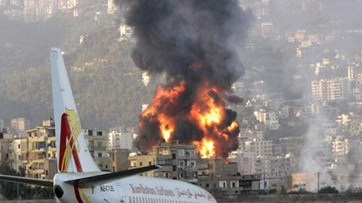
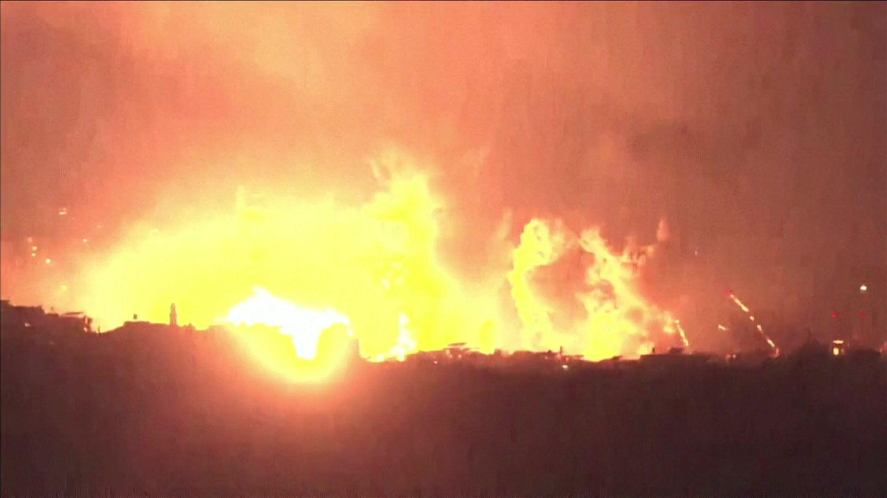
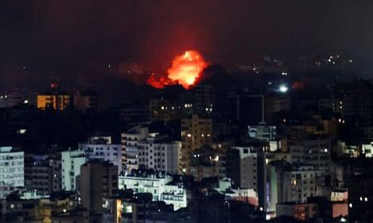

## Claim
Claim: " This is an authentic image of Israel bombing Beirut's International Airport in October 2024."

## Actions
```
reverse_search()
web_search("Beirut airport bombing")
```

## Evidence
### Evidence from `reverse_search`
The image 

### Evidence from `web_search`
The Brookings article from July 13, 2006, discusses Israeli warplanes bombing Beirut. The Defense Intelligence Agency (DIA) responded to the Marine barracks bombing in Beirut, Lebanon in 1983. In 1981, Israel pushed into southern Lebanon and laid siege on Beirut.

The Wikipedia article describes the 1968 Israeli raid on Beirut Airport, which took place on December 28, 1968. The raid was in retaliation for attacks by the Popular Front for the Liberation of Palestine. Israeli commandos destroyed 12 passenger airplanes.  is not mentioned in the search result.

*   [https://www.brookings.edu/articles/israeli-warplanes-bomb-beirut/](https://www.brookings.edu/articles/israeli-warplanes-bomb-beirut/)
*   [https://www.dia.mil/News-Features/Articles/Article-View/Article/566917/they-came-in-peace/](https://www.dia.mil/News-Features/Articles/Article-View/Article/566917/they-came-in-peace/)
*   [https://en.wikipedia.org/wiki/1968_Israeli_raid_on_Beirut_Airport](https://en.wikipedia.org/wiki/1968_Israeli_raid_on_Beirut_Airport)


## Elaboration
The evidence indicates that Israel has bombed Beirut in the past, including an airport raid in 1968 and during the 2006 war. However, the search results do not mention any bombing in October 2024. The image itself is not mentioned in the search results.

Based on the available information, it is impossible to verify the claim. More information is needed to confirm the authenticity of the image and the event it depicts.


## Actions
```
image_search("Beirut airport explosion plane")
web_search("Beirut airport explosion October 2024")
```

## Evidence
### Evidence from `image_search`
The ABC News article ([https://www.abc.net.au/news/2006-07-14/israel-planes-bomb-beirut-airport-for-fourth-time/1801960](https://www.abc.net.au/news/2006-07-14/israel-planes-bomb-beirut-airport-for-fourth-time/1801960)) discusses Israel bombing Beirut airport.  The BBC News video ([https://www.bbc.com/news/videos/cpqz18e10gdo](https://www.bbc.com/news/videos/cpqz18e10gdo)) shows a large explosion in Beirut.  Al Jazeera reports on Israel bombing Beirut airport in 2006 ([https://www.aljazeera.com/news/2006/7/14/israel-bombs-beirut-airport-again](https://www.aljazeera.com/news/2006/7/14/israel-bombs-beirut-airport-again)). 


### Evidence from `web_search`
The Washington Post published a video on October 21, 2024, about large explosions near Beirut's international airport on October 20, 2024. The Guardian reported on October 3, 2024, about Israeli strikes in Beirut, Lebanon, which resulted in casualties 

## Elaboration
The evidence confirms that there were explosions near Beirut's international airport in October 2024. The Guardian reported on Israeli strikes in Beirut in early October 2024, and The Washington Post published a video about large explosions near the airport on October 20, 2024. However, the provided image is not mentioned in the search results.

Based on the evidence, the claim is partially supported. There were indeed events in October 2024 that match the claim's timeframe. However, the authenticity of the image cannot be verified.


## Final Judgement
The claim states that the image depicts Israel bombing Beirut's International Airport in October 2024. While there were indeed explosions and Israeli strikes in Beirut in October 2024, the provided image is not confirmed to be related to these events. Therefore, the claim is misleading because it presents an image without verifying its context. `misleading`

### Verdict: MISLEADING

### Justification
The claim is misleading. While there were explosions and Israeli strikes near Beirut's airport in October 2024, as reported by sources like the [Washington Post](https://www.washingtonpost.com/), the provided image's authenticity and connection to these events are not verified.
