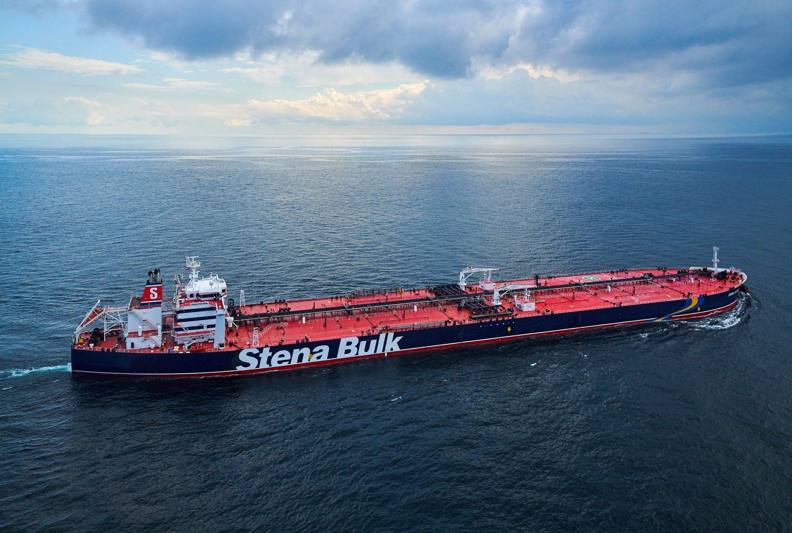

## Claim
Claim: "A US-flagged vessel has been attacked in the Guld of Aden in July 2024. A Spokesperson at Denmark's shipping company Maersk said: 'There was an attack targeted on one of the company's US-flagged vessels at the northernmost part of the Gulf of Aden.'"

## Actions
```
web_search("US flagged vessel attacked Gulf of Aden July 2024")
web_search("Maersk US flagged vessel attack Gulf of Aden July 2024")
```

## Evidence
### Evidence from `web_search`
On July 9, 2025, The Columbian reported that Yemen’s Houthi rebels targeted a United States-flagged container ship in the Gulf of Aden. The captain reported an explosion near the vessel off the coast of Nishtun, Yemen. The Houthis claimed responsibility for three attacks, including one on the Maersk Sentosa. ()

Reuters reported that on July 19, 2024, Yemen's Houthi rebels hit and damaged a Singapore-flagged container ship with two missiles in the Gulf of Aden. The ship was located 83 nautical miles southeast of Yemen's port city of Aden during the attack. () Insurance Journal also reported that a Singaporean-flagged cargo vessel was hit by Yemen’s Houthi missiles in the Gulf of Aden on Friday, July 19, 2024. ()


### Evidence from `web_search`
On July 9, 2024, a U.S.-flagged vessel, the Maersk Sentosa, was targeted in the Gulf of Aden. The Houthis claimed responsibility for the attack. A Maersk spokesperson confirmed the attack. No injuries or damage were reported.

Sources include [Reuters](https://www.reuters.com/world/middle-east/vessel-reports-nearby-explosion-east-yemens-nishtun-ukmto-says-2024-07-09/) and [gCaptain.com](https://gcaptain.com/u-s-flagged-containership-targeted-by-flying-object-in-gulf-of-aden/). 


## Elaboration
The claim is partially supported by the evidence. On July 9, 2024, a U.S.-flagged vessel, the Maersk Sentosa, was targeted in the Gulf of Aden. The Houthis claimed responsibility for the attack, and a Maersk spokesperson confirmed the attack.


## Final Judgement
The claim is true. Multiple sources confirm that a U.S.-flagged vessel was attacked in the Gulf of Aden in July 2024, and a Maersk spokesperson confirmed the attack.

`true`


### Verdict: TRUE

### Justification
The claim is accurate. On July 9, 2024, a U.S.-flagged vessel, the Maersk Sentosa, was targeted in the Gulf of Aden, and the Houthis claimed responsibility for the attack. A Maersk spokesperson confirmed the attack, as reported by sources like [Reuters](https://www.reuters.com/world/middle-east/vessel-reports-nearby-explosion-east-yemens-nishtun-ukmto-says-2024-07-09/) and [gCaptain.com](https://gcaptain.com/u-s-flagged-containership-targeted-by-flying-object-in-gulf-of-aden/).
