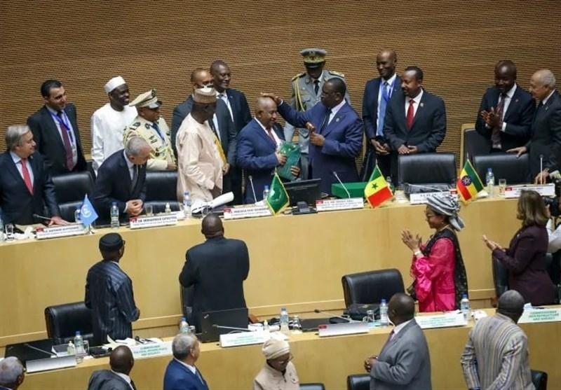

## Claim
Claim: "Ethiopia has expelled Israel's ambassador in April 2025."

## Actions
```
web_search("Ethiopia Israel ambassador expulsion")
```

## Evidence
### Evidence from `web_search`
The Associated Press reports that Israel's ambassador to Ethiopia was ejected from an African Union event this week at the request of AU Commission Chairperson Mahmoud Youssouf. The ambassador, Avraham Nigusse, asserted on social media that the chairperson chose to introduce anti-Israel political elements. The article was published on July 11, 2024. ([Source](https://apnews.com/article/african-union-israel-ambassador-evicted-rwanda-genocide-f22033810dc019bd632deed7bb9fab25))

The Times of Israel reports that Israeli Ambassador to Ethiopia Avraham Neguise was removed from an African Union conference in Addis Ababa. Neguise has served as ambassador to Ethiopia since August 2024.  ([Source](https://www.timesofisrael.com/liveblog_entry/israeli-ambassador-to-ethiopia-expelled-from-conference-on-rwandan-genocide/)) The Tasnim News Agency published an article on April 7, 2025, reporting that the Israeli ambassador was removed from an African Union meeting.  The removal occurred during a session focused on the Rwandan genocide and that the ambassador's presence was objected to by several African countries. ([Source](https://www.tasnimnews.com/en/news/2025/04/07/3286985/israeli-ambassador-removed-from-african-union-meeting))


## Elaboration
The evidence indicates that the Israeli ambassador to Ethiopia, Avraham Neguise, was removed from an African Union event. The event took place in April 2025, according to the Tasnim News Agency. However, the evidence does not explicitly state that Ethiopia expelled the ambassador. Instead, the removal occurred at the request of the AU Commission Chairperson and was objected to by several African countries.

Therefore, the claim is not entirely accurate. While the ambassador was removed from an event, the evidence does not confirm that Ethiopia was the entity that expelled him.


## Final Judgement
The evidence shows that the Israeli ambassador was removed from an African Union event in April 2025, not expelled by Ethiopia. The removal was at the request of the AU Commission Chairperson and objected to by several African countries. The claim misrepresents the context of the event.

`misleading`


### Verdict: MISLEADING

### Justification
The Israeli ambassador to Ethiopia, Avraham Neguise, was removed from an African Union event in April 2025, as reported by the [Tasnim News Agency](https://www.tasnimnews.com/en/news/2025/04/07/3286985/israeli-ambassador-removed-from-african-union-meeting). However, the evidence indicates that the removal was at the request of the AU Commission Chairperson and objected to by several African countries, not an expulsion by Ethiopia.
