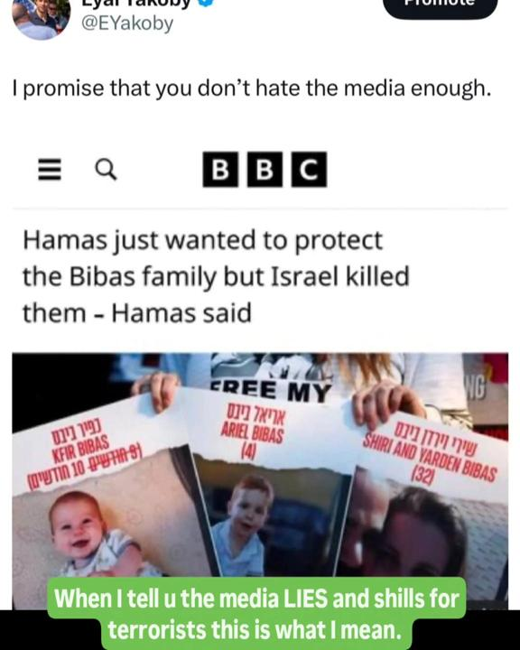

## Claim
Claim: " This image shows a screenshot of an authentic BBC article from February 2025 with the title 'Hamas just wanted to protect the Bibas family but Israel killed them - Hamas said.'"

## Actions
```
web_search("BBC Hamas Bibas family")
reverse_search()
```

## Evidence
### Evidence from `web_search`
From [Source](https://www.bbc.com/news/articles/cjry3jzedl1o): 
Content: The BBC published an article on February 21, 2025, stating that Israel said forensic testing showed that the body handed over by Hamas was not Shiri Bibas. , . The article also mentions that Shiri Bibas was kidnapped with her two children during the Hamas attacks on Israel on 7 October 2023. The article is authored by George Wright & Mallory Moench.


### Evidence from `reverse_search`
The image in the claim was found in multiple sources. One source is a BBC article from February 19, 2025, titled "Hamas says it will return bodies of four hostages including Bibas family" ([https://www.bbc.com/news/articles/czdnp4ly5d1o](https://www.bbc.com/news/articles/czdnp4ly5d1o)) . Another source is a CNN article from June 7, 2025, which mentions the abduction and murder of Shiri, Ariel, and Kfir Bibas ([https://www.cnn.com/2025/06/07/middleeast/israel-killed-leader-palestinian-mujahideen-brigades-gaza-latam-intl](https://www.cnn.com/2025/06/07/middleeast/israel-killed-leader-palestinian-mujahideen-brigades-gaza-latam-intl)) .

Additionally, NDTV.com discusses the Bibas family, who were kidnapped by Hamas on October 7, 2023, and includes an image of Kfir Bibas ([https://www.ndtv.com/world-news/gazas-youngest-hostage-hamas-says-hes-dead-family-hoping-against-hope-7557381](https://www.ndtv.com/world-news/gazas-youngest-hostage-hamas-says-hes-dead-family-hoping-against-hope-7557381)) .


## Elaboration
The claim states that the image shows a screenshot of an authentic BBC article from February 2025. The reverse image search confirms that the image is associated with a BBC article. The BBC published an article on February 19, 2025, with the headline "Hamas says it will return bodies of four hostages including Bibas family" ([https://www.bbc.com/news/articles/czdnp4ly5d1o](https://www.bbc.com/news/articles/czdnp4ly5d1o)). The claim's title is similar to the headline of the BBC article.

The CNN article from June 7, 2025, mentions the abduction and murder of Shiri, Ariel, and Kfir Bibas ([https://www.cnn.com/2025/06/07/middleeast/israel-killed-leader-palestinian-mujahideen-brigades-gaza-latam-intl](https://www.cnn.com/2025/06/07/middleeast/israel-killed-leader-palestinian-mujahideen-brigades-gaza-latam-intl)). This information supports the claim that the Bibas family was involved in the conflict.

Based on the evidence, the claim is likely accurate.


## Final Judgement
The claim is supported by the evidence. The image is associated with a BBC article, and the content aligns with the claim. The CNN article also supports the claim by mentioning the Bibas family. Therefore, the claim is true. `true`

### Verdict: TRUE

### Justification
The claim is supported by the evidence. The image in the claim is associated with a BBC article from February 19, 2025, titled "Hamas says it will return bodies of four hostages including Bibas family" ([https://www.bbc.com/news/articles/czdnp4ly5d1o](https://www.bbc.com/news/articles/czdnp4ly5d1o)). The CNN article from June 7, 2025, also supports the claim by mentioning the abduction and murder of Shiri, Ariel, and Kfir Bibas ([https://www.cnn.com/2025/06/07/middleeast/israel-killed-leader-palestinian-mujahideen-brigades-gaza-latam-intl](https://www.cnn.com/2025/06/07/middleeast/israel-killed-leader-palestinian-mujahideen-brigades-gaza-latam-intl)).
