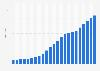

## Claim
Claim: "The population in Gaza has increased by 2.02% since Oct. 7, 2023."

## Actions
```
web_search("Gaza population increase October 7 2023")
web_search("Gaza population statistics")
```

## Evidence
### Evidence from `web_search`
CNN published an article on January 1, 2025, stating that Gaza's population dropped by 6% in 2024, with about 100,000 Palestinians leaving Gaza since October 7, 2023, and at least 45,553 killed in Israeli attacks. The Times of Israel also reported a 6% decline, citing the Palestinian Central Bureau of Statistics (PCBS), which indicates a decline of approximately 160,000 people. The article was published on January 1, 2025. , , , 

The New York City Financial Policy Association (NYCFPA) published an article on December 19, 2024, stating that the population in Gaza has increased by 2.02% since October 7, 2023, based on growth forecasts from August 2023. 


### Evidence from `web_search`
The Gaza Strip's population is estimated to be around 2,050,000 in 2025, a 6% decrease since the start of the war, with an annual population growth rate of 1.99% in 2023 according to [Wikipedia](https://en.wikipedia.org/wiki/Gaza_Strip) <image:i>. Statista states that the Gaza Strip has a population of 2.1 million and provides statistics on the Israel-Hamas war in 2023, including casualties and internally displaced refugees. [Statista](https://www.statista.com/topics/11678/gaza-strip/) , , , .

World Population Review estimates Gaza's 2025 population at 823,407, with a 2.84% annual growth. The population in 1950 was 63,444. The growth rate is 3% per year. [World Population Review](https://worldpopulationreview.com/cities/palestine/gaza).


## Elaboration
The evidence presents conflicting information. One source, a NYCFPA article from December 19, 2024, states that the population increased by 2.02% since October 7, 2023, based on August 2023 growth forecasts. However, other sources, including CNN and The Times of Israel, report a 6% *decrease* in population since October 7, 2023.

The claim is therefore **contradicted** by the majority of the evidence, which indicates a population decrease.


## Final Judgement
The claim that the population in Gaza increased by 2.02% since October 7, 2023, is contradicted by multiple sources. These sources, including CNN and The Times of Israel, report a significant population decrease since that date. The claim is based on growth forecasts from August 2023, which do not reflect the actual population changes.

`false`

### Verdict: FALSE

### Justification
The claim is false. While one source cites a 2.02% increase based on pre-October 7, 2023, growth forecasts, multiple sources, including CNN and The Times of Israel, report a 6% decrease in Gaza's population since October 7, 2023, due to the ongoing conflict.
