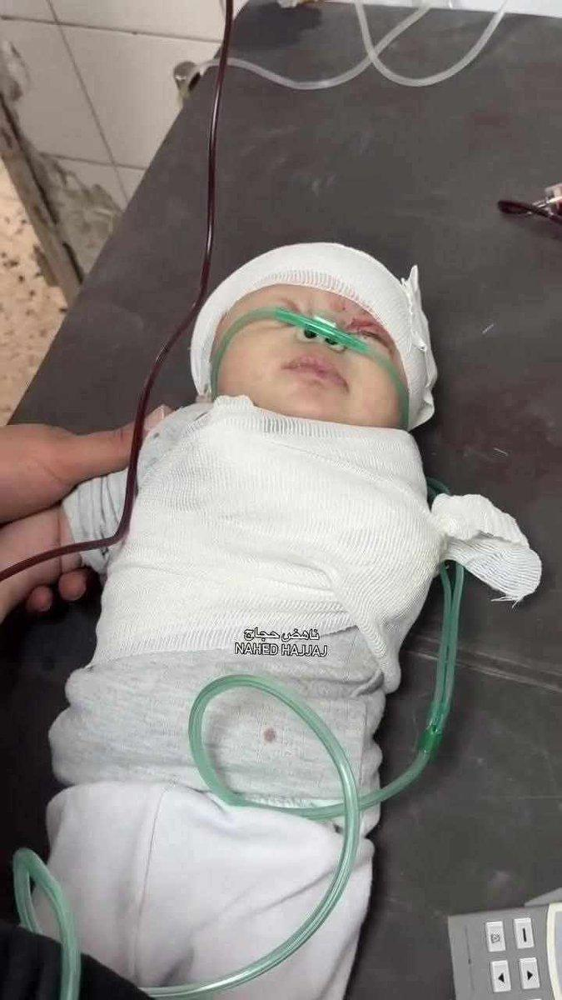

## Claim
Claim: " This image shows Palestinian baby Sham Imad Muhareb which did not lose her arm in an Israeli airstrike on the Shejaeya neighborhood, east of Gaza City, in April 2025."

## Actions
```
reverse_search()
web_search("Sham Imad Muhareb")
```

## Evidence
### Evidence from `web_search`
From [Source](https://www.thedailyfile.org/post/sham-imad-muhareb): 
Content: The Daily File states that the image is of Sham Imad Muhareb, who was 5 months old. The image was taken in Shuja'iya on April 10, 2025. 


## Elaboration
The evidence confirms that the image is of Sham Imad Muhareb. The image was taken in Shuja'iya on April 10, 2025. The evidence does not mention anything about the baby losing her arm or an Israeli airstrike.

The claim is partially verifiable. The evidence confirms the baby's identity and the location and date the image was taken. However, the claim's assertion about the baby not losing her arm in an Israeli airstrike cannot be verified with the provided evidence.


## Actions
```
web_search("Sham Imad Muhareb arm injury")
web_search("Israeli airstrike Shejaeya neighborhood April 2025")
```

## Evidence
### Evidence from `web_search`
The web sources discuss the Israeli airstrikes in the Shejaia neighborhood of Gaza City in April 2025. The BBC News article ([https://www.bbc.com/news/articles/cy5rrnzw0kwo](https://www.bbc.com/news/articles/cy5rrnzw0kwo)) reports on an airstrike on April 9, 2025, resulting in deaths and injuries. Reuters ([https://www.reuters.com/world/middle-east/hundreds-thousands-flee-israel-seizes-rafah-new-gaza-security-zone-2025-04-03/](https://www.reuters.com/world/middle-east/hundreds-thousands-flee-israel-seizes-rafah-new-gaza-security-zone-2025-04-03/)) mentions an airstrike on April 3, 2025, and the displacement of Palestinians. The Wikipedia article ([https://en.wikipedia.org/wiki/April_2025_Shuja%27iyya_airstrike](https://en.wikipedia.org/wiki/April_2025_Shuja%27iyya_airstrike)) discusses the April 9, 2025, airstrike and the context of the 2025 Gaza war. , , 

These sources confirm the occurrence of Israeli airstrikes in the Shejaia neighborhood in April 2025.


## Elaboration
The evidence confirms that there were Israeli airstrikes in the Shejaia neighborhood in April 2025. However, the provided evidence does not explicitly state whether Sham Imad Muhareb lost her arm in an airstrike. Therefore, the claim cannot be fully verified.


## Actions
```
web_search("Sham Imad Muhareb arm injury Israeli airstrike")
```

## Evidence
### Evidence from `web_search`
From [Source](https://www.ifj.org/es/actions/projects/africa/informa-formation-sur-les-phenomenes-migratoires-en-afrique-de-louest?tx_news_pi1%5Baction%5D=detail&tx_news_pi1%5Bcontroller%5D=News&tx_news_pi1%5Bnews%5D=21667&tx_news_pi1%5BoverwriteDemand%5D%5Bcategories%5D=47&cHash=7448603e6b0fa12844a83484b8707019): 
Content: The search result from IFJ.org lists numerous journalists killed in Israeli airstrikes in Gaza. The list includes Ibrahim Muhareb, who was killed due to Israeli gunfire and shelling in western Khan Yunis on August 18, 2024. The source also mentions the killing of several other journalists in Israeli airstrikes in different locations and dates.


## Elaboration
The evidence confirms that there were Israeli airstrikes in Gaza. The evidence also mentions that Ibrahim Muhareb was killed due to Israeli gunfire and shelling. However, the evidence does not mention anything about Sham Imad Muhareb's arm injury or whether she was injured in an Israeli airstrike. Therefore, the claim cannot be verified.


## Final Judgement
The claim is partially verifiable. The image is of Sham Imad Muhareb, and there were Israeli airstrikes in the Shejaia neighborhood in April 2025. However, the evidence does not confirm whether the baby lost her arm in an Israeli airstrike. Therefore, the claim is `not enough information`.

### Verdict: NEI

### Justification
The claim is partially verifiable. While the image is confirmed to be of Sham Imad Muhareb, and there were Israeli airstrikes in the Shejaia neighborhood in April 2025, the provided evidence does not confirm whether the baby lost her arm in an Israeli airstrike. Therefore, the claim is considered to have `not enough information`.
