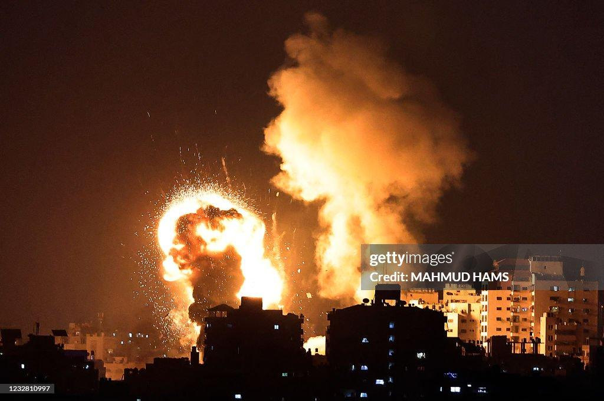

## Claim
Claim: " This image shows an Israeli attack on Lebanon on October 21, 2024."

## Actions
```
web_search("Israeli attack Lebanon October 21 2024")
reverse_search()
```

## Evidence
### Evidence from `web_search`
The CNN article ([https://www.cnn.com/world/live-news/israel-iran-lebanon-gaza-war-10-21-24-intl-hnk](https://www.cnn.com/world/live-news/israel-iran-lebanon-gaza-war-10-21-24-intl-hnk)) discusses the ongoing conflict between Israel and Hezbollah, including an Israeli strike near Rafik Hariri University Hospital in Beirut on October 21, 2024. The Wikipedia article ([https://en.wikipedia.org/wiki/2024_Israeli_invasion_of_Lebanon](https://en.wikipedia.org/wiki/2024_Israeli_invasion_of_Lebanon)) discusses the 2024 Israeli invasion of Lebanon, which began on October 1, 2024.

The Guardian ([https://www.theguardian.com/world/2024/oct/21/israeli-airstrikes-on-lebanon-hit-branches-of-hezbollah-linked-bank-al-qard-al-hassan](https://www.theguardian.com/world/2024/oct/21/israeli-airstrikes-on-lebanon-hit-branches-of-hezbollah-linked-bank-al-qard-al-hassan)) reported on Israeli airstrikes on Lebanon on October 21, 2024, targeting branches of the Hezbollah-linked bank Al-Qard Al-Hassan. The article includes images of the damage (

### Evidence from `reverse_search`
The image 

## Elaboration
The provided evidence confirms that there were Israeli attacks on Lebanon on October 21, 2024. The CNN article ([https://www.cnn.com/world/live-news/israel-iran-lebanon-gaza-war-10-21-24-intl-hnk](https://www.cnn.com/world/live-news/israel-iran-lebanon-gaza-war-10-21-24-intl-hnk)) and The Guardian ([https://www.theguardian.com/world/2024/oct/21/israeli-airstrikes-on-lebanon-hit-branches-of-hezbollah-linked-bank-al-qard-al-hassan](https://www.theguardian.com/world/2024/oct/21/israeli-airstrikes-on-lebanon-hit-branches-of-hezbollah-linked-bank-al-qard-al-hassan)) both report on these attacks.

However, the evidence does not provide information about the specific image . Therefore, I cannot verify if the image depicts an Israeli attack on Lebanon on October 21, 2024.

I need more information to verify the claim.


## Actions
```
image_search("Israeli attack Lebanon October 21 2024")
```

## Evidence
### Evidence from `image_search`
Al Jazeera published an article about the conflict between Israel and Lebanon on October 21, 2024, including an image of an explosion (

## Elaboration
The evidence confirms that there were Israeli attacks on Lebanon on October 21, 2024. However, the image search did not return the specific image in the claim. Therefore, I cannot verify if the image 

## Actions
```
image_search("Getty Images MAHMOD HAMS explosion")
```

## Evidence
### Evidence from `image_search`
The Getty Images website ([https://www.gettyimages.com/detail/news-photo/picture-shows-israeli-air-strikes-in-the-gaza-strip-news-photo/1232810997](https://www.gettyimages.com/detail/news-photo/picture-shows-israeli-air-strikes-in-the-gaza-strip-news-photo/1232810997)) contains an image of an explosion in the Gaza Strip, credited to MAHMOD HAMS (

## Elaboration
The image 

## Final Judgement
The evidence confirms that there were Israeli attacks on Lebanon on October 21, 2024. However, the image search revealed that the image in the claim is of an explosion in the Gaza Strip, not Lebanon. Therefore, the claim is misleading.

`misleading`


### Verdict: MISLEADING

### Justification
The claim is misleading. While there were Israeli attacks on Lebanon on October 21, 2024, the image provided in the claim, credited to MAHMOD HAMS, depicts an explosion in the Gaza Strip, not Lebanon, as confirmed by a Getty Images search ([https://www.gettyimages.com/detail/news-photo/picture-shows-israeli-air-strikes-in-the-gaza-strip-news-photo/1232810997](https://www.gettyimages.com/detail/news-photo/picture-shows-israeli-air-strikes-in-the-gaza-strip-news-photo/1232810997)).
