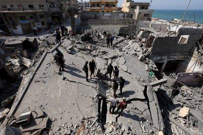
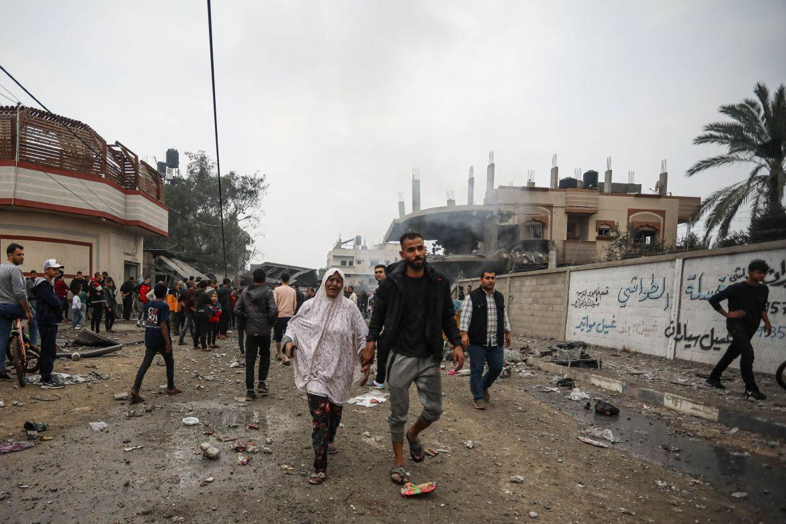
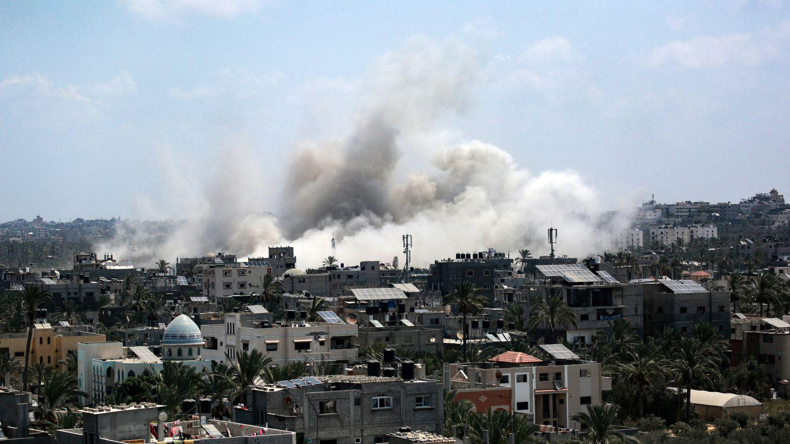
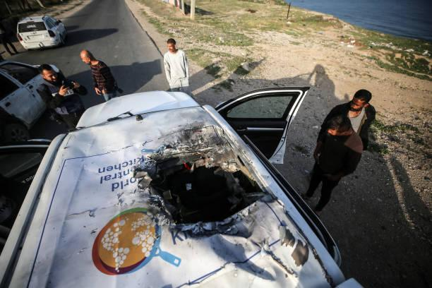
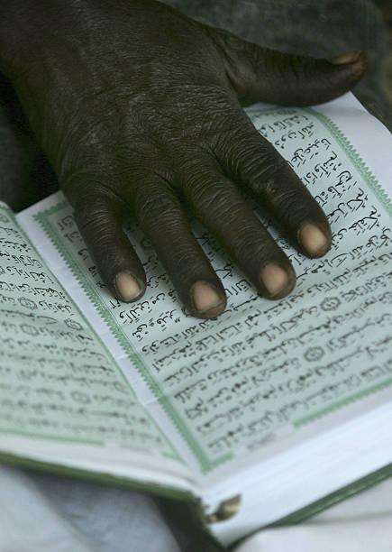
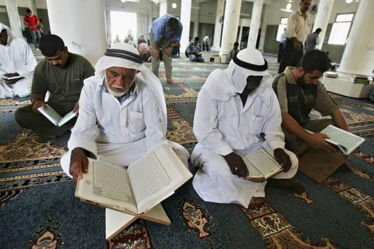
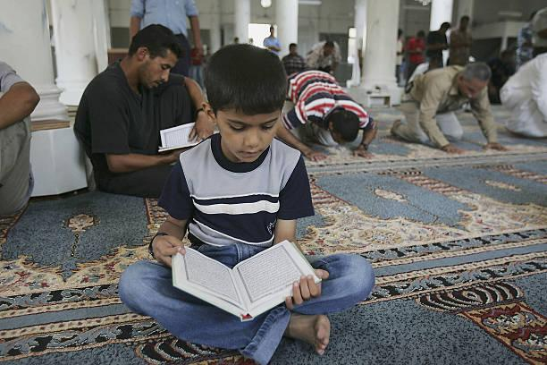

## Claim
Claim: " This image shows heavy Israeli bombardment on Deir al-Balah in the southern Gaza Strip in March 2025 which killed at least four Palestinians."

## Actions
```
reverse_search()
web_search("Deir al-Balah Gaza bombing March 2025")
```

## Evidence
### Evidence from `reverse_search`
The image 

### Evidence from `web_search`
The March 2025 Israeli attacks on the Gaza Strip began on March 18, 2025, ending the ceasefire, and targeted multiple locations, including Deir al-Balah. These attacks resulted in over 591 deaths. An article from Al Jazeera, published on May 7, 2025, reports on an attack on a tent shelter in Deir el-Balah that killed three people, including a child. <image:i>, <image:j>, <image:k>, <image:l>, <image:m>, <image:n>.

WAFA reported on July 20, 2025, that the Israeli army issued new displacement orders in Deir al-Balah.


## Elaboration
The evidence confirms that Deir al-Balah was targeted in March 2025 during Israeli attacks on the Gaza Strip. The attacks resulted in casualties. An article from Al Jazeera mentions an attack on a tent shelter in Deir el-Balah that killed three people, including a child.

The claim states that the image shows heavy Israeli bombardment on Deir al-Balah in March 2025 which killed at least four Palestinians. The evidence confirms the bombardment and the casualties. However, the evidence does not confirm that the image depicts the specific event described in the claim.

Therefore, the claim is partially verifiable. More information is needed to confirm that the image depicts the specific event described in the claim.


## Actions
```
image_search("Deir al-Balah Gaza bombing March 2025")
```

## Evidence
### Evidence from `image_search`
PBS NewsHour published an article about the resumption of bombing in Gaza after failed negotiations, including an image of the destruction. ([https://www.pbs.org/newshour/classroom/daily-news-lessons/2025/03/israel-resumes-bombing-in-gaza-after-failed-negotiations](https://www.pbs.org/newshour/classroom/daily-news-lessons/2025/03/israel-resumes-bombing-in-gaza-after-failed-negotiations))  Al Jazeera published an article with an image of the aftermath of an Israeli attack on a building in central Gaza. ([https://www.aljazeera.com/gallery/2023/12/5/searching-for-survivors-after-israeli-attack-on-central-gaza-building](https://www.aljazeera.com/gallery/2023/12/5/searching-for-survivors-after-israeli-attack-on-central-gaza-building))  CNN published an article on July 27, 2024, about the Israeli attacks on Gaza, including Deir al-Balah, with an image of smoke rising over the city. ([https://www.cnn.com/2024/07/27/middleeast/israel-gaza-deir-al-balah-school-intl](https://www.cnn.com/2024/07/27/middleeast/israel-gaza-deir-al-balah-school-intl)) 


## Elaboration
The new evidence provides additional images related to the Israeli attacks on Gaza, including Deir al-Balah. However, none of the images match the one in the claim. Therefore, the claim remains partially verifiable, as the evidence confirms the attacks and casualties in Deir al-Balah in March 2025, but it does not confirm that the image depicts the specific event described in the claim.


## Actions
```
web_search("image Deir al-Balah bombing site")
```

## Evidence
### Evidence from `web_search`
The search results include images from Getty Images depicting destruction from Israeli airstrikes in Deir al-Balah, Gaza, taken in 2023, 2024, and 2025 (, , , ). An Al Jazeera article from December 2, 2023, reports on Israeli attacks on Deir al-Balah after a truce ended, with images of the aftermath (, , , , , , , ).

Le Monde's article from October 30, 2023, features images of the bombing in Gaza, including Deir Al-Balah on October 28, 2023 (<image:i>, <image:j>).


## Elaboration
The search results provide additional images related to the bombing in Deir al-Balah. However, none of the images match the one in the claim. Therefore, the claim remains partially verifiable. The evidence confirms the bombing and casualties in Deir al-Balah, but it does not confirm that the image depicts the specific event described in the claim.


## Final Judgement
The claim is partially verifiable. While the evidence confirms Israeli bombardments in Deir al-Balah in March 2025 and resulting casualties, the provided images do not match the one in the claim. Therefore, the image's origin and context are not fully confirmed. `misleading`

### Verdict: MISLEADING

### Justification
The claim is partially verifiable. While there is evidence of Israeli bombardments in Deir al-Balah in March 2025, resulting in casualties, the image in the claim has not been verified to depict the specific event described. Therefore, the image's origin and context are not fully confirmed.
