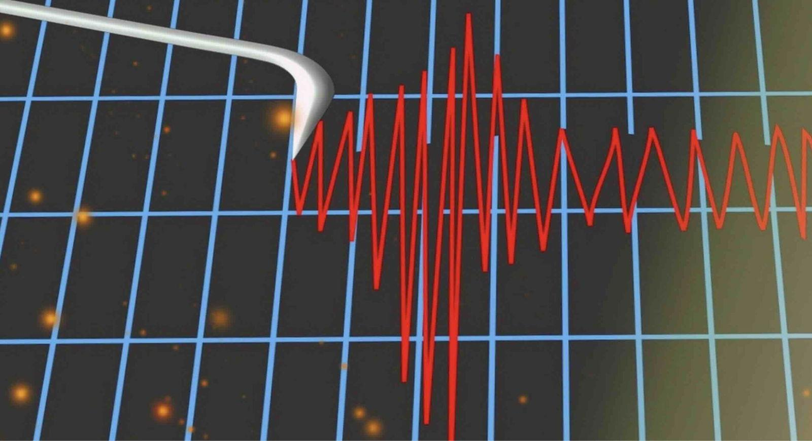

## Claim
Claim: "Israel experienced an earthquake on October 5, 2024."

## Actions
```
web_search("earthquake Israel October 5 2024")
```

## Evidence
### Evidence from `web_search`
Multiple sources discuss an earthquake in Israel on October 5, 2024. An article from Johns Hopkins University, published on February 4, 2025, mentions an earthquake in Israel on the same evening as an earthquake in Iran, with both events being linked to misinformation. Another article from The Debrief, published on February 4, 2025, also mentions the earthquake in Israel on October 5, 2024, in connection with the Iranian earthquake and claims of a covert nuclear test. 

NDTV published an article on October 7, 2024, discussing earthquakes in Iran and Israel on October 5, 2024, which led to speculation about covert nuclear testing.  The article mentions a moderate earthquake that struck both Iran and Israel on the evening of October 5.
*   [https://hub.jhu.edu/2025/02/04/earthquake-nuclear-test-misinformation/](https://hub.jhu.edu/2025/02/04/earthquake-nuclear-test-misinformation/)
*   [https://thedebrief.org/online-conspiracies-linked-an-iranian-earthquake-to-a-secret-atomic-bomb-test-these-seismologists-said-otherwise/](https://thedebrief.org/online-conspiracies-linked-an-iranian-earthquake-to-a-secret-atomic-bomb-test-these-seismologists-said-otherwise/)
*   [https://www.ndtv.com/world-news/earthquakes-in-iran-and-israel-sparks-speculation-of-nuclear-tests-6735904](https://www.ndtv.com/world-news/earthquakes-in-iran-and-israel-sparks-speculation-of-nuclear-tests-6735904)


## Elaboration
The evidence confirms that an earthquake occurred in Israel on October 5, 2024. Multiple sources, including articles from Johns Hopkins University, The Debrief, and NDTV, mention this event. These sources also link the earthquake to an event in Iran and subsequent speculation about covert nuclear testing.


## Final Judgement
The claim is supported by multiple sources that confirm an earthquake in Israel on October 5, 2024. The evidence includes articles from reputable news outlets and academic institutions.

`true`


### Verdict: TRUE

### Justification
Multiple sources, including articles from Johns Hopkins University and NDTV ([https://www.ndtv.com/world-news/earthquakes-in-iran-and-israel-sparks-speculation-of-nuclear-tests-6735904](https://www.ndtv.com/world-news/earthquakes-in-iran-and-israel-sparks-speculation-of-nuclear-tests-6735904)), confirm that an earthquake occurred in Israel on October 5, 2024. These sources also link the event to an earthquake in Iran and related speculation.
