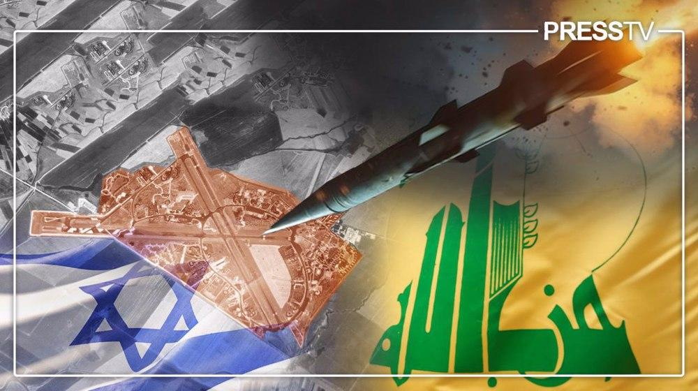
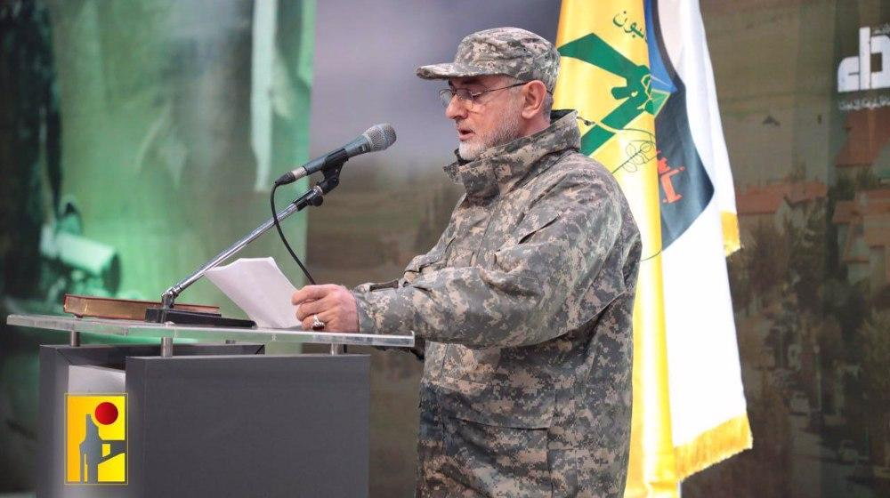
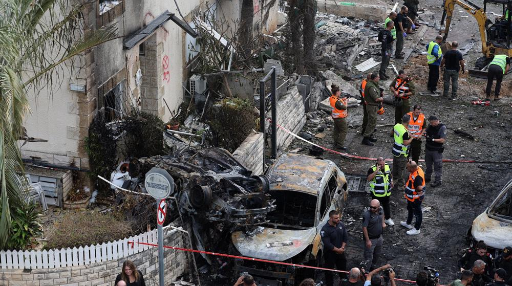

## Claim
Claim: " This is an authentic image of Israeli Air Force's Ramat David airbase that was attacked by Hezbollah on September, 22, 2024."

## Actions
```
reverse_search()
web_search("Ramat David airbase attack September 22 2024")
```

## Evidence
### Evidence from `reverse_search`
The image 

### Evidence from `web_search`
Al Jazeera ([https://www.aljazeera.com/news/2024/9/21/hezbollah-claims-rocket-attack-deep-inside-northern-israel](https://www.aljazeera.com/news/2024/9/21/hezbollah-claims-rocket-attack-deep-inside-northern-israel)) and Politico.eu ([https://www.politico.eu/article/hezbollah-launches-revenge-rocket-attack-against-israeli-base/](https://www.politico.eu/article/hezbollah-launches-revenge-rocket-attack-against-israeli-base/)) report that Hezbollah claimed to have launched rockets at Israel’s Ramat David Airbase on September 22, 2024. The Jerusalem Post ([https://www.jpost.com/israel-news/article-821267](https://www.jpost.com/israel-news/article-821267)) also discusses the attacks on the airbase.

The Jerusalem Post article includes a photo of Israeli air force technicians working on a F-16 Fighting Falcon in Ramat David Airbase, northern Israel, January 14, 2024. <image:i>


## Elaboration
The evidence confirms that Hezbollah claimed to have launched a rocket attack on the Ramat David Airbase on September 22, 2024. However, the provided search results do not include any images of the attack. Therefore, the authenticity of the image cannot be verified.

The image search did not provide any information about the image.

To verify the claim, additional evidence is needed, such as images or videos of the attack from reliable sources.


## Actions
```
image_search("Ramat David airbase attack September 22 2024")
```

## Evidence
### Evidence from `image_search`
From [Source](https://www.understandingwar.org/backgrounder/iran-update-september-22-2024): 
Content: The Institute for the Study of War and Critical Threats Project published a map showing the location of the attacks into Northern Israel from Lebanon as of September 22, 2024.  The map indicates that Lebanese Hezbollah conducted a three-wave rocket attack targeting an IDF airbase near Haifa.


## Elaboration
The evidence confirms that Hezbollah conducted a three-wave rocket attack targeting an IDF airbase near Haifa on September 22, 2024. The Institute for the Study of War and Critical Threats Project published a map showing the location of the attacks. However, the provided evidence does not include any images of the attack. Therefore, the authenticity of the image cannot be verified.


## Actions
```
web_search("Ramat David airbase damage September 22 2024")
```

## Evidence
### Evidence from `web_search`
From [Source](https://www.presstv.ir/Detail/2024/09/22/733773/explainer-hezbollah-struck-ramat-david-airbase-rafael-arms-factory-haifa): 
Content: The Press TV website reports that Hezbollah launched a barrage of Fadi-1 and Fadi-2 rockets targeting the Ramat David airbase and military airport southeast of Haifa on September 22, 2024. The article mentions that the airbase has three runways and covers an area of six square kilometers. The article also mentions that the attacks followed the assassination of Aqil and other senior Hezbollah officials in an Israeli airstrike in the southern suburbs of Beirut. The article includes images , , , , .


## Elaboration
The evidence confirms that Hezbollah launched rockets at the Ramat David airbase on September 22, 2024. However, the provided search results do not include the image in the claim. Therefore, the authenticity of the image cannot be verified.


## Final Judgement
The claim is that the image depicts the Ramat David airbase after an attack by Hezbollah on September 22, 2024. While there is evidence of an attack on the airbase on that date, the image has not been verified. Therefore, the claim is `not enough information`.

### Verdict: NEI

### Justification
The claim cannot be verified because, while there is evidence of a Hezbollah rocket attack on the Ramat David airbase on September 22, 2024, the provided image has not been found in any of the search results ([Al Jazeera](https://www.aljazeera.com/news/2024/9/21/hezbollah-claims-rocket-attack-deep-inside-northern-israel), [Politico.eu](https://www.politico.eu/article/hezbollah-launches-revenge-rocket-attack-against-israeli-base/), [The Jerusalem Post](https://www.jpost.com/israel-news/article-821267), [Press TV](https://www.presstv.ir/Detail/2024/09/22/733773/explainer-hezbollah-struck-ramat-david-airbase-rafael-arms-factory-haifa)).
