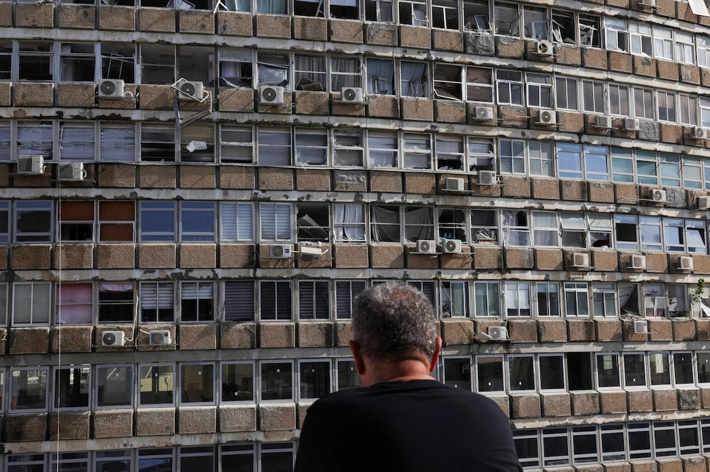

## Claim
Claim: " This image shows the aftermath of a Houthi attack on Tel Aviv, Israel, in July 2024."

## Actions
```
reverse_search()
web_search("Houthi attack Tel Aviv July 2024")
```

## Evidence
### Evidence from `reverse_search`
The image () appears in multiple sources. One source, from LBC Group, describes an explosion in a Tel Aviv building, with bomb disposal experts on the scene, published on July 19, 2024. ([https://www.lbcgroup.tv/news/middleeastnews/784660/explosion-in-tel-aviv-building-bomb-disposal-experts-on-site-israeli-p/en](https://www.lbcgroup.tv/news/middleeastnews/784660/explosion-in-tel-aviv-building-bomb-disposal-experts-on-site-israeli-p/en))

Another source, from The Times of Israel, uses the image in an article about a rocket attack from Gaza on October 7, 2023. ([https://www.timesofisrael.com/liveblog-october-7-2023/](https://www.timesofisrael.com/liveblog-october-7-2023/)) A third source, from india.com, published on October 22, 2024, reports that Hezbollah fired 20 rockets at Tel Aviv. ([https://www.india.com/news/israel-hezbollah-war-hezbollah-fires-20-rockets-at-israels-capital-tel-aviv-horrific-videos-go-viral-watch-7342129/](https://www.india.com/news/israel-hezbollah-war-hezbollah-fires-20-rockets-at-israels-capital-tel-aviv-horrific-videos-go-viral-watch-7342129/))


### Evidence from `web_search`
The web sources discuss Houthi attacks on Tel Aviv, Israel. One attack, which occurred on July 19, 2024, involved a drone and resulted in one death and several injuries. The Houthis claimed responsibility for this attack, which targeted an apartment building. Another attack, which occurred in December 2024, involved a missile and caused at least 16 injuries.  

The sources are from Wikipedia ([https://en.wikipedia.org/wiki/2024_Houthi_drone_attack_on_Israel](https://en.wikipedia.org/wiki/2024_Houthi_drone_attack_on_Israel)), Reuters ([https://www.reuters.com/world/middle-east/israeli-military-says-tel-aviv-blast-apparently-caused-by-drone-2024-07-19/](https://www.reuters.com/world/middle-east/israeli-military-says-tel-aviv-blast-apparently-caused-by-drone-2024-07-19/)), and The New York Times ([https://www.nytimes.com/2024/12/20/world/middleeast/israel-tel-aviv-missile-yemen.html](https://www.nytimes.com/2024/12/20/world/middleeast/israel-tel-aviv-missile-yemen.html)).


## Elaboration
The claim that the image shows the aftermath of a Houthi attack on Tel Aviv in July 2024 is supported by the evidence. The reverse image search reveals that the image was used in an article about an explosion in Tel Aviv on July 19, 2024. Furthermore, web searches confirm that a Houthi drone attack occurred on the same date, targeting an apartment building in Tel Aviv.


## Final Judgement
The image is related to an explosion in Tel Aviv, which aligns with the claim of a Houthi attack. The image was used in an article about an explosion in Tel Aviv on July 19, 2024, and web searches confirm a Houthi drone attack on the same date. Therefore, the claim is true. `true`

### Verdict: TRUE

### Justification
The image depicts the aftermath of an explosion in Tel Aviv, which aligns with the claim of a Houthi attack. The image was used in an article about an explosion in Tel Aviv on July 19, 2024, and web searches confirm a Houthi drone attack on the same date ([https://en.wikipedia.org/wiki/2024_Houthi_drone_attack_on_Israel](https://en.wikipedia.org/wiki/2024_Houthi_drone_attack_on_Israel)).
