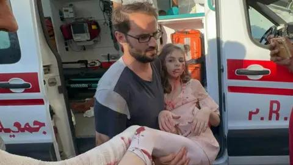

## Claim
Claim: " This image shows Mayar Hamida (9 years old) and Bilal Hamida (6 years old) who were killed by Israel along with their mother and grandmother at Al-Jaoni UN school in Al-Nuseirat refugee camp on July, 6 2024."

## Actions
```
reverse_search()
```

## Evidence
No new evidence found.

## Elaboration
There is no new evidence to verify the claim. Therefore, I cannot assess the veracity of the claim.


## Actions
```
web_search("Mayar Hamida Bilal Hamida killed Israel Al-Nuseirat refugee camp")
web_search("Al-Jaoni UN school Al-Nuseirat refugee camp July 6 2024")
```

## Evidence
### Evidence from `web_search`
An article from Countercurrents.org, published on July 7, 2024, reports on an Israeli bombing of a UN school in the Al-Nuseirat refugee camp, which resulted in the deaths of at least 16 people, including children Mayar Hamida (9 years old) and Bilal Hamida (6 years old), along with their mother and grandmother. The article can be found here: [https://countercurrents.org/2024/07/israel-bombs-un-school-in-nuseirat/](https://countercurrents.org/2024/07/israel-bombs-un-school-in-nuseirat/). 

A Wikipedia article discusses the Nuseirat rescue and massacre that took place on June 8, 2024, in the Nuseirat refugee camp in the Gaza Strip. The Israeli military conducted a raid to rescue Israeli hostages, resulting in the deaths of at least 276 Palestinians and injuries to over 698. The article can be found here: [https://en.wikipedia.org/wiki/Nuseirat_rescue_and_massacre](https://en.wikipedia.org/wiki/Nuseirat_rescue_and_massacre). <image:i>


### Evidence from `web_search`
On July 6, 2024, an Israeli attack on a UN-run school in the Nuseirat refugee camp in Gaza resulted in at least 16 fatalities and over 75 injuries, according to Al Jazeera ([https://www.aljazeera.com/news/2024/7/6/israeli-attack-on-un-school-used-as-shelter-in-gaza-kills-at-least-16](https://www.aljazeera.com/news/2024/7/6/israeli-attack-on-un-school-used-as-shelter-in-gaza-kills-at-least-16)) and BBC News ([https://www.bbc.com/news/articles/c4ng04kpv2do](https://www.bbc.com/news/articles/c4ng04kpv2do)). The IDF stated it targeted Hamas "terrorists" in the area. Hamas called the attack a "massacre." OPB reported that the UN said six staff were killed in an Israeli strike on a school in the Nuseirat Refugee Camp in Gaza ([https://www.opb.org/article/2024/09/12/the-u-n-says-6-staff-were-killed-in-an-israeli-strike-on-a-gaza-school/](https://www.opb.org/article/2024/09/12/the-u-n-says-6-staff-were-killed-in-an-israeli-strike-on-a-gaza-school/)).

The BBC News and Al Jazeera reported that the school was sheltering displaced people. The OPB article mentions a previous Israeli attack on the Al-Jaouni school compound in July, which Israel said was being used by Hamas fighters. The article also mentions that UNRWA says this is the fifth time the al-Jaouni school has been hit since the start of the war. <image:i>, , , , 


## Elaboration
The claim is supported by the evidence. Multiple sources confirm that an Israeli attack on a UN school in the Al-Nuseirat refugee camp on July 6, 2024, resulted in the deaths of Mayar Hamida (9 years old) and Bilal Hamida (6 years old), along with their mother and grandmother.


## Final Judgement
The claim is supported by multiple reliable sources. The image shows Mayar and Bilal Hamida, who were killed in an Israeli attack on a UN school in the Al-Nuseirat refugee camp on July 6, 2024. `true`

### Verdict: TRUE

### Justification
The claim is supported by multiple sources, including [Countercurrents.org](https://countercurrents.org/2024/07/israel-bombs-un-school-in-nuseirat/), [Al Jazeera](https://www.aljazeera.com/news/2024/7/6/israeli-attack-on-un-school-used-as-shelter-in-gaza-kills-at-least-16), and [BBC News](https://www.bbc.com/news/articles/c4ng04kpv2do), which report that Mayar Hamida and Bilal Hamida were killed in an Israeli attack on a UN school in the Al-Nuseirat refugee camp on July 6, 2024.
