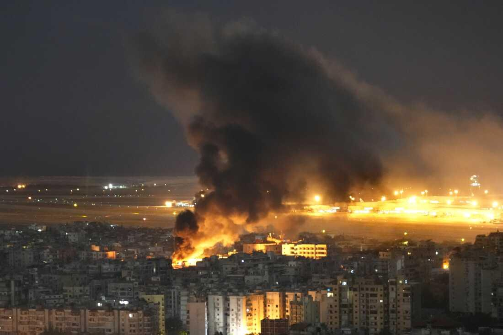
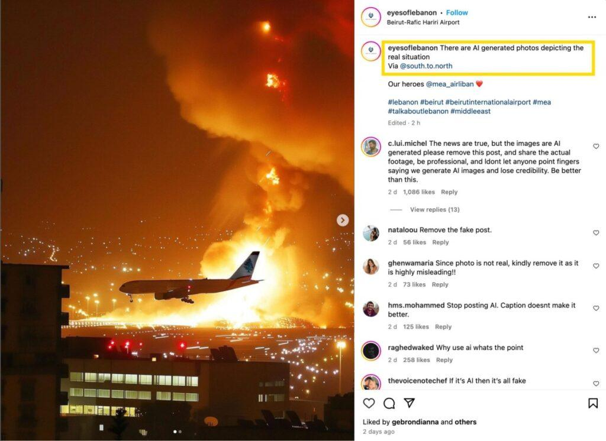

## Claim
Claim: " This is an authentic image of Israel bombing Beirut's International Airport in October 2024."

## Actions
```
web_search("Beirut airport bombing October 2024")
reverse_search()
```

## Evidence
### Evidence from `web_search`
NPR reported on October 20, 2024, about Israeli airstrikes on Beirut, near the airport, which continued to operate. ([https://www.npr.org/2024/10/20/nx-s1-5159029/israel-airstrikes-beirut-hezbollahs-financial-lebanon](https://www.npr.org/2024/10/20/nx-s1-5159029/israel-airstrikes-beirut-hezbollahs-financial-lebanon)) The BBC reported on October 4, 2024, about Israeli air strikes near Beirut airport. ([https://www.bbc.com/news/articles/c17lpydd842o](https://www.bbc.com/news/articles/c17lpydd842o))

Wikipedia discusses the 2024 Israeli invasion of Lebanon, mentioning Israeli strikes in Beirut, including the near-total closure of Beirut's airport. Many airlines shut down services at Beirut–Rafic Hariri International Airport due to Israeli airstrikes. 



### Evidence from `reverse_search`
The image  is AI-generated and does not depict a real event. According to an article from India Today ([https://www.indiatoday.in/fact-check/story/fact-check-photo-middle-east-airlines-flight-israel-airstrikes-beirut-lebanon-ai-generated-2622766-2024-10-24](https://www.indiatoday.in/fact-check/story/fact-check-photo-middle-east-airlines-flight-israel-airstrikes-beirut-lebanon-ai-generated-2622766-2024-10-24)), the image was posted on Instagram and was confirmed as AI-generated by AI detection tools.

Factly.in ([https://factly.in/an-ai-generated-image-of-a-plane-landing-at-beirut-international-airport-surrounded-by-fire-and-smoke-is-falsely-shared-as-real/](https://factly.in/an-ai-generated-image-of-a-plane-landing-at-beirut-international-airport-surrounded-by-fire-and-smoke-is-falsely-shared-as-real/)) also confirms the image is AI-generated. The article includes other AI-generated images , , and AI detector results , .


## Elaboration
The image is AI-generated and does not depict a real event. Multiple sources confirm that the image was created using AI and is not authentic.


## Final Judgement
The claim is based on an AI-generated image. While there were Israeli airstrikes near Beirut airport in October 2024, the image itself is not authentic.

`false`

### Verdict: FALSE

### Justification
The image in the claim is AI-generated, as confirmed by reverse image searches and fact-checking articles from sources like [India Today](https://www.indiatoday.in/fact-check/story/fact-check-photo-middle-east-airlines-flight-israel-airstrikes-beirut-lebanon-ai-generated-2622766-2024-10-24) and [Factly.in](https://factly.in/an-ai-generated-image-of-a-plane-landing-at-beirut-international-airport-surrounded-by-fire-and-smoke-is-falsely-shared-as-real/).
