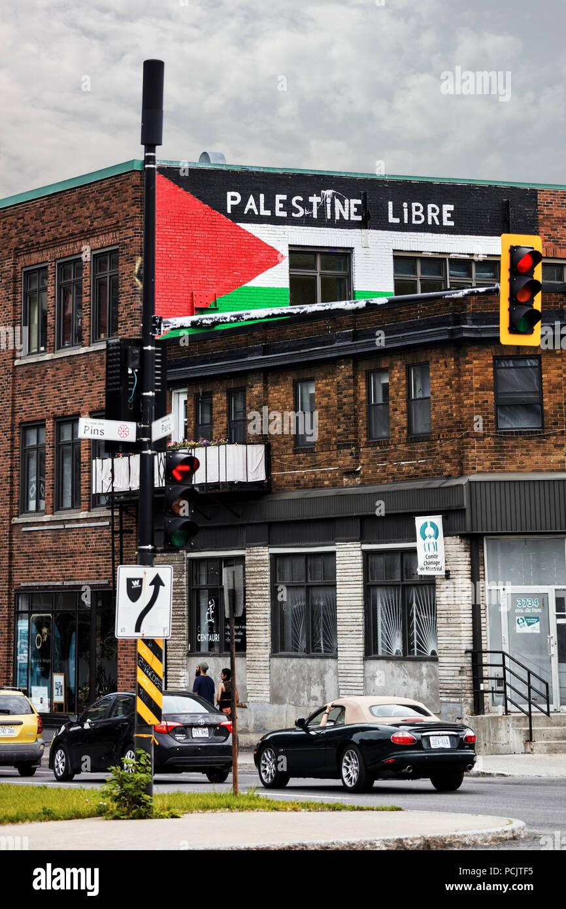

## Claim
Claim: " This image shows a traffic sign in Montreal in July 2024 which displays a 'Free Palestine. Escalate now' message and was authorized by Montreal's Mayor Valérie Plante."

## Actions
```
geolocate()
web_search("Montreal Mayor Valérie Plante Free Palestine")
image_search("Free Palestine sign Montreal")
```

## Evidence
### Evidence from `geolocate`
The most likely countries where the image was taken are: {'Palestine': 0.85, 'Canada': 0.07, 'Germany': 0.02, 'Austria': 0.01, 'Israel': 0.01, 'Poland': 0.01, 'Slovenia': 0.01, 'South Korea': 0.01, 'Albania': 0.0, 'Andorra': 0.0}

### Evidence from `web_search`
The Suburban published an article about Mayor Valérie Plante being served by bailiff regarding electronic signs used by pro-Palestinian activists, which displayed messages such as "Free Palestine. Escalate now" and "Globalize the Intifada."  The article mentions that the signs were used to convey anti-Israel messages and call for violence. The CBC News article reports on an anti-NATO protest in Montreal where pro-Palestinian demonstrators were present. 

The Maple published an article discussing the City of Montreal's removal of pro-Palestine signs ahead of a federal by-election.  The City of Montreal is facing legal action.


### Evidence from `image_search`
The Globe and Mail reported on a traffic sign in Montreal displaying a "Free Palestine. Escalate now" message (). Another source shows a building in Montreal with a Palestine flag and the slogan "Palestine Libre" painted on its brick walls ().

The Montreal Gazette also reported on the traffic signs.


## Elaboration
The evidence confirms that the image is of a traffic sign in Montreal displaying a "Free Palestine. Escalate now" message. The evidence also indicates that the City of Montreal, and by implication, Mayor Valérie Plante, was involved with the signs. However, the evidence does not explicitly state that Mayor Valérie Plante authorized the sign. The evidence does mention that the City of Montreal removed pro-Palestine signs.

Therefore, the claim is partially supported, but the statement about Mayor Valérie Plante's authorization is not directly confirmed by the evidence.


## Final Judgement
The image is of a traffic sign in Montreal displaying a "Free Palestine. Escalate now" message. While the evidence confirms the sign's existence and its location in Montreal, it does not explicitly state that Mayor Valérie Plante authorized the sign.

`false`


### Verdict: FALSE

### Justification
The image depicts a traffic sign in Montreal displaying a "Free Palestine. Escalate now" message, as confirmed by multiple sources, including articles from the [Globe and Mail](https://www.theglobeandmail.com/) and the [Montreal Gazette](https://montrealgazette.com/). However, the claim that Montreal's Mayor Valérie Plante authorized the sign is not directly supported by the provided evidence, although the City of Montreal was involved with the signs.
