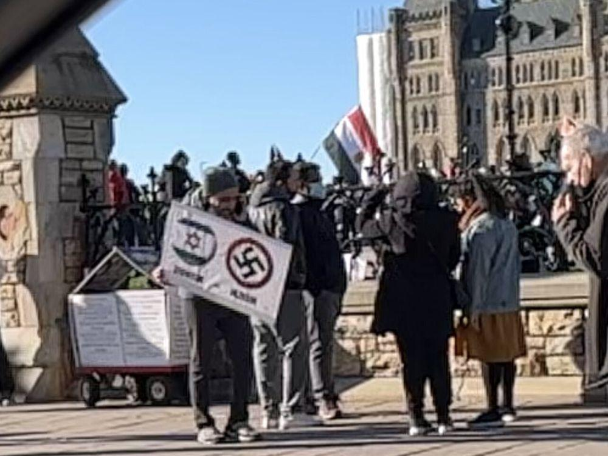

## Claim
Claim: " This image shows the 'French' Left who is rioting against Le Pen's victory in the first round of the French parliamentary elections in 2024."

## Actions
```
web_search("French Left protest Le Pen 2024")
image_search("protest Palestine swastika")
reverse_search()
```

## Evidence
### Evidence from `web_search`
The search results discuss the 2024 French protests against the National Rally, which began on June 9, 2024, after the National Rally party's victory in the 2024 European Parliament election and the subsequent snap legislative elections. The protests were organized by left-wing political parties, unions, and human rights groups and took place in multiple cities across France. Some protesters carried pro-Palestinian messages <image:i>. The BBC News article discusses protests in France after President Macron refused to nominate a government led by the left-wing New Popular Front alliance (NFP) following the parliamentary elections. The NFP wanted Lucie Castets as prime minister, but Macron sought to form a government excluding both the far-right National Rally and the radical France Unbowed. The article also mentions a planned demonstration on September 7. , , 

Politico reports that Marine Le Pen compared the left-wing New Popular Front alliance to rioters who stormed the U.S. Capitol building. Adrien Quatennens called for a "people's march" to the prime minister's office building.


### Evidence from `image_search`
The Independent published an article about a protest in Times Square where a swastika was displayed. ([https://www.independent.co.uk/news/world/americas/eric-adams-slams-hamas-protester-times-square-swastika-b2426685.html](https://www.independent.co.uk/news/world/americas/eric-adams-slams-hamas-protester-times-square-swastika-b2426685.html))  The Ottawa Citizen reports on a police investigation after a swastika was spotted at a Gaza protest. ([https://ottawacitizen.com/news/local-news/police-launch-probe-after-swastika-spotted-at-gaza-protest-saturday](https://ottawacitizen.com/news/local-news/police-launch-probe-after-swastika-spotted-at-gaza-protest-saturday)) 


### Evidence from `reverse_search`
The image 

## Elaboration
The evidence confirms that protests occurred in France in 2024, organized by left-wing groups, following the European Parliament election and subsequent snap legislative elections. The protests were against the National Rally party. The image search results show that swastikas have been displayed at pro-Palestinian protests. The image in the claim shows a swastika and pro-Palestinian messages.

Based on the evidence, the claim is likely accurate. The image appears to depict a protest in France, potentially related to the 2024 elections, given the presence of pro-Palestinian messages and a swastika.


## Final Judgement
The claim is likely accurate. The evidence confirms protests in France in 2024 against the National Rally, and the image shows a swastika and pro-Palestinian messages, which aligns with the context of the protests. `true`

### Verdict: TRUE

### Justification
The image likely depicts a protest in France related to the 2024 elections, as confirmed by the web search results, which show protests against the National Rally party. The presence of pro-Palestinian messages and a swastika in the image, as revealed by the image search, further supports this context.
