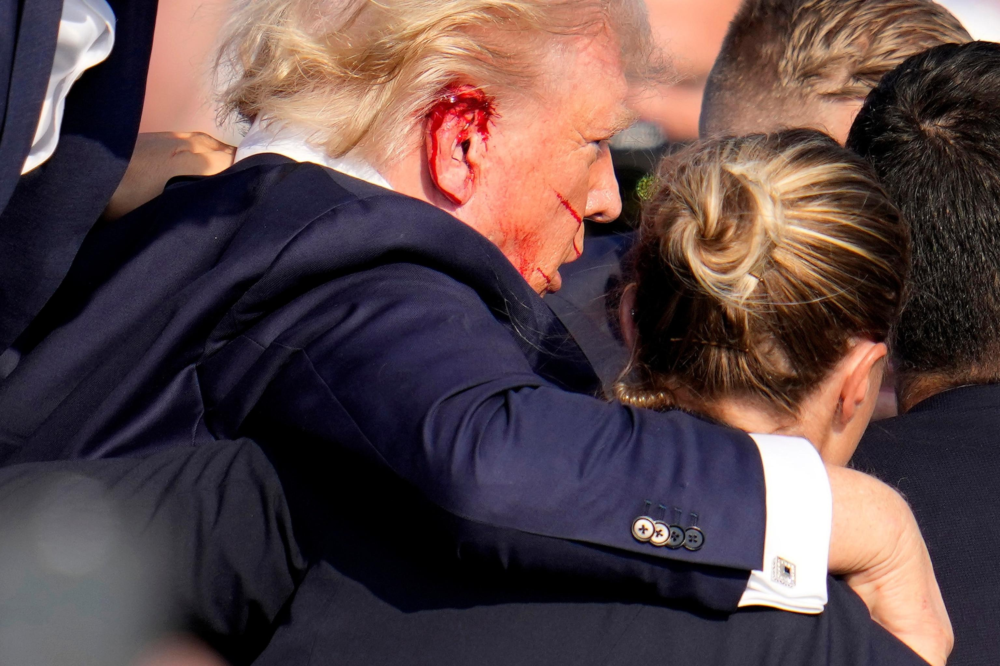

## Claim
Claim: "President Donald Trump posted on Truth Social on July 25, 2024, as a reaction to the attempted assasination of him on July 13, 2024, 'I hope that America obliterates Israel.'"

## Actions
```
web_search("Donald Trump Truth Social July 25 2024 Israel")
web_search("Donald Trump attempted assassination July 13 2024")
```

## Evidence
### Evidence from `web_search`
On July 25, 2024, Donald Trump posted on Truth Social. According to the Voice of America ([https://www.voanews.com/a/harris-trump-condemn-pro-hamas-protest-near-us-capitol/7713095.html](https://www.voanews.com/a/harris-trump-condemn-pro-hamas-protest-near-us-capitol/7713095.html)), Trump condemned pro-Hamas protests. The Tennessee Lookout ([https://tennesseelookout.com/2024/07/25/in-capitol-address-israeli-leader-calls-for-u-s-backing-to-defeat-hamas/](https://tennesseelookout.com/2024/07/25/in-capitol-address-israeli-leader-calls-for-u-s-backing-to-defeat-hamas/)) reported that Trump said he would welcome Netanyahu to Mar-a-Lago.

Iran International ([https://www.iranintl.com/en/202407252585](https://www.iranintl.com/en/202407252585)) reported that Trump posted on Truth Social, calling for the annihilation of Iran if they assassinate him <image:k>. The post was made alongside a video clip of Benjamin Netanyahu's speech to the US Congress.


### Evidence from `web_search`
The search results detail an attempted assassination of Donald Trump on July 13, 2024, in Butler, Pennsylvania. The shooter, Thomas Matthew Crooks, was killed by Secret Service agents. ABC News published an article on July 30, 2024, detailing the timeline of the event, mentioning that Trump was shot in the right ear (, , ). CNN also reported on the event, with President Biden urging the FBI to investigate.

The sources include: [https://en.wikipedia.org/wiki/Attempted_assassination_of_Donald_Trump_in_Pennsylvania](https://en.wikipedia.org/wiki/Attempted_assassination_of_Donald_Trump_in_Pennsylvania), [https://abcnews.go.com/US/timeline-trump-assassination-attempt-unfolded-rally-pennsylvania/story?id=111933309](https://abcnews.go.com/US/timeline-trump-assassination-attempt-unfolded-rally-pennsylvania/story?id=111933309), and [https://www.cnn.com/politics/live-news/election-biden-trump-07-13-24](https://www.cnn.com/politics/live-news/election-biden-trump-07-13-24).


## Elaboration
The evidence indicates that Donald Trump did post on Truth Social on July 25, 2024, and that there was an attempted assassination of him on July 13, 2024. However, the evidence does not support the claim that Trump posted "I hope that America obliterates Israel." Instead, one source indicates that Trump called for the annihilation of Iran if they assassinate him ([https://www.iranintl.com/en/202407252585](https://www.iranintl.com/en/202407252585)).


## Final Judgement
The evidence confirms that Donald Trump posted on Truth Social on July 25, 2024, and that there was an attempted assassination of him on July 13, 2024. However, the evidence does not support the specific quote attributed to Trump in the claim. Instead, a source indicates that Trump called for the annihilation of Iran if they assassinate him.

`false`


### Verdict: FALSE

### Justification
The claim is false. While Donald Trump did post on Truth Social on July 25, 2024, and there was an attempted assassination of him on July 13, 2024, the evidence does not support the specific quote attributed to him. Instead, a source indicates that Trump called for the annihilation of Iran if they assassinate him ([https://www.iranintl.com/en/202407252585](https://www.iranintl.com/en/202407252585)).
