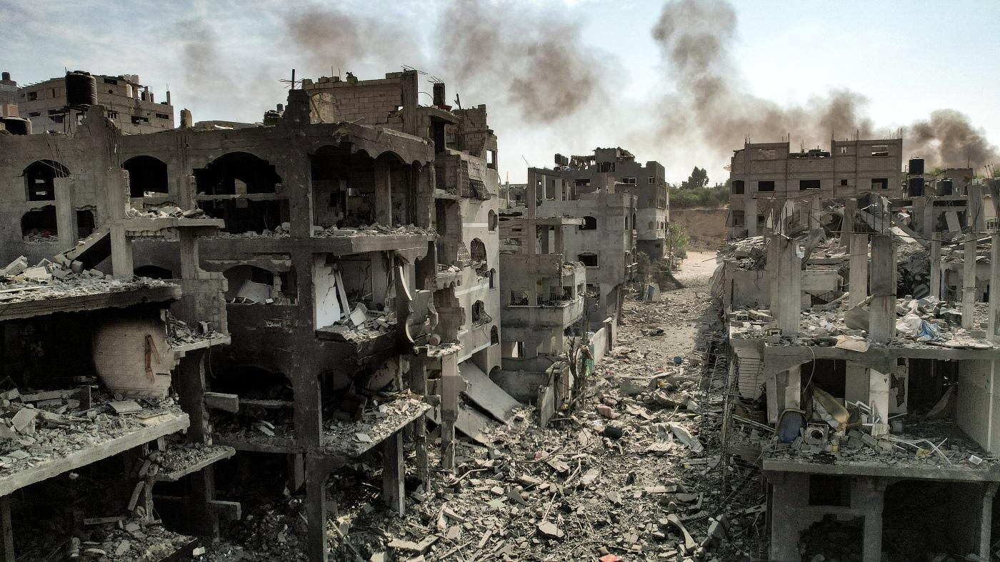

## Claim
Claim: " This image shows Gaza, completely destroyed, in December 2024."

## Actions
```
reverse_search()
web_search("Gaza destroyed buildings")
```

## Evidence
### Evidence from `web_search`
The Wikipedia article discusses the destruction of cultural heritage during the Israeli invasion of the Gaza Strip, stating that nearly 80% of the buildings in Gaza were damaged or destroyed by July 2025. The article also mentions that Israel destroyed 815 mosques and 19 cemeteries as of January 2025. The article does not contain the image.

A UN News article from April 2025 reports that approximately 92% of residential buildings in Gaza have been damaged or destroyed since the start of the conflict. The article includes an image of a bulldozer removing rubble in Gaza City. The Bloomberg article contains no information.


## Elaboration
The evidence suggests that a significant portion of buildings in Gaza were damaged or destroyed. The Wikipedia article states that nearly 80% of buildings were damaged or destroyed by July 2025, and the UN News article reports that approximately 92% of residential buildings have been damaged or destroyed since the start of the conflict.

The claim states that the image shows Gaza completely destroyed in December 2024. The evidence supports the claim that there was significant destruction in Gaza. However, the evidence does not confirm that the image is from December 2024.

I need more information to verify the date of the image.


## Actions
```
image_search("Gaza destroyed buildings")
geolocate()
```

## Evidence
### Evidence from `image_search`
The Guardian published an article on January 18, 2025, with an image showing the destruction of Gaza (). NPR published an image of destroyed buildings in Gaza (). Al Jazeera published an article with aerial photos showing the scale of destruction in Gaza ().


### Evidence from `geolocate`
The most likely countries where the image was taken are: {'Jordan': 0.59, 'Palestine': 0.15, 'United Arab Emirates': 0.07, 'Pakistan': 0.05, 'Tunisia': 0.02, 'Israel': 0.01, 'Malta': 0.01, 'Russia': 0.01, 'Turkey': 0.01, 'Albania': 0.0}

## Elaboration
The evidence confirms that there was significant destruction in Gaza. The image search provides additional images of destroyed buildings in Gaza. However, the evidence does not confirm the date of the image. The geolocation suggests the image was most likely taken in Jordan.

I still need more information to verify the date of the image.


## Actions
```
web_search("Gaza destruction timeline")
```

## Evidence
### Evidence from `web_search`
The Wikipedia article provides a timeline of events from October 7, 2023, to August 2025, including military engagements and attacks. The PBS article, published on February 5, 2025, provides a timeline of the Gaza Strip in modern history and includes an image of destruction in Gaza (). The Oxfam timeline details the humanitarian impact of the Gaza blockade from 2007 to 2018, including images of destruction.


## Elaboration
The evidence indicates significant destruction in Gaza, with nearly 80-92% of buildings damaged or destroyed by July 2025. However, the provided evidence does not confirm the image's date or location. The geolocation suggests the image was most likely taken in Jordan. Therefore, the claim cannot be verified.


## Final Judgement
The evidence confirms widespread destruction in Gaza, but the image's date and location are not verified. The geolocation suggests the image was most likely taken in Jordan. Therefore, the claim that the image shows Gaza completely destroyed in December 2024 is not supported by the evidence.

`false`

### Verdict: FALSE

### Justification
The claim is not supported by the evidence. While the evidence confirms significant destruction in Gaza, with nearly 80-92% of buildings damaged or destroyed by July 2025, the image's date and location are not verified. The geolocation suggests the image was most likely taken in Jordan.
