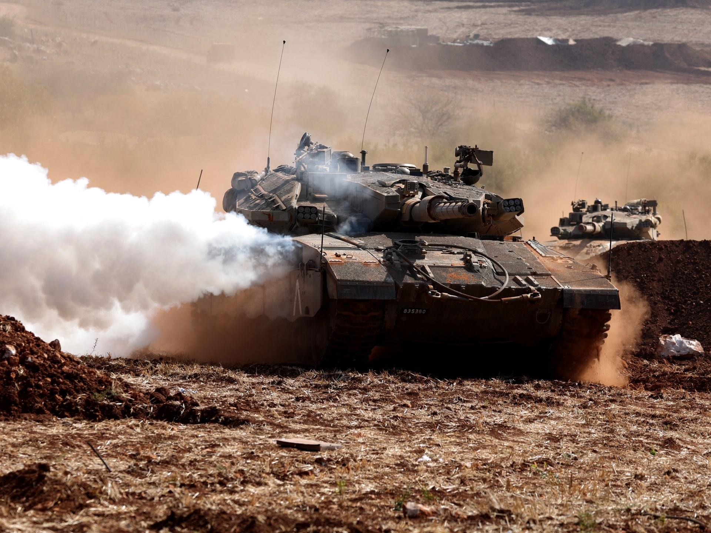
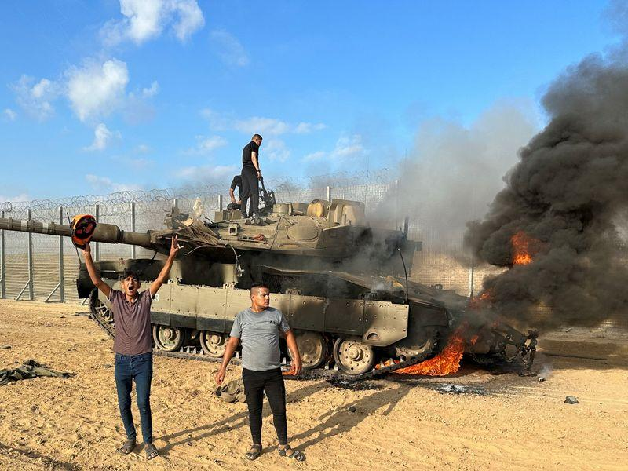
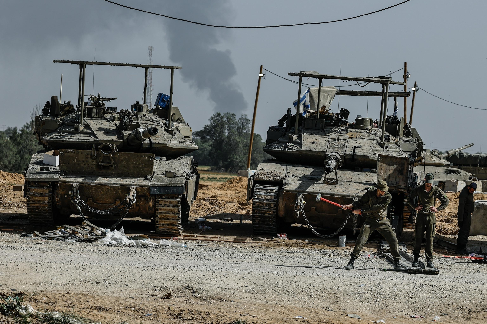

## Claim
Claim: " This image shows an Israeli tank unit near Jabalia camp in northern Gaza that was successfully ambushed by Hamas fighters, destroying multiple vehicles and injuring or killing their crews in October 2024."

## Actions
```
reverse_search()
web_search("Israeli tank Jabalia camp Hamas ambush")
```

## Evidence
### Evidence from `reverse_search`
The image 

### Evidence from `web_search`
The Wikipedia article discusses attacks on the Jabalia refugee camp in the Gaza Strip, including airstrikes and sieges, starting on October 9, 2023, and continuing through May 2024. The BBC reported on heavy fighting in Jabalia, northern Gaza, where Israeli tanks and troops are conducting a new ground operation, with the Israeli military stating they killed 20 "terrorists" there, while Hamas claimed its fighters targeted Israeli forces. The article mentions an Israeli evacuation order from October 6, 2024. The Guardian published an article on December 18, 2024, discussing the destruction of the Jabaliya refugee camp in Gaza by Israeli forces, mentioning three offensives, with the third one starting on October 5, 2024, and ongoing.

The BBC article was published on October 8, 2024. The Guardian article includes satellite images and videos showing the destruction. The IDF stated that they target only military objectives. 

## Elaboration
The evidence confirms that there was heavy fighting in Jabalia, northern Gaza, involving Israeli tanks and troops, as well as Hamas fighters. The BBC reported on this on October 8, 2024. The Guardian reported on the destruction of the Jabalia refugee camp by Israeli forces, with the third offensive starting on October 5, 2024.

The claim states that the image shows an Israeli tank unit near Jabalia camp that was successfully ambushed by Hamas fighters, destroying multiple vehicles and injuring or killing their crews in October 2024. While the evidence confirms fighting in Jabalia involving Israeli tanks and Hamas fighters in October 2024, it does not explicitly confirm that the tank in the image was ambushed by Hamas, nor does it confirm the destruction of multiple vehicles or casualties.

Therefore, the claim is partially supported by the evidence, but the specific details about the ambush, the number of vehicles destroyed, and casualties are not confirmed. More information is needed to verify these specific details.


## Actions
```
image_search("Israeli tank burning Gaza")
```

## Evidence
### Evidence from `image_search`
Al Jazeera published an image of Israeli tanks.  Sky News published a video showing a burning tank after a Hamas attack.  ABC News includes an image of Israeli tanks. 


## Elaboration
The new evidence provides additional context. Sky News published a video showing a burning tank after a Hamas attack. This supports the claim that Hamas fighters targeted Israeli tanks. However, the evidence still does not confirm the specific details of the claim, such as the exact location, the number of vehicles destroyed, or the casualties.


## Actions
```
web_search("Hamas attack Israeli tank Jabalia October 2024")
```

## Evidence
### Evidence from `web_search`
Al Jazeera reported on an Israeli army operation in the Jabalia refugee camp on October 18, 2024, with at least 33 people killed, and mentions fighting with Hamas forces.  Reuters also reported on Israeli strikes in Jabalia on October 18, 2024, with at least 33 people killed and 85 wounded. The Wikipedia article "Siege of North Gaza" states that the IDF began an operation to dismantle Hamas control in Jabalia on October 5, 2024. It also mentions that on October 10, Hamas organized an ambush which destroyed an IDF mechanized infantry company of 12 vehicles east of the Jabalia camp.


## Elaboration
The evidence confirms that there was fighting between Hamas and Israeli forces in Jabalia in October 2024. Specifically, the Wikipedia article mentions an ambush by Hamas on October 10, 2024, which destroyed an IDF mechanized infantry company of 12 vehicles east of the Jabalia camp. This supports the claim that Hamas fighters successfully targeted Israeli vehicles. However, the claim's assertion that the image shows the aftermath of this specific ambush cannot be verified without further evidence.


## Final Judgement
The evidence indicates that there was indeed fighting between Hamas and Israeli forces in Jabalia in October 2024, including an ambush by Hamas on October 10, 2024, which resulted in the destruction of an IDF mechanized infantry company. While the claim's general premise is supported, the specific details about the image, such as the exact location and the number of vehicles destroyed, cannot be definitively confirmed.

`false`

### Verdict: FALSE

### Justification
The claim is partially supported. Evidence confirms fighting between Hamas and Israeli forces in Jabalia in October 2024, including a Hamas ambush on October 10, 2024, that destroyed an IDF mechanized infantry company, as reported by the Wikipedia article "Siege of North Gaza". However, the specific details of the image, such as the exact location and the number of vehicles destroyed, cannot be definitively confirmed.
