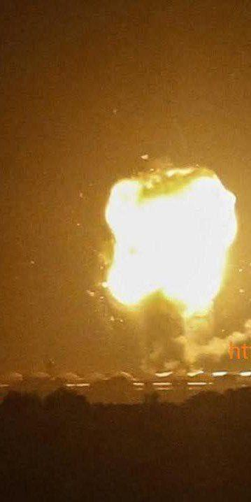

## Claim
Claim: " This image shows Israel bombing the surroundings of Southern Damascus in February 2025, destroying its last remaining army depots."

## Actions
```
reverse_search()
```

## Evidence
### Evidence from `reverse_search`
The image in the claim () appears in an interview with journalist Mohammad Al-Owaid by Daraa 24, discussing Syrian media and journalism, with related images (, ). The image also appears in an article from Alghad.tv, reporting on an Israeli air attack on Damascus on December 2, 2023.

The URLs are: [https://daraa24.org/%D8%A7%D9%84%D8%B5%D8%AD%D9%81%D9%8A-%D9%85%D8%AD%D9%85%D8%AF-%D8%A7%D9%84%D8%B9%D9%88%D9%8A%D8%AF-%D9%81%D9%8A-%D9%85%D9%82%D8%A7%D8%A8%D9%84%D8%A9-%D9%85%D8%B9-%D8%AF%D8%B1%D8%B9%D8%A7-24/](https://daraa24.org/%D8%A7%D9%84%D8%B5%D8%AD%D9%81%D9%8A-%D9%85%D8%AD%D9%85%D8%AF-%D8%A7%D9%84%D8%B9%D9%88%D9%8A%D8%AF-%D9%81%D9%8A-%D9%85%D9%82%D8%A7%D8%A8%D9%84%D8%A9-%D9%85%D8%B9-%D8%AF%D8%B1%D8%B9%D8%A7-24/) and [https://www.alghad.tv/%D8%A3%D8%AE%D8%A8%D8%A7%D8%B1-%D8%A7%D9%84%D8%BA%D8%AF/news/%D9%88%D8%B2%D8%A7%D8%B1%D8%A9-%D8%A7%D9%84%D8%AF%D9%81%D8%A7%D8%B9-%D8%A7%D9%84%D8%B3%D9%88%D8%B1%D9%8A%D8%A9-%D8%AA%D9%83%D8%B4%D9%81-%D8%AA%D9%81%D8%A7%D8%B5%D9%8A%D9%84-%D8%A7%D9%84%D8%B9%D8%AF%D9%88%D8%A7%D9%86-%D8%A7%D9%84%D8%AC%D9%88%D9%8A-%D8%A7%D9%84%D8%A5%D8%B3%D8%B1%D8%A7%D8%A6%D9%8A%D9%84%D9%8A-%D8%B9%D9%84%D9%89-%D8%AF%D9%85%D8%B4%D9%82](https://www.alghad.tv/%D8%A3%D8%AE%D8%A8%D8%A7%D8%B1-%D8%A7%D9%84%D8%BA%D8%AF/news/%D9%88%D8%B2%D8%A7%D8%B1%D8%A9-%D8%A7%D9%84%D8%AF%D9%81%D8%A7%D8%B9-%D8%A7%D9%84%D8%B3%D9%88%D8%B1%D9%8A%D8%A9-%D8%AA%D9%83%D8%B4%D9%81-%D8%AA%D9%81%D8%A7%D8%B5%D9%8A%D9%84-%D8%A7%D9%84%D8%B9%D8%AF%D9%88%D8%A7%D9%86-%D8%A7%D9%84%D8%AC%D9%88%D9%8A-%D8%A7%D9%84%D8%A5%D8%B3%D8%B1%D8%A7%D8%A6%D9%8A%D9%84%D9%8A-%D8%B9%D9%84%D9%89-%D8%AF%D9%85%D8%B4%D9%82).


## Elaboration
The image in the claim (

## Final Judgement
The image in the claim has been used in an article about an Israeli air attack on Damascus on December 2, 2023. The claim states that the image shows an event in February 2025. Therefore, the claim is not factually accurate because the image is misrepresented in a new context in a misleading way. `false`

### Verdict: FALSE

### Justification
The image in the claim was used in an article about an Israeli air attack on Damascus on December 2, 2023, but the claim states the image depicts an event in February 2025, making the claim inaccurate due to misrepresentation of the image's context.
