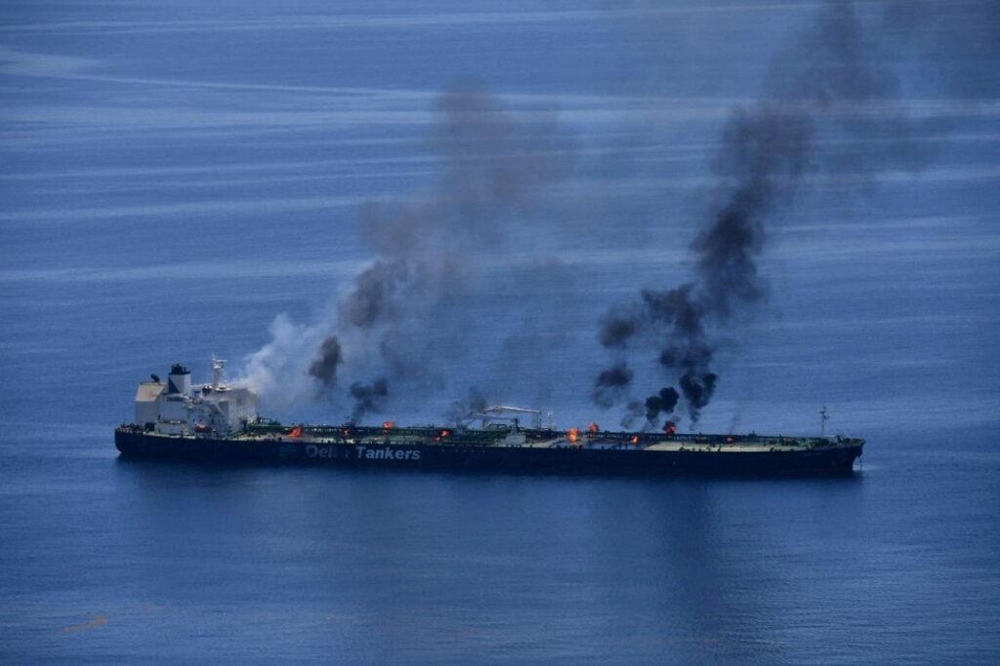
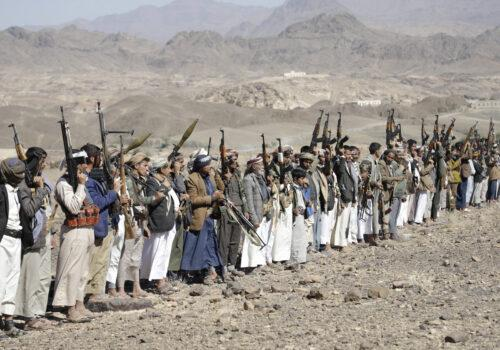

## Claim
Claim: "The Huthi rebels announced the final cessation of their military operations in international waters after Trump won the 2024 US presidential election."

## Actions
```
web_search("Huthi rebels military operations international waters Trump 2024")
```

## Evidence
### Evidence from `web_search`
The Atlantic Council published an article on March 18, 2025, discussing the US approach toward the Houthis, mentioning that Donald Trump ordered airstrikes against Yemen’s Houthi rebels in response to attacks on Red Sea shipping, and that Russia has aided Houthi operations. (, , ) [Source](https://www.atlanticcouncil.org/blogs/new-atlanticist/trump-should-not-forget-the-russian-hand-behind-the-houthis/)

An ABC News article, published on July 8, 2025, reports that the Houthi rebels attacked ships in the Red Sea, killing mariners, after Trump's administration targeted the rebels in airstrikes, and that the Houthis pledged to stop attacking ships. [Source](https://abcnews.go.com/International/wireStory/yemens-houthi-rebels-attack-ship-red-sea-killing-123559774) The Wikipedia article on the Red Sea crisis mentions a 2025 U.S.–Houthi ceasefire and a 2025 Houthi attack on Tel Aviv airport, and that on May 6, 2024, Donald Trump announced a cessation of US strikes as a result of a bilateral ceasefire between the US and the Houthis. [Source](https://en.wikipedia.org/wiki/Red_Sea_crisis)


## Elaboration
The evidence suggests that the Houthis were involved in military operations in international waters, specifically in the Red Sea, and that these operations continued into 2025. The evidence also indicates that Donald Trump ordered airstrikes against the Houthis and that a ceasefire was announced.

The ABC News article states that the Houthis pledged to stop attacking ships. However, the Wikipedia article mentions a 2025 Houthi attack on Tel Aviv airport, which contradicts the claim of a final cessation of military operations.

Based on the provided evidence, the claim cannot be fully verified. While there was a ceasefire and a pledge to stop attacking ships, the evidence also shows continued Houthi attacks. More information is needed to determine if the Houthis announced the final cessation of their military operations.


## Final Judgement
The evidence indicates that the Houthis were involved in military operations in international waters, and that a ceasefire was announced. However, the evidence also shows continued Houthi attacks, which contradicts the claim of a final cessation of military operations.

`false`


### Verdict: FALSE

### Justification
The claim is false. While there was a ceasefire and a pledge to stop attacking ships, the Houthis continued attacks after Trump's election, as evidenced by attacks on ships and the Tel Aviv airport, according to sources like the [ABC News article](https://abcnews.go.com/International/wireStory/yemens-houthi-rebels-attack-ship-red-sea-killing-123559774) and the [Wikipedia article on the Red Sea crisis](https://en.wikipedia.org/wiki/Red_Sea_crisis).
