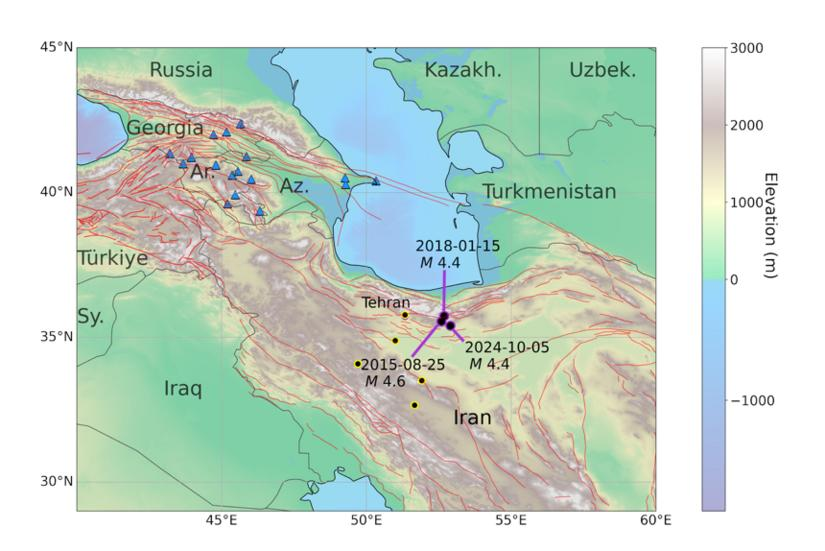

## Claim
Claim: "Israel experienced an earthquake on October 5, 2024."

## Actions
```
web_search("Israel earthquake October 5 2024")
```

## Evidence
### Evidence from `web_search`
The Johns Hopkins Hub published an article on February 4, 2025, discussing a study that debunked claims of a nuclear test in Iran on October 5, 2024, and mentioned a supposed seismic event in Israel on the same evening (). The article from alphadefense.in, published on October 7, 2024, discusses a seismic event in Iran on October 5, 2024, which led to speculation about a nuclear test (, , ).

NDTV published an article on October 7, 2024, discussing earthquakes in Iran and Israel on October 5, 2024, and the speculation of a covert nuclear test (). The article mentions that a moderate earthquake struck both Iran and Israel on the evening of October 5, 2024.


## Elaboration
The evidence suggests that an earthquake occurred in Israel on October 5, 2024. Both the Johns Hopkins Hub and NDTV articles mention a seismic event in Israel on that date.


## Final Judgement
The search results indicate that an earthquake occurred in Israel on October 5, 2024. Multiple sources, including the Johns Hopkins Hub and NDTV, mention a seismic event in Israel on that date.

`true`


### Verdict: TRUE

### Justification
Multiple sources, including the Johns Hopkins Hub and NDTV, report that an earthquake occurred in Israel on October 5, 2024.
