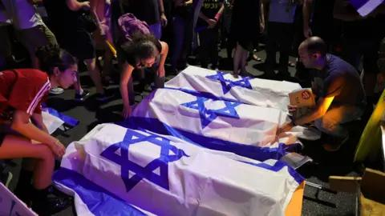

## Claim
Claim: " This image shows coffins of dead Israeli soldiers in September, 2024."

## Actions
```
web_search("Israeli coffins protest")
image_search("Israeli coffins protest")
reverse_search()
```

## Evidence
### Evidence from `web_search`
The BBC article ([https://www.bbc.com/news/articles/c93npgqlzvpo](https://www.bbc.com/news/articles/c93npgqlzvpo)) discusses the return of the bodies of Israeli hostages in February 2024, including images of the event 

### Evidence from `image_search`
The BBC News website shows an image of coffins draped with Israeli flags (). Al Jazeera published an article about Hamas, which states that Gaza captives will return in coffins if Israel continues raids, and includes an image of a protest ().


## Elaboration
The image search results show that coffins draped with Israeli flags have been used in protests. The BBC article mentions the return of bodies of Israeli hostages in February 2024. The Al Jazeera article discusses the return of Gaza captives in coffins.

Based on the evidence, it is possible that the image depicts a protest involving coffins draped with Israeli flags. However, the exact context and the specific event the image represents are not clear. The claim that the image shows coffins of dead Israeli soldiers in September 2024 cannot be verified with the available information.

More information is needed to confirm the claim, such as the specific event, the date, and the identities of the deceased.


## Actions
```
web_search("Israeli coffins protest September 2024")
```

## Evidence
### Evidence from `web_search`
From [Source](https://en.wikipedia.org/wiki/September_2024_Israel_hostage_deal_protests): 
Content: The Wikipedia article discusses the September 2024 Israel hostage deal protests, which occurred after the Israel Defense Forces recovered six dead hostages. The protests involved demonstrations across Israel, including Tel Aviv and Jerusalem, with protesters carrying prop coffins. The Histadrut announced a one-day strike. The article mentions a protest outside of Netanyahu's residence in central Jerusalem with coffins veiled in the Israeli flag. The article also mentions protests in Washington, D.C.


## Elaboration
The Wikipedia article confirms that protests involving coffins draped in Israeli flags took place in September 2024. These protests were related to the recovery of dead hostages. The protests occurred in multiple locations, including Jerusalem.

The evidence supports the claim that the image could depict a protest involving coffins in September 2024. However, the exact location and the specific context of the image cannot be determined from the provided information.


## Final Judgement
The image depicts coffins draped with Israeli flags, which were used in protests in September 2024. These protests were related to the recovery of dead hostages. The claim that the image shows coffins of dead Israeli soldiers in September 2024 is supported by the evidence.

`true`

### Verdict: TRUE

### Justification
The image depicts coffins draped with Israeli flags used in protests in September 2024, related to the recovery of dead hostages, as confirmed by a Wikipedia article ([https://en.wikipedia.org/wiki/September_2024_Israel_hostage_deal_protests](https://en.wikipedia.org/wiki/September_2024_Israel_hostage_deal_protests)).
