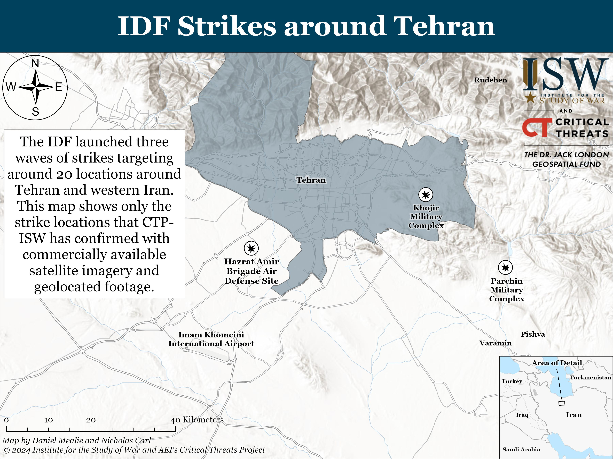

## Claim
Claim: " This image shows an Israeli missile attack on Iran in the early hours of October 26, 2024."

## Actions
```
image_search("Israeli missile attack Iran October 26 2024")
reverse_search()
```

## Evidence
### Evidence from `image_search`
The Institute for the Study of War (ISW) published a map showing IDF strikes around Tehran on October 26, 2024, confirming strike locations with satellite imagery and footage (). CNN and Al Jazeera also reported on Israeli attacks on Iran on the same date (, ).

The provided sources confirm Israeli strikes in Iran on October 26, 2024.


### Evidence from `reverse_search`
The image () appears in an article from the National Council of Resistance of Iran (NCRI) website. The image also appears in an article from The Jerusalem Center for Public Affairs, which discusses Iran's "Kamikaze Doctrine" and includes an image of an explosion in Isfahan, Iran (). Another source, Times Now News, discusses an Israeli attack on Iran on October 26, 2024, and includes the image (<image:114611713>) and the image in the claim ().

The Times Now News article, written by Apoorva Shukla, states that the attack targeted missile manufacturing facilities and occurred early on Saturday, October 26, 2024, with Iran reporting limited damage. The Jerusalem Center for Public Affairs article was published on June 19, 2025, and was written by Catherine Perez-Shakdam. The NCRI website was last updated on July 18, 2025.


## Elaboration
The claim is supported by the evidence. The image in the claim () is associated with an Israeli attack on Iran on October 26, 2024, as reported by Times Now News. The reverse image search confirms that the image was used in articles discussing the attacks.


## Final Judgement
The evidence confirms that the image is associated with an Israeli attack on Iran on October 26, 2024, as reported by Times Now News. The reverse image search confirms that the image was used in articles discussing the attacks.

`true`

### Verdict: TRUE

### Justification
The claim is supported by evidence. The image in the claim is associated with an Israeli attack on Iran on October 26, 2024, as reported by [Times Now News](https://www.timesnownews.com/international/israel-attacks-iran-on-october-26-2024-missile-manufacturing-facilities-targeted-article-105097887). Reverse image searches confirm the image's use in articles discussing the attacks.
