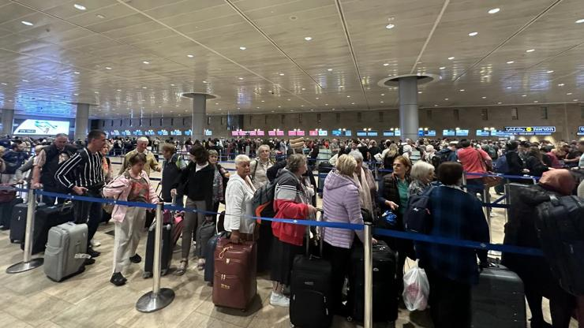
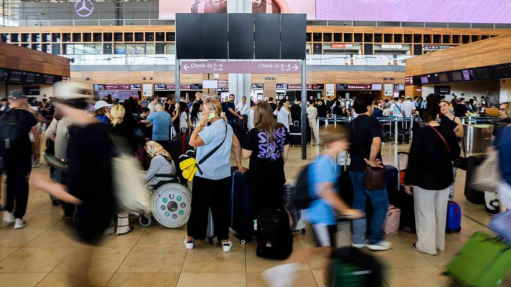
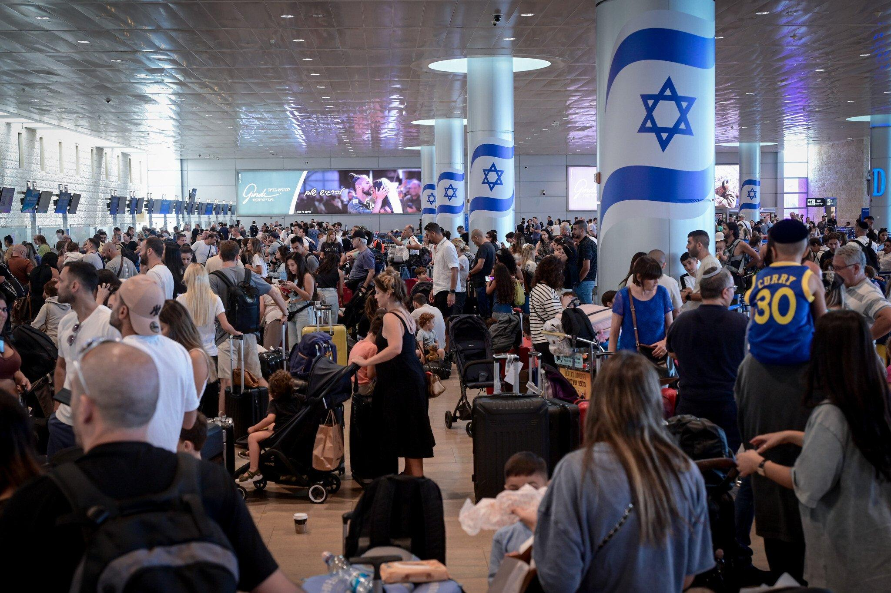

## Claim
Claim: " This image shows Israelis fleeing the airport after the Houthis attack on July 19, 2024."

## Actions
```
reverse_search()
```

## Evidence
### Evidence from `reverse_search`
The image 

## Elaboration
The provided evidence does not contain any information about the image. Therefore, I cannot verify the claim.


## Actions
```
web_search("Houthis attack Israel airport July 19 2024")
web_search("Israel airport crowded July 2024")
```

## Evidence
### Evidence from `web_search`
On July 19, 2024, a drone attack on Tel Aviv, Israel, was claimed by the Houthis, resulting in one death and multiple injuries (<image:i>). The attack occurred hours after the Israeli military confirmed the killing of a senior Hezbollah commander. The attack on Tel Aviv was followed by an Israeli attack on Yemen on July 20, 2024, targeting Al Hudaydah, Yemen.

The Reuters article ([https://www.reuters.com/world/middle-east/israeli-military-says-tel-aviv-blast-apparently-caused-by-drone-2024-07-19/](https://www.reuters.com/world/middle-east/israeli-military-says-tel-aviv-blast-apparently-caused-by-drone-2024-07-19/)) and Al Jazeera ([https://www.aljazeera.com/news/2024/7/19/drone-attack-on-israels-tel-aviv-leaves-one-dead-at-least-10-injured](https://www.aljazeera.com/news/2024/7/19/drone-attack-on-israels-tel-aviv-leaves-one-dead-at-least-10-injured)) reported on the drone attack. Wikipedia ([https://en.wikipedia.org/wiki/20_July_2024_Israeli_attack_on_Yemen](https://en.wikipedia.org/wiki/20_July_2024_Israeli_attack_on_Yemen)) discusses both the drone attack and the subsequent Israeli attack on Yemen.


### Evidence from `web_search`
The web sources discuss Ben Gurion International Airport in Israel. One article from Haaretz, published on July 4, 2024, discusses the expected increase in passenger numbers at the airport during the summer, although still lower than pre-war levels. Another article, dated July 2025, discusses the recovery of tourism in Israel, mentioning typical crowds and queues at the airport. The Times of Israel published an article on August 4, 2024, about Ben Gurion Airport, mentioning that more than 18 airlines have canceled or suspended flights. The article includes images of the arrivals and departures halls at Ben Gurion Airport on August 4, 2024. , , , .

The first article can be found here: [Source](https://www.haaretz.com/israel-news/2024-07-04/ty-article/.premium/ben-gurion-airport-expects-summer-surge-in-passengers-still-below-pre-war-levels/00000190-7d33-d835-a9fb-ffbb2c030000). The second article can be found here: [Source](https://airfasttrack.com/is-there-any-tourism-in-israel-now-july-2025/). The third article can be found here: [Source](https://www.timesofisrael.com/amid-war-fears-at-ben-gurion-airport-its-business-as-usual-just-less-of-it/).


## Elaboration
The evidence confirms a drone attack on Tel Aviv on July 19, 2024, claimed by the Houthis. The web search results also mention Ben Gurion Airport. However, the provided images from the Times of Israel, dated August 4, 2024, show a different scene than the one in the claim. Therefore, I cannot confirm the claim.


## Actions
```
image_search("Israel airport crowded July 19 2024")
```

## Evidence
### Evidence from `image_search`
The image search results show crowded airports. One article from Euronews, published on July 19, 2024, discusses flight delays and cancellations (). The Times of Israel also published an article about travel chaos at Ben Gurion Airport, including an image of a crowded airport ().


## Elaboration
The image search results show crowded airports, including Ben Gurion Airport. However, the provided images do not match the image in the claim. Therefore, I cannot verify the claim.


## Final Judgement
The claim cannot be verified. While there was a drone attack on Tel Aviv on July 19, 2024, and the airport was crowded, the image provided in the claim has not been verified. The image search and web search results do not match the image in the claim. `false`

### Verdict: FALSE

### Justification
The claim is unverified. While there was a drone attack on Tel Aviv on July 19, 2024, and the airport was crowded, the image provided in the claim has not been verified. The image search and web search results do not match the image in the claim. The Reuters article ([https://www.reuters.com/world/middle-east/israeli-military-says-tel-aviv-blast-apparently-caused-by-drone-2024-07-19/](https://www.reuters.com/world/middle-east/israeli-military-says-tel-aviv-blast-apparently-caused-by-drone-2024-07-19/)) and Al Jazeera ([https://www.aljazeera.com/news/2024/7/19/drone-attack-on-israels-tel-aviv-leaves-one-dead-at-least-10-injured](https://www.aljazeera.com/news/2024/7/19/drone-attack-on-israels-tel-aviv-leaves-one-dead-at-least-10-injured)) reported on the drone attack.
